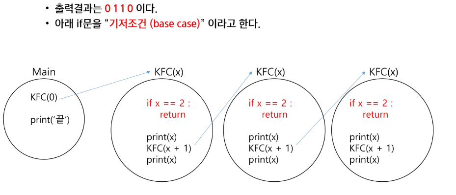

# 재귀 호출
## 반복(Iteration)과 재귀(Recursion)
- 반복과 재귀는 유사한 작업을 수행
- 반복은 수행하는 작업이 완료될 때까지 반복
  - 루프(for, while)
  - 반복문은 코드를 n번 반복시킬 수 있다.
  
- 재귀는 주어진 문제의 해를 구하기 위해 동일하면서 더 작은 문제의 해를 이용하는 방법
  - 하나의 큰 문제를 해결할 수 있는 더 작은 문제로 쪼개고 결과들을 결합한다.
  - 재귀호출은 n 중 반복문을 만들어낼 수 있다.
  
- **반복문으로는 n번 반복을 구현할 수 있고, 재귀호출로 n중 for문을 구현할 수 있다**
### 재귀 연습 전 함수의 특징 1
- 함수 호출할 떄, int 타입 객체를 전달하면 값만 복사가 된다.

### 재귀 연습 전 함수의 특징 2
- 함수가 끝나면, Main으로 되돌아 오는 것이 아니라, 해당 함수를 호출했던 곳으로 돌아온다.

### 재귀호출의 시작은 무한 재귀호출을 막는것 부터 시작

# 순열(Permutation)
- 서로 다른 N 개에서, R개를 중복없이, 순서를 고려하여 나열하는 것
## 중복순열
- 중복 허용 순열
1. 재귀호출을 할 때 마다, 이동 경로를 흔적으로 남긴다.
2. 가장 마지막 레벨에 도착했을 때, 이동 경로를 출력한다.

- 먼저 path라는 전역 리스트를 준비
- level2, Branch 3으로 동작되는 재귀 코드 구현
- 재귀호출 직전에 이동할 곳의 위치를 path 리스트에 기록
- 재귀호출 후 코드가 진행되어 path.append(i) 수행
- 출력
- 함수가 리턴되고, 함수가 종료, 이후 path에 적은 마지막 기록이 삭제 돼야한다.
- 이어서 for문이 진행되고, 변수 i 값은 1이 된다.
- path 배열 마지막에 1이 삽입된다.
- 재귀호출이 된 후, path 리스트를 출력한다.

## 중복을 취급않는 순열
1. 중복순열 코드를 작성
2. 중복을 제거하는 코드 추가
  - 원리 : 전역 리스트를 사용해 이미 선택했던 숫자인지 아닌지 구분
        - 이를 used 배열 또는 visited 배열로 칭
- 재귀 호출 직전 이미 선택했던 숫자인지 검사
  - 전역으로 used 리스트 준비
  - 이미 사용한 숫자일 경우, 재귀 호출 생략(continue)
  - 처음 사용하는 숫자라면 used에 기록
  - 모든 처리가 끝나고 돌아오면 used[i]를 False로 바꿔준다.

# 완전 탐색
- 모든 가능한 경우를 모두 시도를 해보며 정답을 찾아내는 알고리즘
