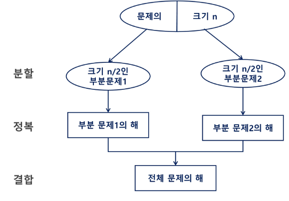
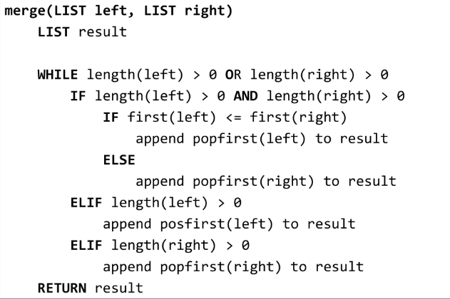
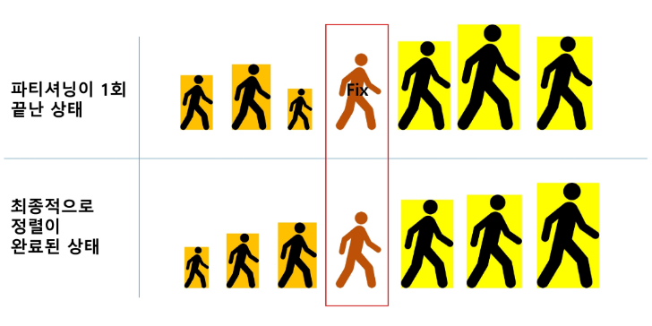

# 분할정복(Divide and Conquer)
- 문제를 분할해서 해결하는 기법
- 대표적으로 퀵 정렬, 병합 정렬, 이진 검색이 있다.

## 설계 전략
- 분할(Divide) : 해결할 문제를 여러 개의 작은 부분으로 나눈다.
- 정복(Conquer) : 나눈 작은 문제를 각각 해결한다,
- 통합(Combine) : 해결된 해답을 모은다.


### Top-down approach
분할은 더 이상 분할할 수 없을 때까지 혹은 필요 없을 때 까지 진행한다.




### 병합 정렬(Merge sort)
- 여러 개의 정렬된 자료의 집합을 병합하여 한 개의 정렬된 집합으로 만드는 방식
- 분할 정복 알고리즘 활용
  - 자료를 최소 단위의 문제까지 나눈 후에 차례대로 정렬하여 최종 결과를 얻어냄.
  - top-down 방식
- 시간 복잡도 : O(nlogn)


```python
def merge_sort(m):  # 정렬 함수
  # 리스트의 길이가 1이면 이미 정렬된 상태이므로 그대로 반환
  if len(m) == 1:
    return m

  List left=m[:mid], right=m[mid:]
  middle = length(m)/2
  
  # 재귀적으로 좌우 부분 정렬
  left = merge_sort(left)
  right = merge_sort(right)

  # 두 개의 정렬 리스트를 병합하여 반환
  return merge(left, right)
```


```
def merge(left, right):  # 병합 함수
  result = [0] * (len(left) + len(right))
  l = r = 0

  while l <len(left) and r < len(right):
    if left[l] < right[r]:
      result[l+r] = left[l]
      l += 1
    else:
      reult[l+r] = right[r]
      r += 1
  
```




### 퀵 정렬 - Partitioning
- 작업 1회 : pivot의 위치를 확정짓기
1. 작업 영역을 정한다.
2. 작업영역 중 가장 왼쪽에 있는 수를 pivot이라 한다.
3. pivot을 기준으로 왼쪽에는 pivot보다 작은 수를 배치(정렬 안됨)
4. 오른쪽에는 pivot보다 큰 수 배치(정렬 안됨)




### 이진 검색
**이진 검색은 자료가 정렬된 상태여야 한다.**
1. 자료의 중앙에 있는 원소 선택
2. 중앙 원소의 값과 찾고자 하는 목표 값을 비교
3. 목표 값이 중앙 원소 값보다 작으면 자료의 왼쪽 반, 크다면 오른쪽 반에 대해 새로 검색 수행
4. 1-3 반복