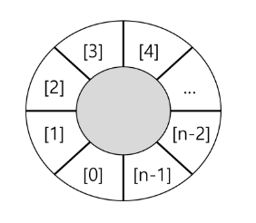
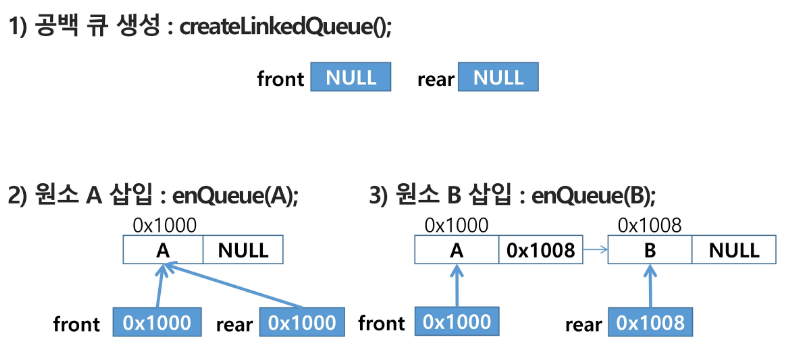
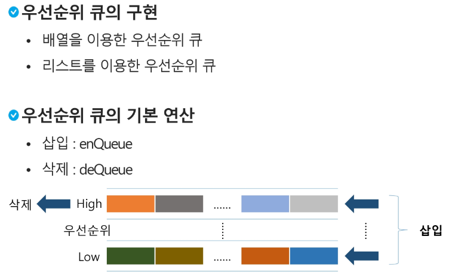
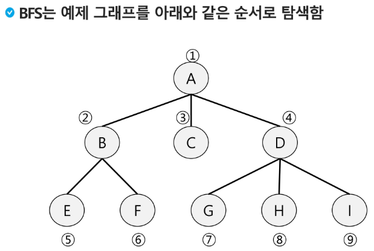

# 큐(queue)

## 큐
- 스택과 마찬가지로 삽입과 삭제의 위치가 제한적인 자료구조
  - 큐의 뒤에서는 삽입만 하고, 큐의 앞에서는 삭제만 이루어지는 구조

-  <span style='background-color: #dcffe4'>선입선출구조(FIFO : First In First Out)</span>
  - 큐에 삽입한 순서대로 원소가 저장되어, 가장 먼저 삽입(First In)됭 원소는 가장 먼저 삭제(First Out)된다.

- 큐의 기본 연산
  - 삽입 : enQueue
  - 삭제 : deQueue
- 큐의 주요 연산
  - enQueue(item) : 큐의 뒤쪽(rear 다음)에 원소를 삽입하는 연산
  - deQueue() : 큐의 앞쪽(front)에서 원소를 삭제하고 반환하는 연산
  - createQueue() : 공백 상태의 큐를 생성하는 연산
  - isEmpty() : 큐가 공백상태인지를 확인하는 연산
  - isFull() : 큐가 포화상태인지를 확인하는 연산
  - Qpeek() : 큐의 앞쪽(front)에서 원소를 삭제없이 반환한는 연산


### 선형 큐
- 1차원 배열을 이용한 큐
  - 큐의 크기 = 배열의 크기
  - front : 저장된 첫 번쨰 원소의 인덱스
  - rear : 저장된 마지막 원소의 인덱스

- 상태 표현
  - 초기 상태 : front = rear = -1
  - 공백 상태 : front == rear
  - 포화 상태 : rear == n-1 (n : 배열의 크기, n-1 : 배열의 마지막 인덱스)

#### 선형 큐의 구현
- 초기 공백 큐 생성
  - 크기 n인 1차원 배열 생성
  - frontdhk rear를 -1로 초기화

- 삽입 : enQueue(item)
  - 마지막 원소 뒤에 새로운 원소를 삽입하기 위해
    1) rear 값 하나 증가시켜 새로운 원소를 삽입할 자리를 마련
    2) 그 인덱스에 해당하는 배열원소 Q[rear]에 item 저장
  ```python
  def enQueue(item):
    global rear
    if isFull(): print("Queue_Full")
    else:
      rear <- rear +1
      Q[rear] <- item 
  ```
- 삭제 : deQueue()
  - 가장 앞에 있는 원소를 삭제하기 위해
    1) front 값을 하나 증가시켜 큐에 남아있는 첫 번째 원소 이동
    2) 새로운 첫 번째 원소를 리턴 함으로써 삭제와 동일한 기능함
  ```py
  deQueue()
  if(isEmpty()) then Queue_Empty();
  else{
    front <- front +1;
    return Q[front];
  }
  ```

- 공백상태 및 포화상태 검사 : isEmpty(), isFull()
  - 공백상태 : front == rear
  - 포화상태 : rear == n-1 (n: 배열의 크기, n-1 : 배열의 마지막 인덱스)

  ```py
  def isEmpty():
    return front == rear
  
  def isFull():
    return rear == len(Q)-1
  ```  

### 원형 큐
- 선형 큐 이용시의 문제점
   - 잘못된 포화상태 인식
    - 선형 큐를 이용하여 원소의 삽입과 삭제를 계속할 경우, 배열의 앞부분에 활용할 수 있는 공간이 있음에도 불구하고, rear=n-1인 상태 즉, 포화상태로 인식하여 더 이상의 삽입을 수행하지 않게 됨

- 해결방법1
  - 매 연산이 이루어질 때마다 저장된 원소들을 배열의 앞부분으로 모두 이동시킴
  - 원소 이동에 많은 시간이 소요되어 큐의 효율성이 급격히 떨어짐
- 해결방법2
  - 1차원 배열을 사용하되, 논리적으로는 배열의 처음과 끝이 연결되어 원형 형태의 큐를 이룬다고 가정하고 사용
  - 원형큐의 논리적 구조 

- 초기 공백 상태
  - front = rear = 0

- Index의 순환
  - front와 rear의 위치가 배열의 마지막 인덱스인 n-1을 가리킨 후, 논리적 순환을 이루어 배열의 처음 인덱스인 0으로 이동해야 함.
  - 이를 위해 나머지 연산자 mod를 사용함

- front 변수
  - 공백 상태와 포화 상태 구분을 쉽게 하기 위해 front가 있는 자리는 사용하지 않고 항상 빈자리로 둠
  

#### 원형 큐의 구현
- 초기 공백 큐 생성
  - 크기 n인 1차원 배열 생성
  - front와 rear를 0으로 초기화

- 공백상태 및 포화상태 검사 : isEmpty(), isFull()
  - 공백상태 : front == rear
  - 포화상태 : 삽입할 rear의 다음 위치 == 현재 front
    - (rear + 1) mod n == front

  ```py
  def isEmpty():
    return front == rear
  
  def isFull():
    return (rear +1) % len(cQ) == front
  ```

- 삽입 : enQueue(item)
  - 마지막 원소 뒤에 새로운 원소를 삽입하기 위해
    1) rear 값을 조정하여 새로운 원소를 삽입할 자리를 마련함:
      rear <- (rear+1) mod n;
    2) 그 인덱스에 해당하는 배열원소 cQ[rear]에 item 저장
  ```python
  def enQueue(item):
    global rear
    if isFull(): print("Queue_Full")
    else:
      rear <- (rear +1) len(cQ)
      cQ[rear] <- item 
  ```
- 삭제 : deQueue()
  - 가장 앞에 있는 원소를 삭제하기 위해
    1) front 값을 조정하여 삭제할 자리를 준비
    2) 새로운 front 원소를 리턴 함으로써 삭제와 동일한 기능함
  ```py
  deQueue()
  if(isEmpty()) then Queue_Empty();
  else{
    front <- (front +1) % len(cQ);
    return cQ[front];
  }
  ```

  ### 연결 큐
  - 단순 연결 리스트(Linked List)를 이용한 큐
    - 큐의 원소 : 단순 연결 리스트의 노드
    - 큐의 원소 순서 : 노드의 연결 순서, 링크로 연결되어 있음
    - front : 첫 번째 노드를 가리키는 링크
    - rear : 마지막 노드를 가리키는 링크

  - 상태 표현
  
#### 연결 큐의 연산 과정


### 덱_deque
- 컨테이너 자료형 중 하나
- deque 객체
  - 양쪽 끝에서 빠르게 추가와 삭제를 할 수 있는 리스트류 컨테이너

- 연산
  - append(x) : 오른쪽에 x 추가
  - popleft() : 왼쪽에서 요소를 제거하고 반환. 요소가 없으면 IndexEror

  ```py
  from collections import deque

  q = deque()
  q.append(1)   # enqueue()
  t = q.popleft() # dequeue()
  ```

### 우선순위 큐(Priority Queue)
- 우선순위 큐의 특성
  - 우선순위를 가진 항목들을 저장하는 큐
  - FIFO 순서가 아니라 우선순위가 높은 순서대로 먼저 나가게 된다.

- 우선순위 큐의 적용 분야
  - 시뮬레이션 시스템
  - 네트워크 트래픽 제어
  - 운영체제의 테스크 스케일링
  

- 배열을 이용하여 우선순위 큐 구현
  - 배열을 이용하여 자료 저장
  - 원소를 삽입하는 과정에서 우선순위를 비교하여 적절한 위치에 삽입하는 구조
  - 가장 앞에 최고 우선순위의 원소가 위치하게 됨

- 문제점
  - 배열을 사용하므로, 삽입이나 삭제 연산이 일어날 때 원소의 재배치가 발생함
  - 이에 소요되는 시간이나 메모리 낭비가 큼

## 버퍼(Buffer)
- 버퍼
  - 데이터를 한 곳에서 다른 한 곳으로 전송하는 동안 일시적으로 그 데이터를 보관하는 메모리의 영역
  - 버퍼링 : 버퍼를 활용하는 방식 또는 버퍼를 채우는 동작을 의미한다.

- 버퍼의 자료 구조
  - 버퍼는 일반적으로 입출력 및 네트워크와 관련된 기능에서 이용된다.
  - 순서대로 입력/출력/전달 되어야 하므로 FIFO 방식의 자료구조인 큐가 활용된다.

# BFS
- 그래프를 탐색하는 방법에는 크게 두 가지가 있다.
  - 깊이 우선 탐색(Depth First Search, DFS)
  - 너비 우선 탐색(Breadth First Search, BFS)

- 너비우선탐색은 탐색 시작점의 인접한 정점들을 먼저 모두 차례로 방문한 후에, 방무해던 정점을 시작점으로 하여 다시 인접한 정점들을 차례로 방문하는 방식

- 인접한 정점들에 대해 탐색을 한 후, 차례로 다시 너비우선탐색을 진행해야 하므로, 선입선출 형태의 자료구조인 큐를 활용함


- 입력 파라미터 : 그래프 G와 탐색 시작점 v
```py
def BFS(G, v, n):  # 그래프 G, 탐색 시작점 v 
  visited = [0]*(n+1)   # n : 정점의 개수
  queue = []          # 큐 생성
  queue.append(v)     # 시작점 v를 큐에 삽입
  visited[v] = 1
  while queue:      # 큐가 비어있지 않은 경우
    t = queue.pop(0)    # 큐의 첫 번째 원소 반환
    if not visited[t]:  # 방문하지 않은 곳이라면
      visited[t] = True   # 방문한 것으로 표시
      visit(t)    # 정점 t에서 할 일
      for i in G[t]     # t와 연결된 모든 정점에 대해
        if not viited[i]    # 방문하지 않은 곳이라면
          queue.append(i)   # 큐에 넣기
          visited[i] = visited[t] + 1   # n으로부터 1만큼 이동
```

1. BFS(너비 우선 탐색) 개념:
   - BFS는 그래프나 트리를 탐색하는 알고리즘
   - 시작 노드에서 가까운 노드부터 차례대로 탐색
   - 같은 레벨의 모든 노드를 탐색한 후 다음 레벨로 넘어감

2. 큐(Queue) 사용:
   - BFS는 큐 자료구조를 사용하여 구현
   - 큐는 선입선출(FIFO) 방식으로 동작
   - 탐색할 노드를 큐에 넣고, 순서대로 꺼내며 탐색

3. 방문 체크:
   - 이미 방문한 노드를 다시 방문하지 않도록 방문 여부를 체크
   - `visited` 리스트를 사용하여 각 노드의 방문 상태를 관리

4. 인접 노드 탐색:
   - 현재 노드와 연결된 모든 인접 노드를 확인
   - 방문하지 않은 인접 노드를 큐에 추가

5. 그래프 표현:
   - 이 코드에서는 인접 행렬을 사용하여 그래프를 표현
   - `G[i][j] = 1`은 노드 i와 j가 연결되어 있음을 의미

6. 탐색 순서:
   - 시작 노드부터 가까운 순서대로 노드를 탐색
   - 결과적으로 시작 노드로부터의 거리 순으로 노드를 방문

7. 구현 과정:
   - 시작 노드를 큐에 넣고 방문 표시를 
   - 큐가 빌 때까지 다음 과정을 반복:
     a) 큐에서 노드를 하나 꺼낸다.
     b) 꺼낸 노드의 인접 노드 중 방문하지 않은 노드를 모두 큐에 넣고 방문 표시를 한다.


- 예시
```py
'''
7 8
4 2 1 2 1 3 5 2 4 6 5 6 6 7 3 7
'''

def bfs(s, V):  # 시작정점 s, 마지막 정점 V
    visited = [0] * (V+1)   # visited 생성
    q = []          # 큐 생성
    q.append(s)     # 시작점 인큐
    visited[s] = 1  # 시작점 방문표시
    while q:        # 큐에 정점이 남아있으면 front != rear
        t = q.pop(0)    # 디큐
        print(t)        # 방문한 정점에서 할일
        for w in adj_l[t]:  # 인접한 정점 중 인큐되지 않은 정점 w가 있으면
            if visited[w]==0:
                q.append(w)     # w인큐, 인큐되었음을 표시
                visited[w] = visited[t] + 1

V, E = map(int, input().split()) # 1번부터 V번 정점, E개의 간선
arr = list(map(int, input().split()))
# 인접리스트 -------------------------
adj_l = [[] for _ in range(V+1)]
for i in range(E):
    v1, v2 = arr[i*2], arr[i*2+1]
    adj_l[v1].append(v2)
    adj_l[v2].append(v1)    # 방향이 없는 경우
# 여기까지 인접리스트 -----------------
bfs(1, 7)
```

### 큐 자료구조 사용 시 list와 deque의 차이

1. 시간 복잡도
    - `list.pop(0)`: `O(n)`
    - `deque.popleft()`: `O(1)`

2. 성능 차이의 원인
   - list는 동적 배열로 구현되어 있어, 첫 번째 요소를 제거할 때 나머지 모든 요소를 한 칸씩 앞으로 이동시켜야 함
   - deque는 이중 연결 리스트로 구현되어 있어, 양쪽 끝에서의 삽입과 삭제가 효율적

3. 대량의 데이터 처리 시
   - `list.pop(0)`는 데이터 크기가 증가할수록 성능이 급격히 저하됨
   - `deque.popleft()`는 데이터 크기와 관계없이 일정한 성능을 유지함
   

> - 결론적으로, queue를 구현할 때 대량의 데이터를 다루거나 성능이 중요한 경우에는 `deque.popleft()`를 사용하는 것이 훨씬 효율적
> - 작은 규모의 데이터나 간단한 사용의 경우 list.pop(0)도 충분할 수 있지만, 일반적으로 queue 구현에는 deque 사용을 권장