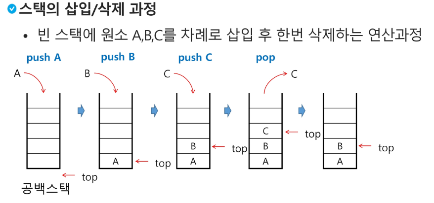
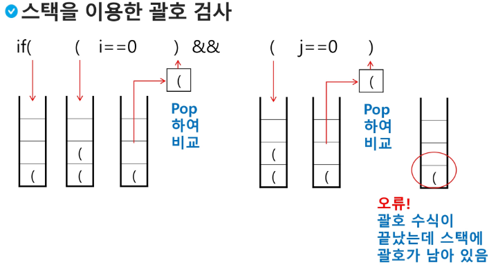
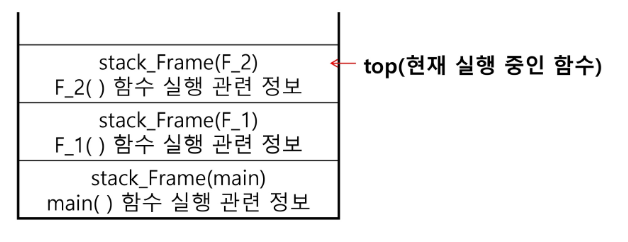
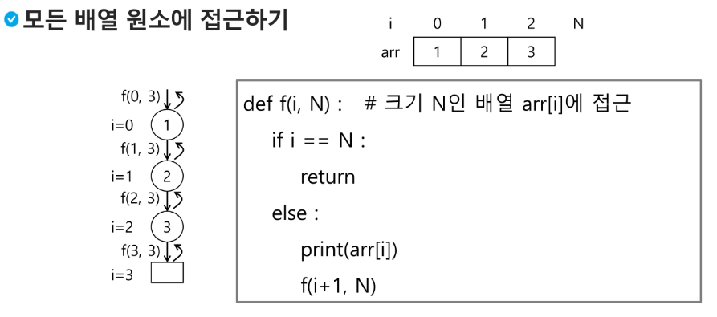

# 스택
## 스택의 특성
- 물건을 쌓아 올리듯 자료를 쌓아 올린 형태의 자료구조
- 스택에 저장된 자료는 선형 구조를 갖는다.
  - 선형구조 : 자료 간의 관계가 1대1
  - 비선형구조 : 자료 간 관계가 1대n(트리)
- 스택에 자료를 삽입하거나 스택에서 자료를 꺼낼 수 있다.

#### ** 중요! 마지막에 삽입한 자료를 가장 먼저 꺼낸다.
  - <span style='background-color: #dcffe4'>후입선출(LIFO, Last-in-First-Out)이라고 부른다.</span>
  - 예를 들어 스택에 1,2,3 순으로 자료를 삽입한 후 꺼내면 역순으로 3,2,1

## 스택의 구현
- 스택을 프로그램에서 구현하기 위해서 필요한 자료구조와 연산
  - 자료구조 : 자료를 선형으로 저장할 저장소
    - 배열을 사용할 수 있다.
    - 저장소 자체를 스택이라 부르기도 한다.
    - 스택세어 마지막 삽입된 원소의 위치를 top이라 부른다.
  - 연산
    - 삽입 : 저장소에 자료를 저장한다. 보통 push라 부른다.
    - 삭제 : 저장소에서 자료를 꺼낸다. 꺼낸 자료는 삽입한 자료의 역순으로 꺼낸다. 보통 pop이라 부른다.
    - isEmpty : 스택이 공백인지 아닌지를 확인하는 연산
    - peek : 스택의 top에 있는 item(원소)을 반환하는 연산.
    


### push 알고리즘
- 스택을 활용한 복잡한 알고리즘을 볼 때 전체 구조에 대한 이해가 우선돼야한다.
- append 메소드를 통해 리스트의 마지막에 데이터를 삽입
```python
def puss(item, size):
  global top
  top += 1
  if top == size:
    print('overflow!') # 스택을 사용할 때 불필요하게 너무 많은 걸 저장하는 등의 문제가 발생할 경우_ 스택이 모자라다 - 디버깅 목적
  else:
    stack[top] = item

size = 10 # 사용할 스택의 크기 우선 파악
stack = [0]* size 
top = -1    # 배열의 인덱스 -1로 초기화

push(10, size)
top += 1        # push(20)
stack[top] = 20 # 
```

### pop 알고리즘
- pop에 아무것도 넣지 않으면 마지막 저장물을 날림 / 맨 앞에꺼 날리고 싶으면 pop(0)

```python
def pop():
  global top
  if top == -1
    prinr('underflow!')
    return 0
  else:
    top -= 1
    return stack[top+1]

print(pop())

if top > -1: # pop()
  top -= 1
  print(stack[top + 1])  # print(stack[top])
                         # top -= 1        // 이렇게 써도 무방
```
## 스택 구현 고려 사항
- 1차원 배열을 사용하여 구현할 경우 구현이 용이하다는 장점, but 스택의 크기를 변경하기 어렵다는 단점이 있다.
- 이를 해결하기 위해 저장소를 동적으로 할당, 스택을 구현하는 방법이 있다.
- 구현이 복잡하지만 메모리를 효율적으로 사용한다.
- 스택의 동적 구현은 생략한다.

#### 스택 구현
```python
s = input()
stack = []
ans = 1
for x in s:
    if x == '(':
        stack.append(x)  # push
    elif x == ')':
        if stack:  # stack에 값이 들어있다면 // 값이 없다면의 표현 - if :
            stack.pop()
        else:
            ans = 0
if stack:       # for문 종료시에 닫는 괄호 없는데 남은 값이 있는 경우
    ans = 0 
print(ans)
```
## 스택의 응용1 : 괄호검사
- 괄호의 종류 : 대괄호[], 중괄호{}, 소괄호()
- 조건
  - 왼쪽 괄호의 개수와 오른쪽 괄호의 개수가 같아야 한다.
  - 같은 괄호에서 왼쪽 괄호는 오른쪽 괄호보다 먼저 나와야 한다.
  - 괄호 사이에는 포함 관계만 존재한다.


- 괄호를 조사하는 알고리즘 개요
  - 문자열에 이는 괄호를 차례대로 조사하면서 왼쪽 괄호를 만나면 스택에 삽입하고, 오른쪽 괄호를 만나면 스택에서 top 괄호를 삭제한 후 오른쪽 괄호와 짝이 맞는지를 검사한다.
  - 이 때, 스택이 비어 있으면 조건 1 또는 조건 2에 위배되고 괄호의 짝이 맞지 않으면 조건 3에 위배된다.
  - 마지막 괄호까지를 조사한 후에도 스택에 괄호가 남아있으면 조건 1에 위배된다.

## 스택의 응용2 : function call
- 프로그램에서의 함수 호출과 복귀에 따른 수행 순서를 관리
  - 가장 마지막에 호출된 함수가 가장 먼저 실행을 완료하고 복귀하는 후입선출 구조이므로, 후입선출 구조의 스택을 이용하여 수행순서 관리


  - 함수 호출이 발생하면 호출한 함수 수행에 필요한 지역변수, 매개변수 및 수행 후 복귀할 주소 등의 정보를 스택 프레임(stack frame)에 저장하여 시스템 스택에 삽입


  - 함수의 실행이 끝나면 시스템 스택의 top 원소(스택 프레임)를 삭제(pop)하면서 프레임에 저장되어 있던 복귀주소를 확인하고 복귀
  - 함수 호출과 복귀에 따라 이 과정을 반복하여 전체 프로그램 수행이 종료되면 시스템 스택은 공백 스택이 된다.
    - 함수를 불러오면 그 저장 장소가 생성되어 스택을 수행하고 종료될 때 삭제된다.

## 재귀호출
- 필요한 함수가 자신과 같은 경우 자신을 다시 호출하는 구조
- 함수에서 실행해야 하는 작업의 특성에 따라 일반적인 호출방식보다 재귀호출방식을 사용하여 함수를 만들면 <span style='background-color: #dcffe4'>프로그램의 크기를 줄이고 간단하게 작성 가능하다.</span>


#### 팩토리얼
```python
def factorial(n):
  if n==1:    # while문처럼 종료 조건(중단)
    return 1
  else:
    return n * factorial(n-1)
```

#### 피보나치 수열
- 0과 1로 시작하고 이전의 두 수 합을 다음 항으로 하는 수열
```python
def fibo(n):
  if n < 2: # while문처럼 종료 조건(중단)
    return n
  else:
    return fibo(n-1) + fibo(n-2)
```

### 모든 배열 원소에 재귀로 접근


```python
f(i,N) # i는 접근할 원소 인덱스, N은 크기
```

## Memoization
- 메모이제이션은 컴퓨터 프로그램을 실행할 때 이전에 계산한 값을 메모리에 저장해서 매번 다시 계산하지 않도록 하여 전체적인 실행속도를 빠르게 하는 기술
- 동적 계획법의 핵심이 되는 기술
- memoization은 글자 그대로 해석하면 메모리에 넣기(to put in memory)라는 의미.

- 값에 대해 계산하자마자 저장하면, $$\theta(n) 만큼실행시간을 줄일 수 있다.$$

```python
# memo를 위한 배열을 할당하고, 모두 0으로 초기화 한다.
# memo[0]을 0으로 memo[1]는 1로 초기화 한다.

def fibo1(n):
  global memo
  if n >= 2 and memo[n] == 0:
    memo[n] = fibo1(n-1) + fibo1(n-2)
  return memo[n]

memo = [0]*(n+1)
memo[0] = 0
memo[1] = 1
```