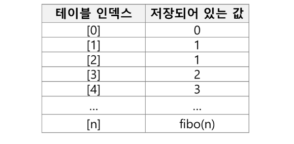
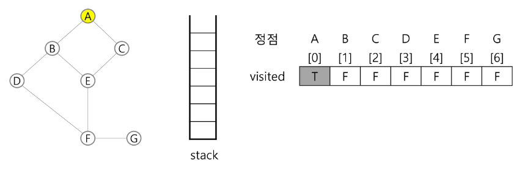
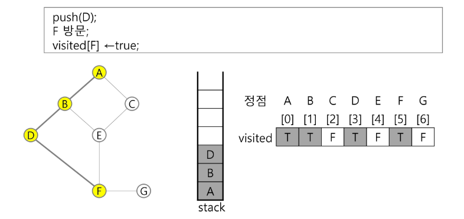
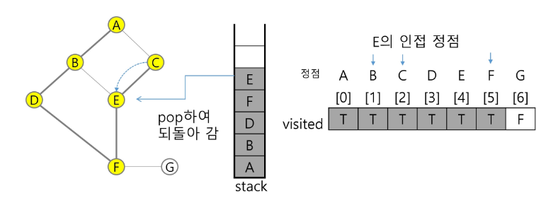
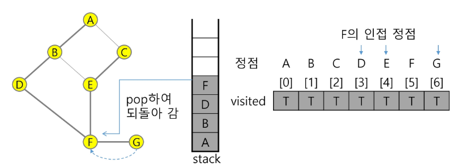
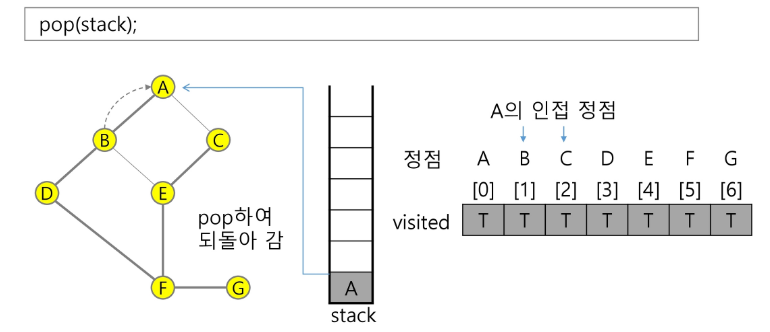
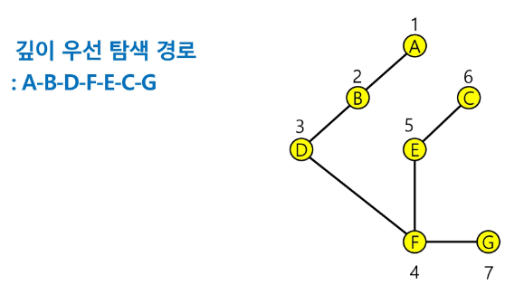

# DP
## 동적 계획 (Dynamic Programming) 알고리즘
- 그리디 알고리즘과 같이 최적화 문제를 해결하는 알고리즘

- 동적 계획 알고리즘은 먼저 입력 크기가 작은 부분 문제들을 모두 해결한 후에 그 해들을 이용하여 보다 큰 크기의 부분 문제들을 해결하여, 원래 주어진 입력의 문제를 해결하는 알고리즘

#### 피보나치 수 DP 적용
- 피보나치 수는 부분 문제의 답으로부터 본 문제의 답을 얻을 수 있으므로 최적 부분 구조로 이루어져 있다.
  1. 문제를 부분 문제로 분할한다.
  

  2. 부분 문제로 나누는 일을 끝냈으면 가장 작은 부분 문제부터 해를 구한다.

  3. 그 결과는 테이블에 저장하고, 테이블에 저장된 부분 문제의 해를 이용하여 상위 문제의 해를 구한다.
  

- 피보나치 수 DP 적용 알고리즘
```python
def fibo2(n):
  f = [0] * (n+1)
  f[0] = 0
  f[1] = 1
  for i in range(2. n+1):
    f[i] = f[i-1] + f[i-2]

  return f[n]
```

- DP의 구현 방식
  - recursive 방식 : fib1()
  - iterative 방식 : fib2()

  - memoization을 재귀적 구조에 사용하는 것보다 반복적 구조로 DP를 구현한 것이 성능 면에서 보다 효율적
  - 재귀적 구조는 내부에 시스템 호출 스택을 사용하는 오버헤드가 발생하기 떄문

# DFS(깊이우선탐색: Depth First Search)
- 비선형구조인 그래프 구조는 그래프로 표현된 모든 자료를 "빠짐없이 검색"하는 것이 중요함.

- 시작 정점의 한 방향으로 갈 수 있는 경로가 있는 곳까지 깊이 탐색해 가다가 더 이상 갈 곳이 없게 되면, 가장 마지막에 만났던 갈림길 간선이 있는 정접으로 되돌아와서 다른 방향의 정점으로 탐색을 계속 반복하여 결국 모든 정점을 방문하는 순회방법
  - 탐색 -> 갈림길 -> 하나를 선택해서 탐색 -> 더이상 갈곳이 없다면 -> 지나온 길 중 가장 가까운 갈림길로 돌아감
  - (지나온 갈림길을 전부 저장하고 있어야 한다. - 스택 이용 혹은 재귀 사용)

- <span style='background-color: #dcffe4'>가장 마지막에 만났던 갈림길의 정점으로 되돌아가서 다시 깊이 우선 탐색을 반복해야 하므로 후입선출 구조의 스택 사용</span>

### DFS 알고리즘 구현
1) 시작 정점 v를 결정하여 방문한다.
2) 정점 v에 인접한 정접중에서
  1. 방문하지 않은 정점 w가 있으면, 정점 v를 스택에 push하고 정점 w를 방문한다. 그리고 w를 v로 하여 다시 '2)'를 반복한다. 
  2. 방문하지 않은 정점이 없으면, 탐색의 방향을 바꾸기 위해서 스택을 pop하여 받은 가장 마지막 방문 정점을 v로 하여 다시 '2)'를 반복한다.
3) 스택이 공백이 될 때까지 2)를 반복한다.

```python
visited[], stack[] 초기화
DFS(v)
  시작점 v방문:
  visited[v] <- true:
  while {
    if (v의 인접 정점 중 방문 안 한 정점 w가 있으면)
      push(v);
      v <- w; (w에 방문)
      visited[w] <- true;
    else:
      if stack: # 스택이 비어있지 않으면
        v <- pop(stack);
      else:
        break
  }
end DFS()
```

#### DFS 구현 설명
0) 초기 상태 : 배열 visited를 False로 초기화하고, 공백 스택을 생성


1) 정점 A를 시작으로 깊이 우선 탐색을 시작
```bash
A 방문;
  visited[A] <- True:
```


2) 정점 A에 방문하지 않은 정점 B, C가 있으므로 A를 스택에 push하고, 인접정점 B와 C 중에서 오름차순에 따라 B를 선택하여 탐색을 계속한다.
```bash
push(A):
B방문;
visited[b] <- True:
```

3) 정점 B에 방문하지 않은 정점 D, E가 있으므로 B를 스택에 push하고, 인접정점 D와 E 중에서 오름차순에 따라 D를 선택하여 탐색을 지속한다.

4) 정점 D에 방문하지 않은 정점 F가 있으므로 D를 스택에 push 하고, 인접정점 F를 선택하여 탐색을 계속한다.


5) 정점 F에 방문하지 않은 정점 E, G가 있으므로 F를 스택에 push하고, 인접정점 E와 G중에서 오름차순에 따라 E를 선택하여 탐색을 계속한다.

6) 정점 E에 방문하지 않은 정점 C가 있으므로 E를 스택에 push하고, 인접정점 C를 선택하여 탐색을 계속한다.


7) 정점 C에서 방문하지 않은 인접정점이 없으므로, 마지막 정점으로 돌아가기 위해 스택을 pop하여 받은 정점 E에 대해서 방문하지 않은 인접정점이 있는지 확인한다.
```bash
pop(stack):
```


8) 정점 E는 방문하지 않은 인접정점이 없으므로, 다시 스택을 pop 하여 받은 정점 F에 대해서 방문하지 않은 인접정점이 있는지 확인한다.
```bash
pop(stack):
```


9) 정점 F에 방문하지 않은 정점 G가 있으므로 F를 스택에 push하고, 인접정점 G를 선택하여 탐색을 계속한다.
```bash
push(F);
G 방문;
visited[G] <- True:
```


10) 정점 G에서 방문하지 않은 인접정점이 없으므로, 마지막 정점으로 돌아가기 위해 스택을 pop하여 받은 정점 F에 대해서 방문하지 않은 인접정점이 있는지 확인한다.
```bash
pop(stack):
```


11) 정점 F에서 방문하지 않은 인접정점이 없기에, 다시 마지막 정점으로 돌아가기 위해 스택을 pop하여 받은 정점 D에 대해서 방문하지 않은 인접정점이 있는지 확인한다.

12) D에서 방문하지 않은 인접정점이 없으므로, 다시 마지막 정점으로 돌아가기 위해 스택을 pop하여 받은 정점 B에 대해서 방문하지 않은 인접정점이 있는지 확인한다.

13) 정점 B에서 방문하지 않은 인접정점이 없으므로, 다시 마지막 정점으로 돌아가기 위해 스택을 pop하여 받은 정점 A에 대해서 방문하지 않은 인접정점이 있는지 확인한다.


14) 현재 정점 A에서 방문하지 않은 인접 정점이 없으므로 마지막 정점으로 돌아가기 위해 스택을 pop 하는데, 스택이 공백이므로 깊이 우선 탐색을 종료한다.


## DFS 예시
```python
'''
1
7 8
1 2 1 3 2 4 2 5 4 6 5 6 6 7 3 7
'''

def DFS(s, n): # 시작 정점 s, 정점개수(1번부터인 마지막 정점) n
    visited = [0]*(n+1)     # 방문한 정점을 표시
    stack = []     # 스택 생성
    print(s)
    visited[s] = 1 # 시작정점 방문 표시
    v = s   # s를 할당받는 새 변수(시작점)
    while True:
        for w in adjL[v]:   # v에 인접하고, 방문안한 w가 있으면
            if visited[w] == 0:
                stack.append(v)  # push(n) 현재 정점을 push하고
                v = w   # w에 방문
                print(v)    # 방문한 순서 표시 출력
                visited[w] = 1 # w에 방문 표시
                break   # for w에 대한 break - n부터 다시 탐색
        else:       # 남은 인접 정점이 없어서 break가 걸리지 않은 경우
            if stack:   # 이전 갈림길을 스택에서 꺼내서... if TOP > -1
                v = stack.pop()
            else:   # 되돌아갈 곳이 없으면 혹은 남은 갈림길이 없으면 탐색 종료
                break   # while True에 대한 break

            
T = int(input())
for rc in range(1, T+1):
    V, E = map(int, input().split())
    # 인접 리스트 저장 방법
    adjL = [[] for _ in range(V+1)]
    arr = list(map(int, input().split()))
    # 두 개씩 가져오는 작업
    for i in range(E):
        v1, v2 = arr[i*2], arr[i*2 + 1]
        adjL[v1].append(v2)
        adjL[v2].append(v1) # 거꾸로의 연결 상태 추가

    DFS(1,V)
```