# 계산기
- 문자열로 된 계산식이 주어질 때, 스택을 이용하여 이 계산식의 값을 계산할 수 있다.
- 문자열 수식 계산의 일반적 방법
  - step1-1.
    - 수식의 각 연산자에 대해서 우선순위에 따라 괄호를 사용하여 다시 표현한다.
    - 각 연산자를 그에 대응하는 오른쪽 괄호의 뒤로 이동시킨다.
    - 괄호를 제거한다.
    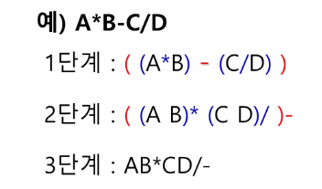

  - step1-2. 중위 표기법에서 후위 표기법으로의 변환 알고리즘(스택이용)
    1. 입력 받은 중위 표기식에서 토큰을 읽는다.
    2. 토큰이 피연산자면 토큰을 출력한다.
    3. 토큰이 연산자(괄호포함)일 때, 이 토큰이 스택의 top에 저장되어 있는 연산자보다 우선순위가 높으면 스택에 push하고, 그렇지 않다면 스택 top의 연산자의 우선순위가 토큰의 우선순위보다 작을 때까지 스택에서 pop한 후 토큰의 연산자를 push한다. 만약 top에 연산자가 없으면 push한다.
    4. 토큰이 오른쪽 괄호 ')'이면 스택 top에 왼쪽 괄호 '('가 올 때까지 스택에 pop 연산을 수행하고 pop 한 연산자를 출력한다. 왼쪽 괄호를 만나면 pop만 하고 출력하지는 않는다.
    5. 중위 표기식에 더 읽을 것이 없다면 중지, 더 읽을 것이 있다면 1부터 다시 반복한다.
    6. 스택에 남아 있는 연사자를 모두 pop하여 출력한다.
      - 스택 밖의 왼쪽 괄호는 우선순위가 가장 높으며, 스택 안의 왼쪽 괄호는 우선순위가 가장 낮다.
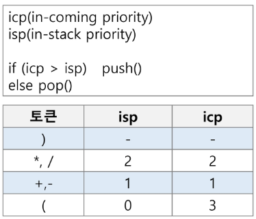

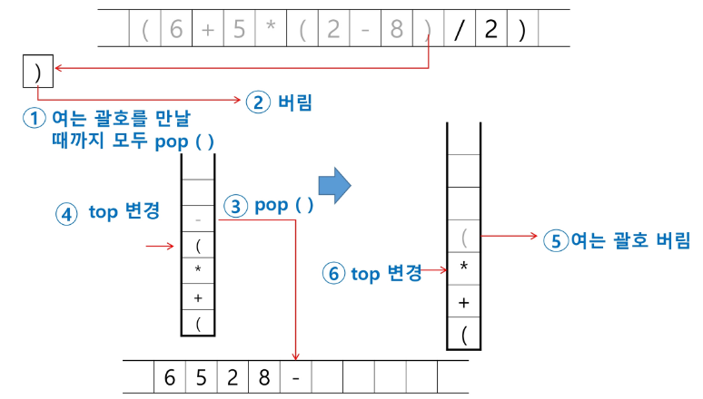
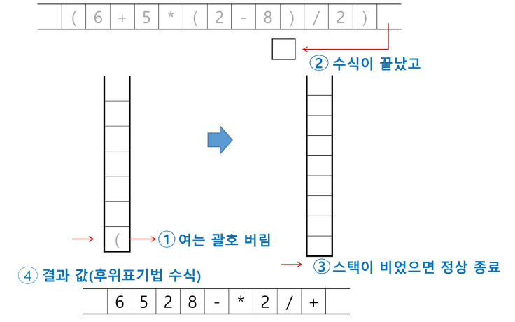

- step2. 후위 표기법의 수식을 스택을 이용하여 계산한다.
  1. 피연산자를 만나면 스택에 push한다.
  2. 연산자를 만나면 필요한 만큼의 피연산자를 스택에서 pop하여 연산하고, 연산결과를 다시 스택에 push한다.
  3. 수식이 끝나면, 마지막으로 스택을 pop하여 출력한다.

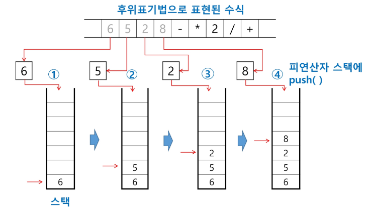
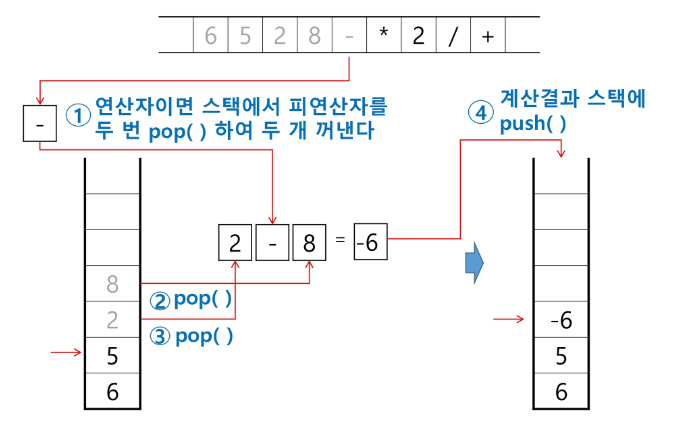
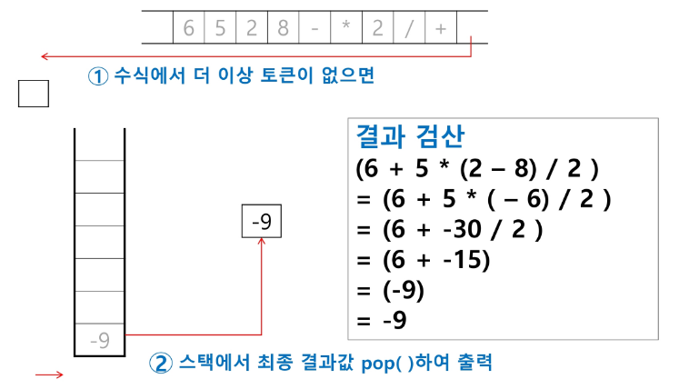


# 백트랙킹
- 백트래킹(Backtracking) 기법은 해를 찾는 도중에 '막히면'(해가 아닐 경우) 되돌아가서 다시 해를 찾아 가는 기법
- 백트래킹 기법은 최적화(optimization) 문제와 결정(decision)문제를 해결할 수 있다.
- 결정문제 : 문제의 조건을 만족하는 해가 존재하는지의 여부를 'yes'도는 'no'로 답하는 문제

## 백트래킹과 깊이우선탐색과의 차이
- 어떤 노드에서 출발하는 경로가 해결책으로 이어질 것 같이 않은면 더 이상 그 경로를 따라가지 않음으로써 시도의 횟수를 줄임. (Prunnung 가지치기)
- 깊이우선탐색이 모든 경로를 추적하는데 비해 백트래킹은 불필요한 경로를 조기에 차단.
- 깊이우선탐색을 가하기에는 경우의 수가 너무나 많음. 즉, N! 가지의 경우의 수를 가진 문제에 대해 깊이우선탐색을 가하면 당연히 처리 불가능한 문제.
- 백트래킹 알고리즘을 적용하면 일반적으로 경우의 수가 줄어들지만 이 역시 최악의 경우에는 여전히 지수함수 시간(Exponential Time)을 요하므로 처리 불가능

- 모든 후보를 검사하지 않는다!

## 백트래킹 기법
 - 어떤 노드의 유망성을 점섬한 후에 유망(promising)하지 않다고 결정됨녀 그 노드의 부모로 되돌아가(baxktracking) 다음 자식 노드로 감
 - 어떤 노드를 방문하였을 때 그 노드를 포함한 경로가 해답이 될 수 없으면 그 노드는 유망하지 않다고 하며, 반대로 해답의 가능성이 있으면 유망하다고 한다.
 - 가지치기(pruning) : 유망하지 않는 노드가 포함된느 경로는 더 이상 고려하지 않는다.

 ### 백트래킹 알고리즘
 1. 상태 공간 트리의 깊이 우선 검색을 실시
 2. 각 노드가 유망한지를 점검
 3. 만일 그 노드가 유망하지 않으면, 그 노드의 부모 노드로 돌아가서 검색 지속
 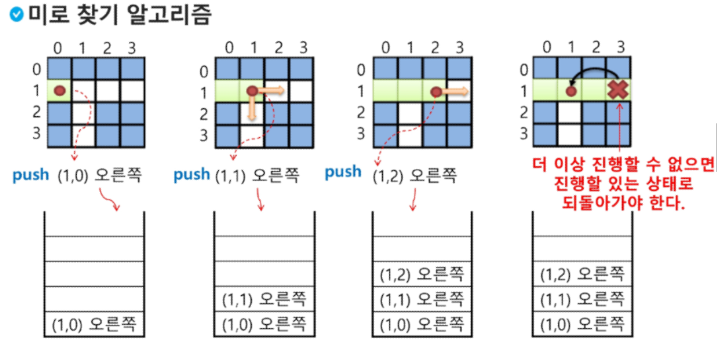
 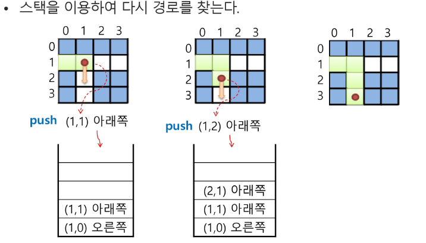

 - 일반 백트래킹 알고리즘
 ```bash
def checknode(v): # node
  if promising(v):
    if ther is a solution at v:
      write the solution
    else:
      for u in each chile of v:
        checknode(u)
 ```
 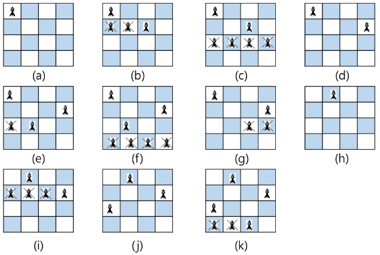

 ## 부분집합
 - 어떤 집합의 공집합과 자기자신을 포함한 모든 부분집합을 powerset이라고 하며 구하고자 하는 어떤 집합의 원소 개수가 n일 경우 부분집합의 개수는 2^n개다.

 - 백트래킹 기법으로 powerset 만들기
  - n개의 원소가 들어있는 집합의 2^n개의 부분집합을 만들 때는, true 또는 false값을 가지는 항목들로 구성된 n개의 배열을 만드는 방법을 이용
  - 배열의 i번쨰 항목은 i번쨰의 원소가 부분집합의 값인지 아닌지를 나타내는 값이다.
  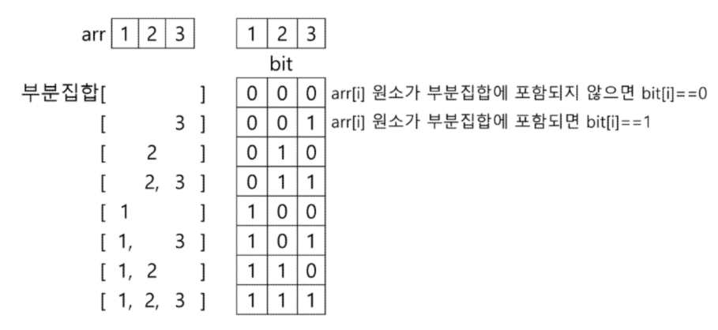

- 각 원소가 부분집합에 포함되었는지를 loop를 이용해 확인하고 부분집합 생성법
```python
bit = [0, 0, 0, 0]
for i in range(2):
  bit[0] = i            # 0번째 원소
  for j in range(2):
    bit[1] = j          # 1번째 원소
    for k in range(2):
      bit[2] = k        # 2번째 원소
      for l in range(2):
        bit[3] = l      # 3번째 원소
        print(bit)      # 생성된 부분집합 출력
```

```python
def backtrack(a, k, n):   # a 주어진 배열, k 결정할 원소, n 원소 개수
  c = [0]*MAXCANDIDATES

  if k ==n:
    proocess_solution(a,k) # 답이면 원하는 작업을 한다.
  else:
    ncandidates = construct_candidates(a, k, n, c)
    for i in range(ncandidates):
      a[k] = c[i]
      backtrack(a, k+1), n

def construct_candidates(a, k, n, c):
  c[0] = True
  c[1] = False
  return 2

def process_solution(a, k):
  for i in range(k):
    if a[i]:
      print(num[i], end = ' ')
  print()

MAXCANDIDATES = 2
NMAX = 4
a = [0]*NMAX
num = [1,2,3,4]
backtrack(a,0,3)
```

## 가지치기

```python
def f(i, K):  # bit[i]를 결정하는 함수
  if i == K:  # 모든 원소에 대해 결정하면
    sum_a = 0     # 부분집합의 합을 저장할 변수
    for j in range(K):
      if bit[j]:  # bit[j]가 0이 아니면
        # print(a[j], end = ' ')  # 모든 원소 출력
        s += a[j]
    print(' : ', s)       # 부분집합을 한 행에 표시
  else:
    # bit[i] = 1
    # f(i+1, K)
    # bit[i] = 0
    # f(i+1, K)
    for j in [1, 0]:
      bit[i] = j
      f(i+1, K)
  

N = 3
a = [1,2,3]   # 주어진 원소의 집합
bit = [0]*N   # 원소의 포함여부를 표시하는 배열

f(0, N)       # N개의 원소에 대해 부분집합을 만드는 함수
```

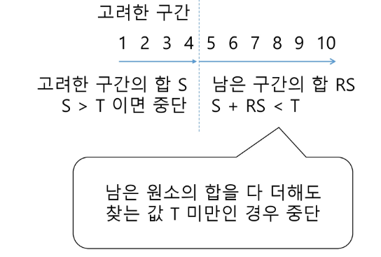

- 추가 고려사항

### 순열
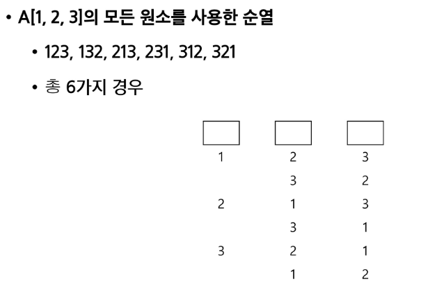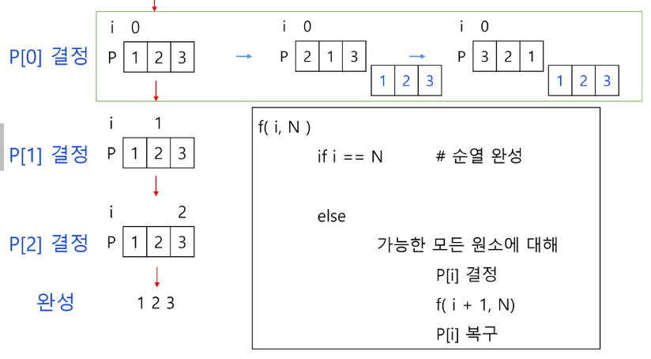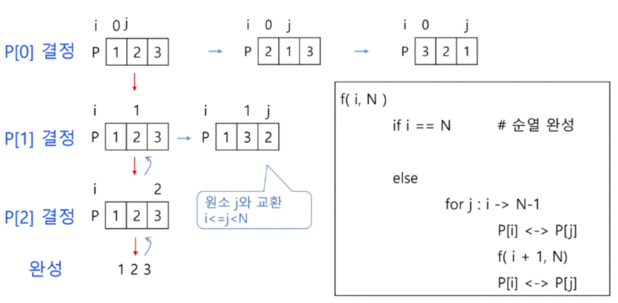