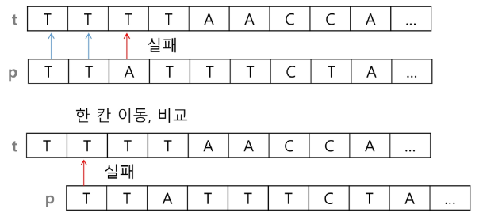
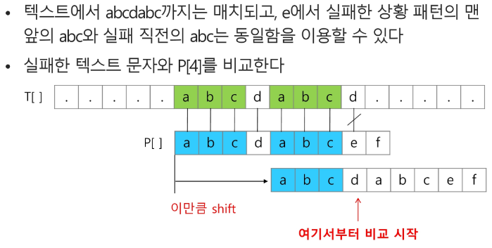
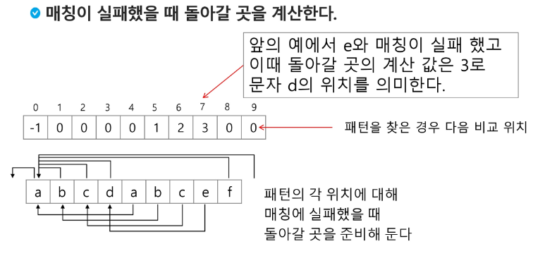
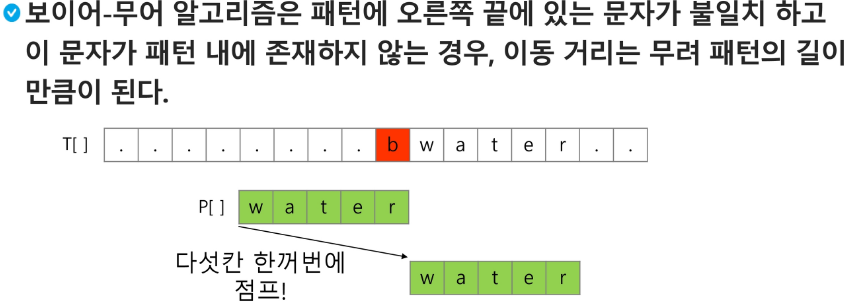
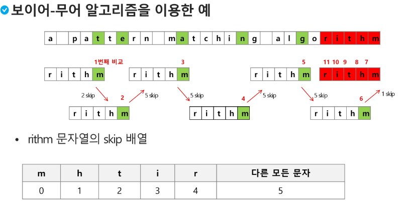

## 패턴 매칭
### 고지식한 알고리즘(Brute Force) _ 시간복잡도 최대 O(MN)
- 본문 문자열을 처음부터 끝까지 차례대로 순회하면서 패턴 내의 문자들을 일일이 비교


```python
p = 'is'  # 찾을 패턴
t = 'this is a book~!'  # 전체 텍스트
M = len(p)  # 찾을 패턴의 길이
N = len(t)  # 전체 텍스트의 길이

def BruteForce(p, t):
  i = 0 # t의 인덱스
  j - 0 # p의 인덱스
  while j < M and i < N:
    # if t[i] != p[j]:
    #   i = i - j
    #   j = -1
    # i = i + 1
    # j = j + 1
    if t[i] == p[j]
      i += 1
      j += 1
    else:
      i = i-j+1
      j = 0
  if j == N : return i - M  # 검색 성공
  else: return -1   # 검색 실패
```

```python
t = 'TTTTTABC'
p = 'TTA'
N = len(t)
m = len(p)

cnt = 0
for i in range(N-M+1): # 비교 시작위치
  for j in range(M):
    if t[i + j] != p[j]:
      break   # for j, 다음 글자부터 비교 시작
  else: # for j가 중단없이 반복되면
    cnt += 1
```

### KMP 알고리즘 _ 시간 복잡도 O(M + N) - 상대적으로 효율적인 패턴검색
- 불일치가 발생한 텍스트 스트링의 앞 부분에 어떤 문자가 있는지를 미리 알고 있으므로, 불일치가 발생한 앞 부분에 대하여 다시 비교하지 않고 매칭을 수행
- 패턴을 전처리하여 배열 next[M]을 구해서 잘못된 시작을 최소화함
  - next[M] : 불일치가 발생했을 경우 이동할 다음 위치

  

  

```python
def kmp(t, p)
N = len(t)
M = len(p)
lps = [0] *(M+1)
# preprossecing _ for
j = 0 # 일치한 개수 == 비교할 패턴 위치
lps[0] -1
for i in ragne(1, M):
  lps[i] = j    # p[i] 이전에 일치한 개수
  if p[i] == p[j]:
    j += 1
  else:
    j = 0
lps[M] = j

# preprossecing _ while
i = 0  # 비교할 텍스트 위치
j = 0  # 비교할 패턴 위치
while i < N and j <= M:
  if j== -1 or t[i] == p[j]:  # 첫 글자가 불일치했거나, 일치하면
    i += 1
    j += 1
  else:       # 불일치
    j = lps[j]
  if j == M:    # 패턴을 찾을 경우
    pritn(i - M, end=' ')   # 패턴의 인덱스 출력
    j = lps[j]
```

### 보이어-무어 알고리즘 **시험 언급
- 오른쪽에서 왼쪽으로 비교
- 대부분의 상용 소프트웨어에서 채택하고 있는 알고리즘



#### 문자열 매칭 알고리즘 비교
- 찾고자 하는 문자열 패턴의 길이 m, 총 문자열 길이 n
  - 고지식한 패턴 검색 알고리즘 : 수행시간 O(mn)
  - 카프 - 라빈 알고리즘 : 수행시간 O(n)
  - KMP 알고리즘 : 수해이간 O(n)
- 보이어-무어 알고리즘
  - 앞의 두 매칭의 공통점은 텍스트문자열의 문자를 적어도 한 번씩은 훑어야한다.
  - 보이어 무어 알고리즘은 문자를 다 보지 않아도 된다.
  - 패턴을 오른쪽부터 비교한다
  - 최악은 동일하게 O(mn)
  - 일반적으로 O(n)보다 시간이 덜 든다.

```python
def f(t, p)  # 패턴 p와 일치하는 구간의 시작인덱스 리턴, 일치하는 경우가 없으면 -1 리턴
  N = len(t)
  M = len(p)

  for i in range(N - M + 1): # 비교 시작위치
    for j in range(M):
      if t[i + j] != p[j]:
        break    # for j, 다음 글자부터 비교 시작
    else: # for j가 중단 없이 반복되면
      return 1  # 패턴을 찾은 경우
  return -1
t = 'TTTTTABC'
p = 'TTA'
```

