# 다 대 일 관계
# Many to one relationships
한 테이블의 0개 이상의 레코드가 다른 테이블의 레코드 한 개와 관련된 관계

### Comment - Article
0개 이상(N)의 댓글은 1개의 게시글에 작성될 수 있다.

- 테이블 관계
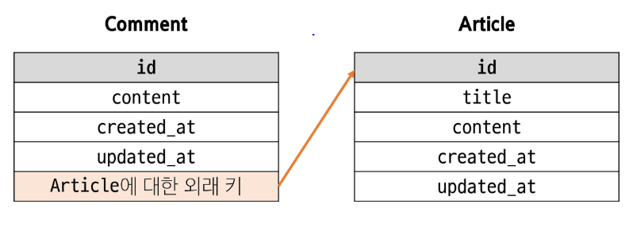

## 댓글 모델 정의
- **ForeignKey 클래스의 인스턴스 이름은 참조하는 모델 클래스 이름의 단수형으로 작성하는 것을 권장
- 외래 키는 ForeignKey 클래스를 작성하는 위치와 관계없이 테이블의 마지막 필드로 생성됨
```py
# articles/models.py
class Comment(models.Model):
  article = models.ForeignKey(상대 모델 클래스, on_delete=models.CASCADE)
```

### Foreignkey(to, on_delete)
한 모델이 다른 모델을 참조하는 관계를 설정하는 필드 
  - to
    - 참조하는 모델 class 이름
  - on_delete
    - 외래 키가 참조하는 객체(1)인 클래스가 삭제 됐을 때,
    - 외래키를 가진 객체(N)를 어떻게 처리할 지를 정의하는 설정(데이터 무결성)
  - on_delete의 'CASCADE'
    - 참조된 객체(부모객체)가 삭제 될 때 이를 참조하는 모든 객체도 삭제되도록 지정
- N:1관계 표현
- 데이터베이스에서 외래 키로 구현


## 역참조
- N:1관계에ㅓ 1에서 N을 참조하거나 조회하는 것 (1 -> N)
- 모델 간의 관계에서 관계를 정의한 모델이 아닌, 관계의 대상이 되는 모델에서 연결된 객체들에 접근하는 방식
- N은 외래 키를 가지고 있어 물리적으로 참조가 가능하지만, 1은 N에 대한 참조 방법이 존재하지 않아 별도의 역참조 키워드가 필요

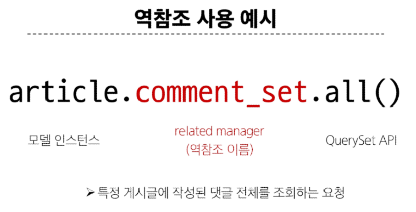

### related manager
N:1  혹은 M:N관계에서 역참조 시에 사용하는 매니저
- 'objects' 매니저를 통해 QuerySet API를 사용했던 것처럼 사용
- 이름 규칙
  - **N:1관계에서 생성되는 Related manager의 이름은 "모델명_set" 형태로 자동 생성됨
    - 관계를 직접 정의하지 않은 모델에서 연결된 객체들을 조회할 수 있게 함
  - 특정 댓글의 게시글 참조 (Comment -> Article)
    - comment.article
  - 특정 게시글의 댓글 목록 참조 (Article -> Comment)
    - article.comment_ser.all()

## 댓글 create 구현
1. 사용자로부터 댓글 데이터를 입력 받기 위한 CommentForm 정의
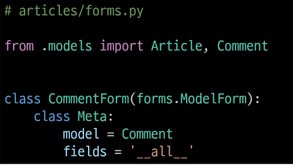
2. detail view 함수에서 CommentForm을 사용하여 detail 페이지에 렌더링
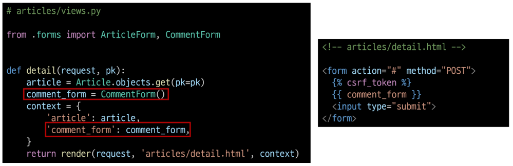
3. 
- Comment 클래스의 외래 키 필드 article 또한 데이터 입력이 필요한 필드이기 때문에 출력 되는 것
- **하지만, 외래 키 필드 데이터는 사용자로부터 입력 받는 값이 아닌 view 함수 내에서 다른 방법으로 전달 받아 저장 돼야함.
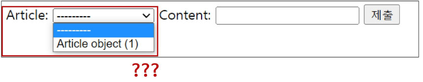
4. CommentForm의 출력 필드 조정하여 외래 키 필드가 출력되지 않도록 조정
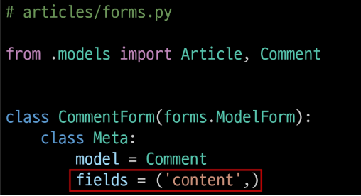
5. 
- 출력에서 제외된 외래키 데이터는 detail 페이지의 URL을 살펴보면
- path('<int:pk>/', views.detail, name='detail')에서 해당 게시글의 pk값이 사용되고 있다.
- 댓글의 외래 키 데이터에 필요한 정보가 바로 게시글의 pk 값
6. url 작성 및 action 값 작성
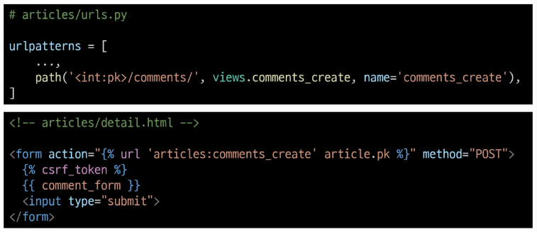
7. comments_create view 함수 정의
   - url로 받은 pk 인자를 게시글을 조회하는 데 사용 
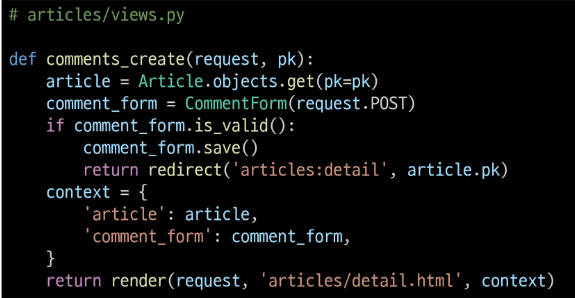

### save(commit=False)
DB에 저장 요청을 보내지 않고 인스턴스만 반환
(Create, but don't sace the new instance)

8. save의 commit 인자를 활용해 외래 키 데이터 추가 입력
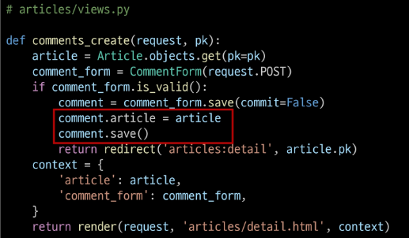


## 댓글 READ 구현
- detail view 함수에서 전체 댓글 데이터를 조회
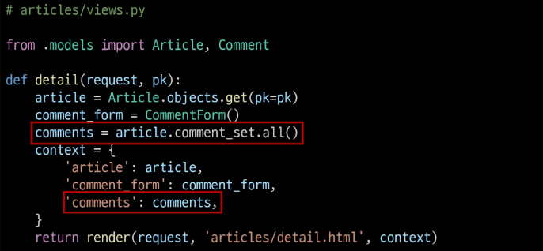
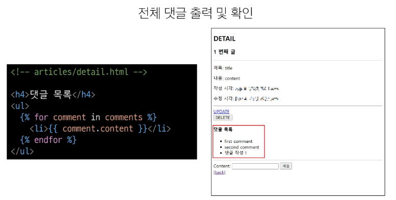

## 댓글 DELETE 구현
- 댓글 삭제 url
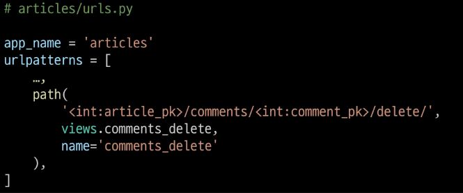
- 댓글 삭제 view
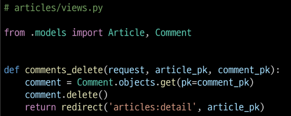
- 댓글 삭제 버튼
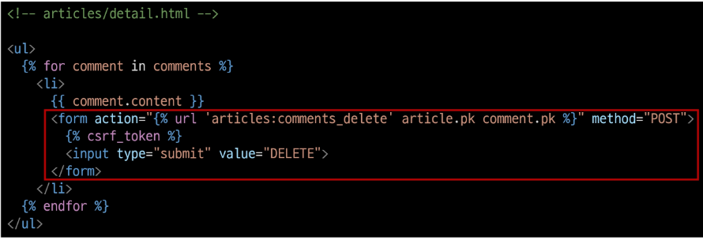


### 데이터 무결성
- 데이터베이스에 저장된 데이터의 정확성, 일관성, 유효성을 유지하는 것
- 데이터베이스에 저장된 데이터 값의 정확성을 보장하는 것
- 중요성
  - 데이터의 신뢰성 확보
  - 시스템 안정성
  - 보안 강화

### admin site등록
Comment 모델을 admin site에 등록해 CRUD 확인
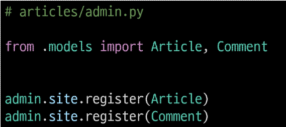

#### 대체 콘텐츠 출력
- 댓글이 없는 경우
DTL의 'for empty' 태그 활용 
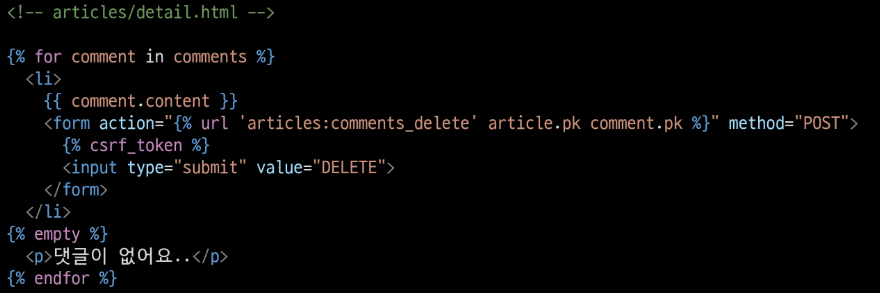

- 댓글 갯수 출력
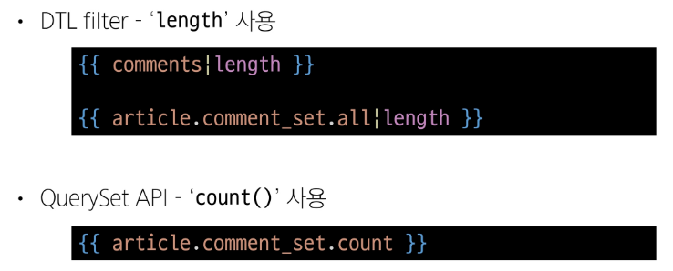

## User와 다른 모델 간의 모델 관계 설정
1. User & Article
2. User & Comment

### Article(N) - User(1)
0개 이상의 게시글은 1명의 회원에 의해 작성될 수 있다.

### Comment(N) - User(1)
0개 이상의 댓글은 1명의 회원에 의해 작성 될 수 있다.

### Article - User 모델 관계 설정
User 외래 키 정의
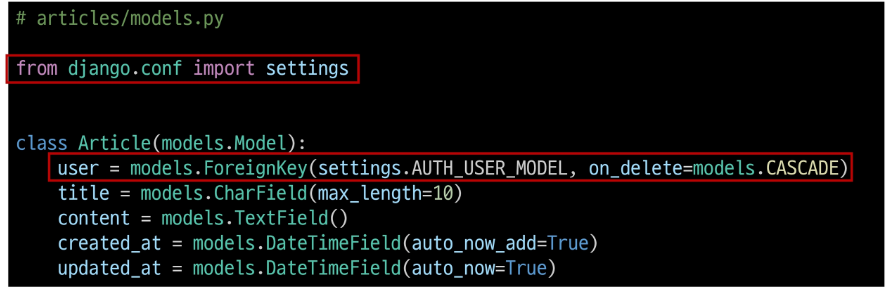

# **User 모델을 참조하는 2가지 방법
django 프로젝트 '내부적인 구동 순서'와 '반환 값'에따른 이유
- **기억해야 할 것은 User 모델은 직접 참조하지 않는다는 것
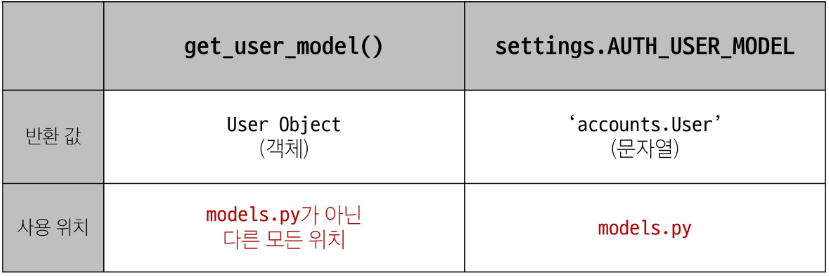

## Migration
1. 
   - 기존에 테이블이 있는 상황에서 필드를 추가 하려하기 때문에 발생하는 과정
   - 기본적으로 모든 필드에는 NOT NULL 제약 조건이 있기 때문에 데이터가 없이는 새로운 필드가 추가되지 못함
   - '1'을 입력하고 Enter 진행 (다음 화면에서 직접 기본 값 입력)
   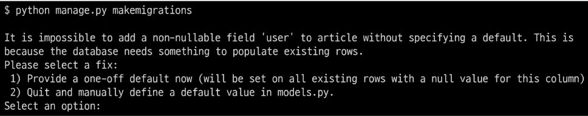

2. 
- 추가하는 외래 키 필드에 어떤 데이터를 넣을 것인지 직접 입력해야 함
- 마찬가지로 '1'을 입력하고 Enter 진행
- 기존에 작성된 게시글이 있다면 모두 1번 회원이 작성한 것으로 처리됨 
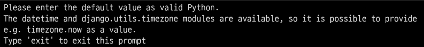

3. 
- migrations 파일 생성 후 migrate 진행
```py
$ python manage.py migrate
```

## 게시글 CREATE
1. 
- 기존 ArticleForm 출력 변화 확인
- User 모델에 대한 외래 키 데이터 입력을 위해 불필요한 input이 출력됨

2. 
- ArticleForm 출력 필드 수정
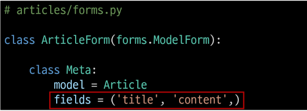

3. 
- 게시글 작성 시 에러 발생
- user_id 필드 데이터가 누락되었기 때문
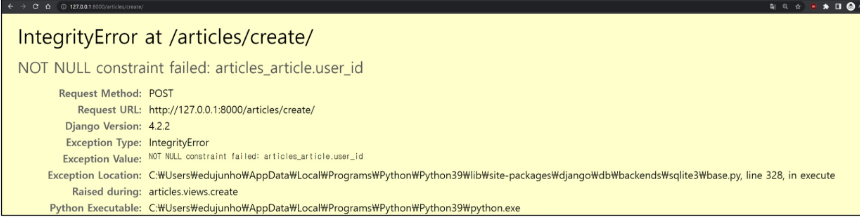

4. 
- 게시글 작성 시 작성자 정보가 함께 저장될 수 있도록 save의 commit 옵션 활용
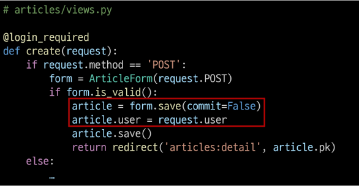

## 게시글 READ
- 각 게시글의 작성자 이름 출력
- index.html
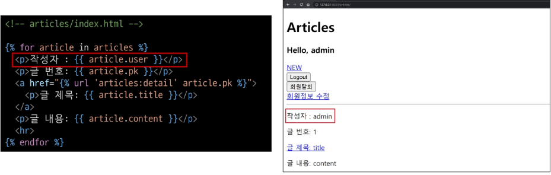
- detail.html
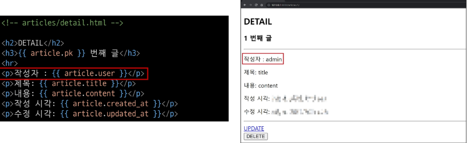

## 게시글 UPDATE
- 게시글 수정 요청 사용자와 게시글 작성 사용자를 비교하여 본인의 게시글만 수정할 수 있도록 하기
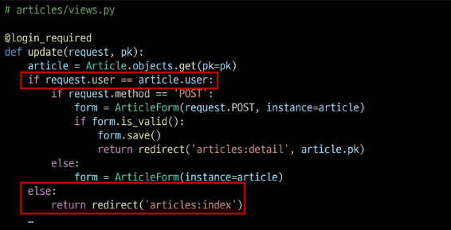

- 해당 게시글의 작성자가 아니라면, 수정/삭제 버튼을 출력하지 않도록 하기
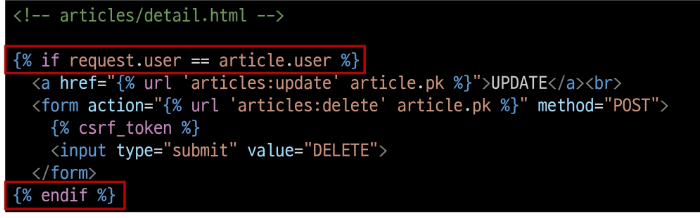

## 게시글 DELETE
- 삭제를 요청하려는 사람과 게시글을 작성한 사람을 비교하여 본인의 게시글만 삭제 할 수 있도록 하기
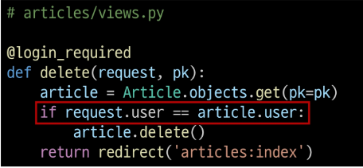


# Comment & User
## 모델 관계 설정
- User 외래 키 정의
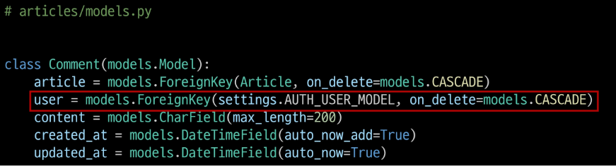

## Migration
- 이전에 Article 와 User 모델 관계 설정 때와 동일한 상황
- 기존 Comment 테이블에 새로운 필드가 빈 값으로 추가될 수 없기 때문에 기본 값 설정 과정이 필요
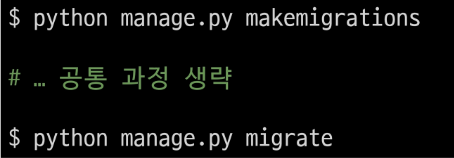


## 댓글 CREATE
- 댓글 작성 시 이전에 게시글 작성 할 떄와 동일한 에러 발생
- 댓글의 user_id 필드 데이터가 누락되었기 때문
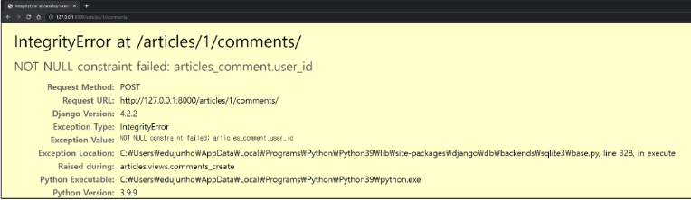

- 댓글 작성 시 작성자 정보가 함께 저장할 수 있도록 작성
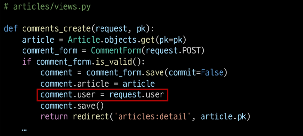

## 댓글 READ
- 댓글 출력 시 댓글 작성자와 함께 출력
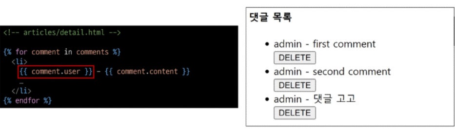


## 댓글 DELETE
- 댓글 삭제 요청 사용자와 댓글 작성 사용자를 비교하여 본인의 댓글만 삭제할 수 있도록 하기
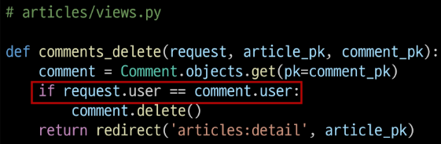
- 해당 댓글의 작성자가 아니라면, 댓글 삭제 버튼을 출력하지 않도록 함
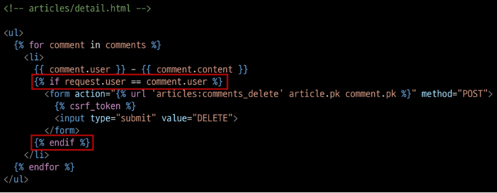

# View decorators
- View 함수의 동작을 수정하거나 추가 기능을 제공하는 데 사용되는 Python 데코레이터
- 코드의 재사용성을 높이고 뷰 로직을 간결하게 유지'

## Allowed HTTP methods
특정 HTTP method로만 View 함수에 접근할 수 있도록 제한하는 데코레이터
1. require_http_methods(["METHOD1", "METHOD2",...])
  - 지정된 HTTP method만 허용
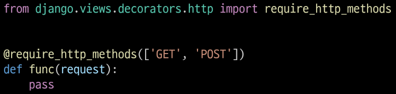
2. require_safe()
  - GET과 HEAD method만 허용
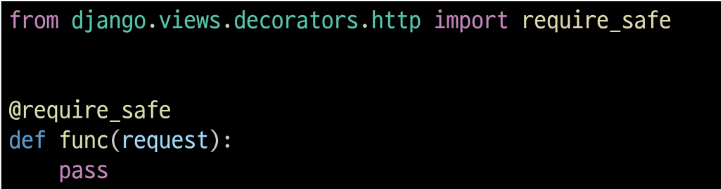
3. require_POST()
  - POST method만 허용
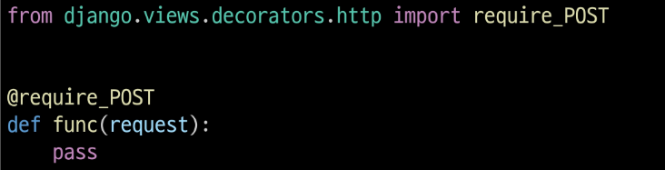

### Allowed HTTP methods 주요 특징
- 지정되지 않은 HTTP method로 요청이 들어오면 HttpResponseNotAllowed (405)를 반환
- 대문자로 HTTP method를 지정

### require_GET 대신 require_safe를 권장하는 이유
- 웹 표준 준수
  - GET과 HEAD는 "안전한(safe)" 메소드로 간주됨
- 호환성
  - 일부 소프트웨어는 HEAD 요청에 의존
- 웹 표준을 준수하고, 더 넓은 범위의 클라이언트와 호환되며, 안전한 HTTP 메소드만을 허용하는 view 함수를 구현할 수 있음

# ERD
- "Entity-Relationship Diagram"
- 데이터베이스의 구조를 시각적으로 표현하는 도구
- Entity(개체), 속정, 그리고 엔티티 간의 관계를 그래픽 형태로 나타내어 시스템의 논리적 구조를 모델링하는 다이어그램

## ERD 구성요소
1. 엔티티 (Entity)
   - 데이터베이스에 저장되는 객체나 개념
   - ex) 고객, 주문, 제품
2. 속성 (Attribute)
   - 엔티티의 특성이나 성질
   - ex) 고객(이름, 주소, 전화번호)
3. 관계 (Relationship)
   - 엔티티 간의 연관성
   - ex) 고객이 '주문'한 제품

## 개체와 속성
- 개체 : 회원 (User)
- 속성 : 회원번호 (id), 이름(name), 주소(address) 등
  - 개체가 지닌 속성 및 속성의 데이터 타입

- 관계 : 회원과 댓글 간의 관계
  - 회원이 "작성"한 댓글
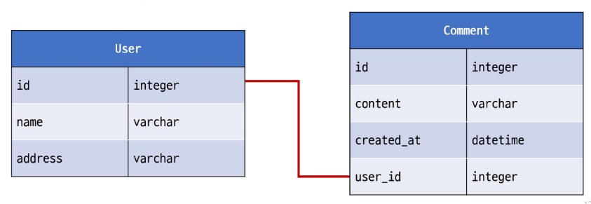

## Cardinality
- 한 엔티티와 다른 엔티티 간의 수적 관계를 나타내는 표현
- 주요 유형
  1. 일대일
  2. 다대일
  3. 다대다

- Cardinality 표현
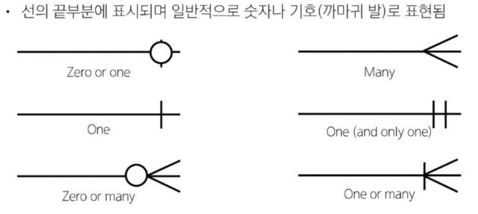

## ERD의 중요성
- 데이터베이스 설계의 핵심 도구
- 시각적 모델링으로 효과적인 의사소통 지원
- 실제 시스템 개발 전 데이터 구조 최적화에 중요