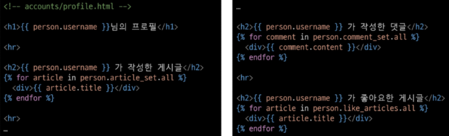
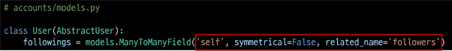

# 다 대 다
# Many to many relationships
### N:M or M:N
한 테이블의 0개 이상의 레코드가 다른 테이블의 0개 이상의 레코드와 관련된 경우
** 양쪽 모두에서 N:1관계를 가짐

## 중개 모델
Django에서는 'ManyToManyField'로 중개모델을 자동으로 생성

### ManyToManyField()
M:N 관계 설정 모델 필드

- 모델에 ManyToManyField 작성
  - 참조하는 두 모델 중 어느 모델에 작성해도 상관 없으며 참조/역참조 관계만 잘 기억할 것

### 'through' argument
중개 테이블에 '추가 데이터'를 사용해 M:N 관계를 형성하려는 경우 사용

- 예약 생성 방법 중 두 인스턴스 중 하나를 통한 예약 생성 시
  - through_defaults = {'' : ''} 딕셔너리의 형태로 생성

## M:N 관계 주요 사항
- M:N 관계로 맺어진 두 테이블에는 물리적인 변화가 없음
- ManyToManyField는 중개 테이블을 자동으로 생성
- ManyToManyField는 M:N 관계를 맺는 두 모델 어디에 위치해도 상관 없음
  - 대신 필드 작성 위치에 따라 참조와 역참조 방향을 주의
- N:1은 완전한 종속의 관계였지만 M:N은 종속적인 관계가 아니며 '의사에게 진찰받는 환자 & 환자를 진찰하는 의사' 이런 식의 2가지 형태로 모두 대등한 표현 가능

## ManyToManyField(to, **options)
M:N 관계 설정 시 사용하는 모델 필드

- 특징
  - 양방향 관계
    - 어느 모델에서든 관련 객체에 접근할 수 있음
  - 중복 방지
    - 동일한 관계는 한 번만 저장됨

1. 'related_name' arguments
   - 역참조 시 사용하는 manager name을 변경
2. 'symmetrical' arguments
   - 관계 설정 시 대칭 유무 설정
   - ManyToManyField가 동일한 모델을 가리키는 정의에서만 사용
   - 기본값 : True
     - True일 경우
       - source 모델의 인스턴스가 target모델의 인스턴스를 참조하면 자동으로 target 모델 인스턴스도 source 모델 인스턴스를 자동으로 참조하도록 함(대칭)
       - 즉, 내가 당신의 친구라면 자동으로 당신도 내 친구가 됨
     - False일 경우
       - True와 반대(대칭되지 않음)

                                  - source 모델
                                    - 관계를 시작하는 모델
                                  - target 모델
                                    - 관계의 대상이 되는 모델
3. 'through' arguments
   - 사용하고자 하는 중개모델을 지정
   - 일반적으로 '추가 데이터를 M:N 관계와 연결하려는 경우'에 활용

### M:N에서의 대표 조작 methods
- add()
  - 관계 추가
  - "지정된 객체를 관련 객체 집합에 추가"
- remove()
  - 관계 제거
  - "관련 객체 집합에서 지정된 모델 객체를 제거"

# 좋아요
## Many to many relationships
### N:M or M:N
한 테이블의 0개 이상의 레코드가 다른 테이블의 0개 이상의 레코드와 관련된 경우
** 양쪽 모두에서 N:1관계를 가짐

### Article(M) - User(N)
0개 이상의 게시글은 0명 이상의 회원과 관련
- 게시글은 회원으로부터 0개 이상의 좋아요를 받을 수 있고, 회원은 0개 이상의 게시글에 좋아요를 누를 수 있음

### 모델 관계 설정
1. Article 클래스에 ManyToManyField 작성

2. Migration 진행 후 에러 발생

3. related_name 작성 후 Migration 재진행

#### 역참조 매니저 충돌
1.  
- N:1
  - "유저가 작성한 게시글"
  - user.article_set.all()
- M:N
  - "유저가 좋아요 한 게시글"
  - user.article_set.all()

1. 
- like_users 필드 생성 시 자동으로 역참조 매니저 .article_set가 생성됨
- 그러나 이전 N:1(Article-User) 관계에서 이미 같은 이름의 매니저를 사용 중
  - user.article_set.all() -> 해당 유저가 작성한 모든 게시글 조회
- 'user가 작성한 글(user.article_set)'과 'user가 좋아요를 누른 글(user.article_set)'을 구분할 수 없게 됨
- **user와 관계된 ForeignKey 혹은 ManyToManyField 둘 중 하나에 related_name 작성 필요**

### User - Article 간 사용 가능한 전체 related manager
- article.user
  - 게시글을 작성한 유저 - N:1
- user.article_set
  - 유저가 작성한 게시글(역참조) - N:1
- article.like_users
  - 게시글을 좋아요 한 유저 - M:N
- user.like_articles
  - 유저가 좋아요 한 게시글(역참조) - M:N

## 좋아요 기능 구현
1. url 작성

2. view 함수

3. index 템플릿에서 각 게시글에 좋아요 버튼 출력

# 팔로우
## 프로필 페이지
- 각 회원의 개인 프로필 페이지에 팔로우 기능을 구현하기 위해 프로필 페이지 먼저 구현
## 프로필 구현
1. url

2. view

3. profile 템플릿

4. 프로필 페이지로 이동할 수 있는 링크 작성

## 모델 관계 설정
### User(M) - User(N)
0명 이상의 회원은 0명 이상의 회원과 관련
회원은 0명 이상의 팔로워를 가질 수 있고, 0명 이상의 다른 회원들을 팔로잉할 수 있음

- ManyToManyField 작성

- 참조
  - 내가 팔로우하는 사람들(팔로잉, followings)
- 역참조
  - 상대방 입장에서 나는 팔로워 중 한 명(팔로워, followers)
- 바뀌어도 상관 없으나 관계 조회 시 생각하기 편한 방향으로 정한 것
- Migrations진행

## 팔로우 기능 구현
1. url

2. view

3. 프로필 유저의 팔로잉, 팔로워 수 & 팔로우, 언팔로우 버튼 작성

# Fixtures
Django가 데이터베이스로 가져오느 방법을 알고 있는 데이터 모음
- 데이터는 데이터베이스 구조에 맞추어 작성 되어있음
- Fixtures의 사용 목적 : 초기 데이터 제공
- 필요성
  - 협업하는 유저 A,B가 있다면
    - A가 먼저 프로젝트를 작업 후 원격 저장소에 push 진행
      - gitignore로 인해 DB는 업로드하지 않기 떄문에 A가 생성한 데이터도 업로드x
    - B가 원격 저장소에서 A가 push한 프로젝트를 pull 혹은 clone
      - 결과적으로 B는 DB가 없는 프로젝트를 받게 됨
  - 이처럼 프로젝트의 앱을 처음 설정할 때 동일하게 준비된 데이터로 데이터베이스르 미리 채우는 것이 필요한 순간이 있음
  - Django에서는 fixtures를 사용해 앱에 초기 데이터(initial data)를 제공

## Dumpdata - 생성(데이터 추출)
데이터베이스의 모든 데이터를 추출

**Fixtures 파일을 직접 만들지 말 것
반드시 dumpdata 명령어를 사용하여 생성

## Loaddata - 로드(데이터 입력)
Fixtures 데이터를 데이터베이스로 불러오기

### Fixture 파일 기본 경로
app_name/fixtures/

- Django는 설치된 모든 app의 디렉토리에서 fixtures 폴더 이후의 경로로 fixtures 파일을 찾아 load

- 활용
  1. db.sqlite3 파일 삭제 후 migrate 진행
  
  2. load 진행 후 데이터가 잘 입력되었는 지 확인
  

- loaddata 순서 주의사항
  - 만약 loaddata를 한 번에 실행하지 않고 별도로 실행한다면 모델 관계에 따라 load 순서가 중요할 수 있음
    - comment는 article에 대한 key 및 user에 대한 key가 필요
    - article은 user에 대한 key가 필요
  - 즉, 현재 모델 관계에서는 user -> article -> comment 순으로 data를 load해야 오류가 발생하지 않음
  