# 데이터베이스
체계적인 데이터 모음

# 데이터
저장이나 처리에 효육적인 형태로 변환된 정보

## 데이터를 저장하고 잘 관리하여 활용할 수 있는 기술이 중요해짐
- 기존의 데이터 저장 방식
  1. 파일(file) 이용
    - 어디에서나 쉽게 사용 가능
    - 데이터를 구조적으로 관리하기 어려움
  2. 스프레드 시트(Spreadsheet) 이용
    - 테이블의 열과 행을 사용해 데이터를 구조적으로 관리 가능
    - 한계가 있음
      - 크기
        - 일반적으로 약 100만 행까지만 저장 가능
      - 보안
        - 단순히 파일이나 링크 소유 여부에 따른 단순한 접근 권한 기능 제공
      - 정확성
        - 공식적으로 이름의 변동이 발생한다면
        - 하나의 변경으로 인해 모든 위치에서 해당 값을 업데이트 해야함
        - 찾기 및 바꾸기 기능이 있지만 여러 시트에 분산돼 있으면 누락이 생기거나 하는 등의 문제가 발생할 수 있음.

## Relational Database
### 데이터베이스의 역할
데이터를 저장하고 조작 (CRUD)

### 관계형 데이터베이스
데이터 간에 관계가 있는 데이터 항목들의 모음
- 테이블, 행, 열의 정보를 구조화하는 방식
- **서로 관련된 데이터 포인터를 저장하고 이에 대한 엑세스를 제공

### 관계
여러 테이블 간의 논리적 연결
- 관계로 할 수 있는 것
  이 관계로 인해 두 테이블을 사용하여 데이터를 다양한 형식으로 조회할 수 있음
  - 특정 날짜에 구매한 모든 고객 조회
  - 지난 달에 배송일이 지연된 고객 조회 등

### **관계형 데이터베이스의 사용
- 각 데이터에 고유한 식별 값을 부여하기 (기본 키, Primary Key)
- 주문 정보에 고객의 고유한 식별 값을 저장하기(외래 키, Foreign Key)

### 관계형 데이터베이스 관련 키워드
1. Table (Relation)
2. Field (Column, Attribute)
3. Record (Row, Tuple)
  - 각 레코드에는 구체적인 데이터 값이 저장됨(행)
4. Database (Schema)
  - 테이블의 집합
5. Primary Key (기본 키, PK)
  - 각 레코드의 고유한 식별값
  - 관계형 데이터베이스에서 레코드의 식별자로 활용
6. Foreign Key (외래 키, FK)
  - 테이블의 필드 중 다른 테이블의 레코드를 식별할 수 있는 키
  - 다른 테이블의 기본 키를 참조
  - 각 레코드에서 서로 다른 테이블 간의 관계를 만드는 데 사용

## DBMS
#### Database Management System
데이터베이스를 관리하는 소프트웨어 프로그램
- 데이터 저장 및 관리를 용이하게 하는 시스템
- 데이터베이스와 사용자 간의 인터페이스 역할
- 사용자가 데이터 구성, 업데이트, 모니터링, 백업, 복구 등을 할 수 있도록 도움

## RDBMS
#### Relational Database Management System
관계형 데이터베이스를 관리하는 소프트웨어 프로그램

## **데이터베이스 정리
- Table은 데이터가 기록되는 곳
- Table에는 행에서 고유하게 식별 가능한 기본 키라는 속성이 있으며 외래 키를 사용하여 각 행에서 서로 다른 테이블 간의 관례를 만들 수 있음
- 데이터는 기본 키 또는 외래 키를 통해 결합(join)될 수 있는 테이블에 걸쳐 구조화 됨

# SQL
#### Structure Query Language
데이터베이스에 정보를 저장하고 처리하기 위한 프로그래밍 언어
  - 테이블의 형태로 구조화된 관계형 데이터베이스에게 요청을 질의

## SQL Syntax
1. SQL 키워드는 대소문자를 구분하지 않음
   - 하지만 대문자로 작성하는 것을 권장 (명시적 구분)
2. **각 SQL Statements의 끝에는 세미콜론(';')이 필요
   - 세미콜론은 각 SQL Statements을 구분하는 방법 (명령어의 마침표)

## SQL Statements
SQL을 구성하는 가장 기본적인 코드 블록

- 해당 예시 코드는 SELECT Statement라 부름
- 이 Statement는 SELECT, FROM 2개의 keyword로 구성 됨

## 수행 목적에 따른 SQL Statements 4가지 유형
1. DDL - 데이터 정의
2. DQL - 데이터 검색
3. DML - 데이터 조작
4. DCL - 데이터 제어

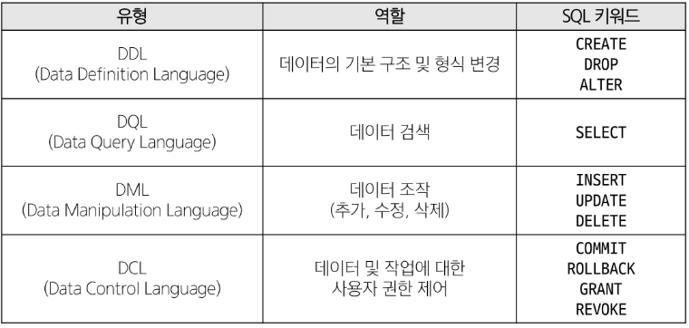

### SQL 표준
- SQL은 미국 국립 표준 협회(ANSI)와 국제 표준화 기구(ISO)에 의해 표준이 채택됨
- 모든 RDBMS에서 SQL 표준을 지원
- 다만 각 RDBMS마다 독자적인 기능에 따라 표준을 벗어나는 문법이 존재

### Query
- 데이터베이스로부터 정보를 요청하는 것
- 일반적으로 SQL로 작성하는 코드를 쿼리문(SQL문)이라 함

## Single Table Queries
### Querying data
### SELECT statement
테이블에서 데이터를 조회

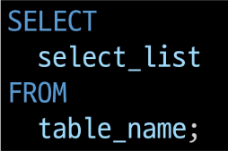
- SELECT 키워드 이후 데이터를 선택하려는 필드를 하나 이상 지정(여러개일 경우 지정한 필드들의 데이터를 조회)
  - 조회시 '이름' 등의 지정 형식으로 출력하기 위한 방법으로 'AS' 사용
  - 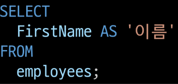
- FROM 키워드 이후 데이터를 선택하려는 테이블의 이름을 지정

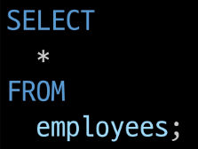
- SELECT 키워드 이후 * 표시를 통해 테이블의 모든 필드 데이터를 조회

### Sorting data
### ORDER BY statement
조회 결과의 레코드를 정렬
- FROM clause 뒤에 위치
- 하나 이상의 컬럼을 기준으로 결과를
  - 오름차순(ASC, 기본 값)
  - 내림차순(DESC)으로 정렬
    - 필드명 뒤에 작성 x - 오름차순(기본 값)
    - 내림차순을 위해선 필드명 뒤에 DESC를 붙임
    - **NULL값이 존재할 경우 오름차순 정렬 시 결과에 NULL이 먼저 출력

### Filtering data
- Clause
  - DISTINCT
  - WHERE
  - LIMIT
- Operator
  - BETWEEN
  - IN
  - LIKE
  - Comparison
  - Logical

### DISTINCT statement
조회 결과에서 중복된 레코드를 제거
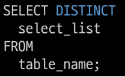
- SELECT 키워드 바로 뒤에 작성
- SELECT DISTINCT 키워드 다음에 고유한 값을 선택하려는 하나 이상의 필드를 지정

### WHERE statement - 중요!
조회 시 특정 검색 조건을 지정
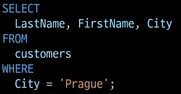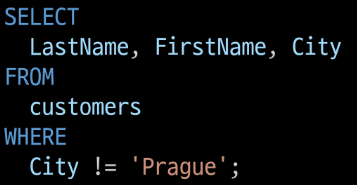
- 도시 이름이 'Prague'인 / 아닌 정보 조회
- FROM clause 뒤에 위치
- search_condition은 비교연산자 및 논리연산자(AND, OR, NOT 등)를 사용하는 구문이 사용됨

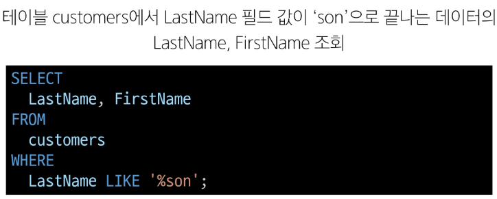

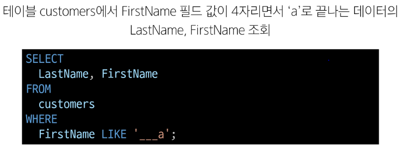

### IN Operator
값이 특정 목록 안에 있는지 확인

### LIKE Operator
값이 특정 패턴에 일치하는지 확인(Wildcards와 함께 사용)

### LIMIT clause
조회하는 레코드 수를 제한
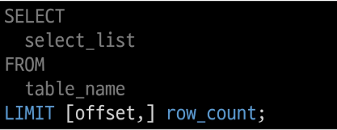
- 하나 또는 두 개의 인자를 사용(0 또는 양의 정수)
- row_count는 조회하는 최대 레코드 수를 지정
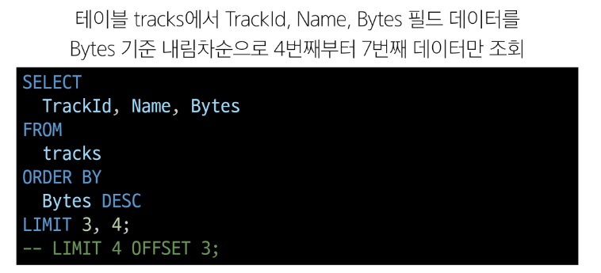

## Grouping data
### GROUP BY clause
레코드를 그룹화하여 요약본 생성
('집계 함수'와 함께 사용)

- Aggregation Functions 집계함수
값에 대한 계산을 수행하고 단일한 값을 반환하는 함수
(SUM, AVG, MAX, MIN, COUNT)

### GROUP BY syntax
- FROM 및 WHERE 절 뒤에 배치
- GROUP BY 절 뒤에 그룹화 할 필드 목록을 작성
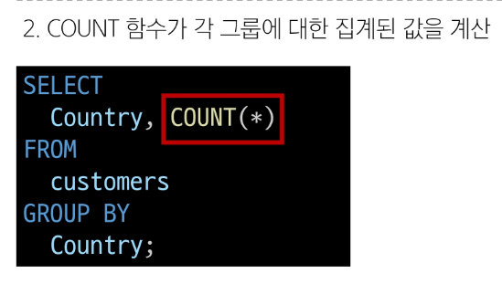
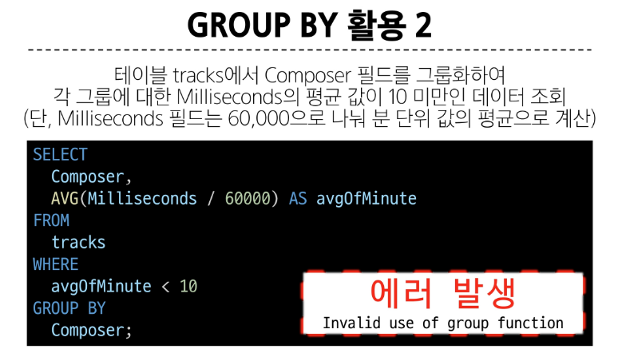

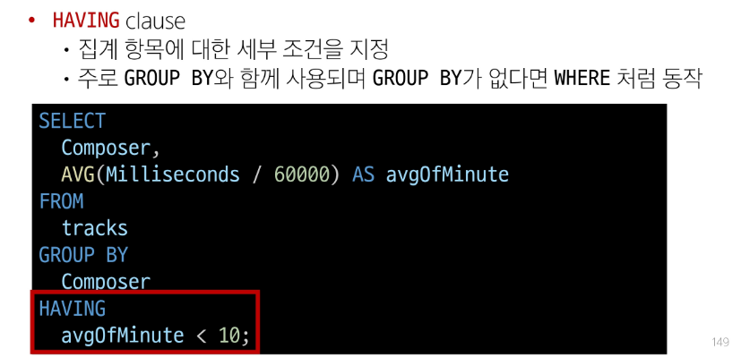

## SELECT statement 실행 순서
1. 테이블에서 (FROM)
2. 특정 조건에 맞추어 (WHERE)
3. 그룹화 하고 (GROUP BY)
4. 만약 그룹 중에서 조건이 있다면 맞추고 (HAVING)
5. 조회하여 (SELECT)
6. 정렬하고 (ORDER BY)
7. 특정 위치의 값을 가져옴 (LIMIT)

