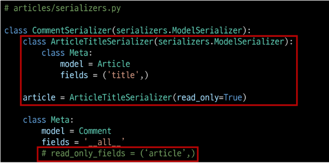

# DRF with N:1 Relation

### 사전 준비
- Comment 모델 정의
  - Comment 클래스 정의 및 데이터베이스 초기화

  - Migration 및 fixtures 데이터 로드

## GET method - List
- 댓글 목록 조회를 위한 CommentSerializer 정의

- url

- view

## GET method - Detail
- 단일 댓글 조회를 위한 url 및 view 함수

## POST method
- 단일 댓글 생성을 위한 url

- view
  - serializer 인스턴스의 save() 메서드는 특정 Serializer 인스턴스를 저장하는 과정에서 추가 데이터를 받을 수 있음

- 상태코드 400 응답 확인
- CommentSerializer에서 외래 키에 해당하는 article field 또한 사용자로부터 입력 받도록 설정되어 있기 때문에 서버 측에서는 누락되었다고 판단한 것
- 유효성 검사 목록에서 제외 필요
- **article field를 읽기 전용 필드로 설정하기

### **읽기 전용 필드(read_only_fields)
- 데이터를 전송 받은 시점에 "유효성 검사에서 제외시키고, 데이터 조회 시에는 출력"하는 필드

## DELETE & PUT
- 단일 댓글 삭제 및 수정을 위한 view 함수 작성

## 응답 데이터 재구성
### 댓글 조회 시 게시글 출력 내역 변경
- 댓글 조회 시 게시글 번호만 제공해주는 것이 아닌 '게시글의 제목'까지 제공하기

- 필요한 데이터를 만들기 위해 Serializer는 내부에서 추가 선언이 가능

## 역참조 데이터 구성
### Article -> Comment 간 역참조 관계를 활용한 JSON 데이터 재구성
- 아래 2가지 사항에 대한 데이터 재구성하기
  1. 단일 게시글 조회 시 해당 게시글에 작성된 댓글 목록도 함께 붙여서 응답
  2. 단일 게시글 조회 시 해당 게시글에 작선된 댓글 개수도 함께 붙여서 응답

## 단일 게시글 + 댓글 목록
1. 단일 게시글 + 댓글 목록
- Nested relationships (역참조 매니저 활용)
  - 모델 관계 상으로 참조하는 대상은 참조되는 대상의 표현에 포함되거나 중첩될 수 있음
  - 이러한 중첩된 관계는 serializers를 필드로 사용하여 표현 가능

2. 단일 게시글 + 댓글 개수
- 댓글 개수에 해당하는 새로운 필드 생성

### 'source' argument
- 필드를 채우는 데 사용할 속성의 리므
- 점 표기법(dotted notaion)을 사용하여 속성을 탐색할 수 있음

## **주의 읽기 전용 필드 지정 이슈
- 특정 필드를 override 혹은 추가한 경우 read_only_fields는 동작하지 않음
- 이런 경우 새로운 필드에 read_only 키워드 인자로 작성해야 함

### 읽기 전용 필드를 사용하는 이유
- 사용자에게 입력으로는 받지 않지만 제공은 해야하는 경우
- 새로운 필드 값을 만들어 제공해야 하는 경우
- 특징 및 주의사항
  - 유효성 검사에서 제외됨
  - 단, 유효성 검사에서 제외된다고 해서 반드시 "생성" 로직에서만 사용이 국한되는 것은 아님

### read_only_fields 속성과 read_only 인자의 사용처
- read_only_fields
  - 기존 외래 키 필드 값을 그대로 응답 데이터에 제공하기 위해 지정하는 경우
- read_only
  - 기존 외래 키 필드 값의 결과를 다른 값으로 덮어쓰는 경우
  - 새로운 응답 데이터 값을 제공하는 경우

### "설계 우선"접근법
- OAS 핵심 이점
- API를 먼저 설계하고 명세를 작성한 후, 이를 기반으로 코드를 구현
- API의 일관성을 유지하고, API 사용자는 더 쉽게 API를 이해하고 사용할 수 있음
- 또한, OAS를 사용하면  API가 어떻게 작동하는지를 시각적으로 보여주는 문서를 생성할 수 있으며, 이는 API를 이해하고 테스트하는 데 매우 유용
  - 이런 목적으로 사용되는 도구가 Swagger_UI 또는 ReDoc