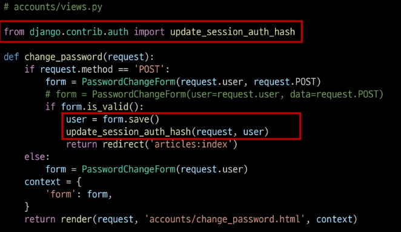

# 회원가입
User 객체를 Create하는 과정

## UserCreationForm()
회원 가입 시 사용자 입력 데이터를 받는 built-in ModelForm

## 회원 가입 페이지 작성


## 회원가입 로직 에러
- 회원가입에 사용하는 UserCreationForm이 대체한 커스텀 유저 모델이 아닌 과거 Django의 기본 유저 모델로 인해 작성된 클래스이기 때문에 에러가 발생

## 커스텀 유저 모델을 사용하려면 다시 작성해야하는 Form
- UserCreationForm
- UserChangeForm
  - 두 폼 모두  class Meta: Model = User가 작성된 Form이기 떄문에 재작성 필요

### get_user_model()
"현재 프로젝트에서 활성화된 사용자 모델(active user model)"을 반환하는 함수
- User 모델을 직접 참조하지 않는 이유
  - get_user_model()을 사용해 User모델을 참조하면 커스텀 User모델을 자동으로 반환해주기 때문
  - Django는 필수적으로 User 클래스를 직접 참조하는 대신 get_user_model()을 사용해 참조해야 한다고 강조하고 있음

## 회원가입 로직 완선
```py
# views.py
from .forms import CustomUserCreationForm

def signup(request):
  if request.method == 'POST':
    form = CustomUserCreationForm(request.POST)
    if form.is_valid():
      form.save()
      return redirect('articles:index')
  else:
    form = CustomUserCreationForm()
  context = {
    'form':form,
  }
  return render(request, 'accounts/signup.html', context)
```

# 회원탈퇴
User 객체를 Delete 하는 과정
  - 로그아웃은 session 삭제

## 회원탈퇴 로직 작성


# 회원정보 수정
User 객체를 Update하는 과정

## UserChangeForm()
회원정보 수정 시 사용자 입력 데이터를 받는 built-in ModelForm
- 사용 시의 문제점
  - User 모델의 모든 정보들(fields)까지 모두 출력됨
  - 일반 사용자들이 접근해서는 안되는 정보는 출력하지 않도록 해야함
    - 이에 따라 CustomUserChangeForm에서 출력 필드를 다시 조정해야한다.


## 회원정보 수정 로직 완성


# 비밀번호 변경
인증된 사용자의 Session 데이터를 Update하는 과정
## PasswordChangeForm()
비밀번호 변경 시 사용자 입력 데이터를 받는 built-in Form

## 비밀번호 변경 페이지 작성


## 비밀번호 변경 로직 완성
```py
# views.py
def change_password(request, user_pk):
  if request.method == 'POST':
    form = PasswordChangeForm(request.user, request.POST)
    if form.is_valid():
      form.save()
      return redirect('articles:index')
  else:
    form = PasswordChangeForm(request.user)
  context = {
    'form':form,
  }
  return render(request, 'accounts/change_password.html', context)
```

## 세션 무효화 방지 - 암호 변경 시
- 비밀번호가 변경되면 기존 세션과의 회원 인증 정보가 일치하지 않게 되어버려 로그인 상태가 유지되지 못하고 로그아웃 처리됨
- 비밀번호가 변경되면서 기존 세션과의 회원 인증 정보가 일치하지 않기 때문

## update_session_auth_hash(request, user)
암호 변경 시  세션 무효화를 막아주는 함수
- 암호가 변경되면 새로운 password의 Session Data로 기존 session을 자동으로 갱신



## 로그인 사용자에 대해 접근을 제한하는 2가지 방법
1. is_authenticated 속성
2. login_required 데코레이터

### is_authenticated
사용자가 인증되었는 지 여부를 알 수 있는 User model의 속성
- 모든 User 인스턴스에 대해 항상 True인 읽기 전용 속성
- 비인증 사용자에 대해서는 항상 False


### 적용


### login_required 데코레이터
인증된 사용자에 대해서만 view 함수를 실행시키는 데코레이터
- 비인증 사용자의 경우 /accounts/login/ 주소로 redirect 시킴

### 적용


## 회원가입 후 로그인까지 이어서 진행하려면


## 탈퇴와 함께 기존 사용자의 Session Data 삭제 방법
- 사용자 객체 삭제 이후 로그아웃 함수 호출
- 단, "탈퇴(1) 후 로그아웃(2)"의 순서가 바뀌면 안됨
- 먼저 로그아웃이 진행됨녀 해당 요청 객체 정보가 없어지기 때문에 탈퇴에 필요한 유저 정보 또한 없어지기 때문
