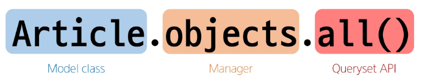

# ORM
### Object-Relational-Mapping
- 객체 지향 프로그래밍 언어를 사용하여 호환되지 않는 유형의 시스템 간에 데이터를 변환하는 기술
- Django에 내장된 ORM이 django와 db간 언어의 차이를 해석

## QuerySet API _ 중요!
- Python의 모델 클래스와 인스턴스를 활용해 DB에 데이터를 저장(C), 조회(R), 수정(U), 삭제(D)하는 것
- ORM에서 데이터를 검색, 필터링, 정렬 및 그룹화 하는데 사용하는 도구
  - API를 사용하여 SQL이 아닌 Python 코드로 데이터를 처리

- 구문




## Query
- 데이터베이스에 특정한 데이터를 보여달라는 요청
- 쿼리문 작성
  - 원하는 데이터를 얻기 위해 데이터베이스에 요청을 보낼 코드 작성
- 파이썬으로 작성한 코드가 ORM에 의해 SQL로 변환되어 데이터베이스에 전달
- 데이터베이스의 응답 데이터를 ORM이 QuerySet 자료 형태로 변환하여 우리에게 전달

## QuerySet
- 데이터베이스에게서 전달 받은 객체 목록(데이터 모음)
  - 순회가 가능한 데이터로써 1개 이상의 데이터를 불러와 사용할 수 있음
- Django ORM을 통해 만들어짐
- 단, 데이터베이스가 단일한 객체를 반환할 때는 QuerySet이 아닌 모델(Class)의 인스턴스로 반환

### CRUD
소프트웨어가 가지는 기본적인 데이터 처리 기능
- Create (저장)
- Read (조회)
- Update (갱신)
- Delete (삭제)

## * QuerySet API를 위한 라이브러리 설치 및 설정
```py
$ pip install ipython
$ pip install django-extensions
# settings.py - APPS에 추가

$ pip freeze > requirements.txt

$ python manage.py migrate # db
$ python manage.py shell_plus # 장고 쉘 실행
```

## Django Shell
- Django 환경 안에서 실행되는 python shell
- 입력하는 QuerySet API 구문이 Django 프로젝트에 영향을 미침

# Create
## 데이터 객체를 만드는 3가지 방법
### 첫 번째
```py
# 특정 테이블에 새로운 행을 추가하여 데이터 추가

>>> article = Article() # Article(class)로부터 article(instance) 생성
>>> article

>>> article.title = 'first' # 인스턴스 변수(title)에 값 할당
>>> article.content = 'django!' # 인스턴스 변수(content)에 값 할당

# save를 하지 않으면 아직 DB에 값이 저장되지 않음
>>> article

>>>Article.object.all()

# save를 호출하고 확인하면 저장된 것을 확인
>>> article.save()
>>> article

>>> article.id

>>> article.pk
>>>Article.objects.all()

# 인스턴스 article을 활용하여 인스턴스 변수 활용하기
>>> article.title
>>> article.content

>>> article.created_at
```

### 두 번쨰
```py
>>> article = Article(title='second', content ='django!')

>>> article

# save를 호출해야 저장됨
>>> article.save()
>>> article

>>> Article.object.all()

# 값 확인
>>> article.pk
>>> article.title
>>> article.content
```

### 세번째
```py
# 위 2가지 방법과 달리 바로 저장 이후 바로 생성된 데이터가 반환
>>> Article.objects.create(title='third', content='django!')
```

- save() : 객체를 데이터베이스에 저장하는 인스턴스 메서드

# Read
- 대표적인 조회 메서드
  - Return new QuertSets
    - all() : 전체 데이터 조회
    - filter() : 주어진 매개변수와 일치하는 객체를 포함하는 QuerySet 반환
  - Do not return QuertSets
    - get() : 주어진 매개변수와 일치하는 객체를 반환
      - get() 특징
        - 객체를 찾을 수 없으면 DoesNotExist 예외를 발생시키고,
        - 둘 이상의 객체를 찾으면 MultipleObjectsReturned 예외를 발생시킴
        - *중요! 위와 같은 특징을 가지고 있기 때문에 primary key와 같이 고유성(uniqueness)을 보장하는 조회에서 사용해야 함

# Uqdate
## 데이터 수정
```py
# 인스턴스 변수를 변경 후 save 메서드 호출
>>> article = Article.objects.get(pk=1) # 조회
>>> article.title = 'byebye'  # 변경

>>> article.save()  # 저장
>>> article.title # 확인
```

# Delete
## 데이터 삭제
```py
# 삭제하려는 데이터 조회 후 delete 메서드 호출
>>> article = Article.objects.get(pk=1) # 조회

>>> article.delete()  # 삭제 - 삭제된 객체가 반환

>>> Article.objects.get(pk=1) # 조회 불가
DoesNotExist
```