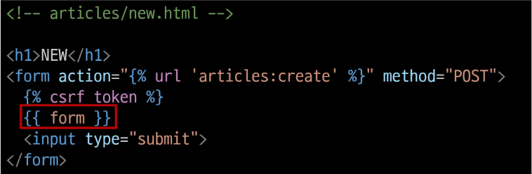
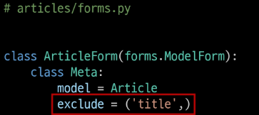
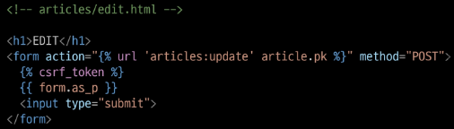

# Form
## HTML 'form'
- 사용자로부터 데이터를 제출 받기 위해 활용한 방법
- 그러나 비정상적 혹은 악의적인 요청을 필터링할 수 없음
- 유효한 데이터인지에 대한 확인이 필요

## 유효성 검사
- 수집한 데이터가 정확하고 유효한지 확인하는 과정
- 유효성 검사를 위해서 입력 값, 형식, 중복, 범위, 보안 등 많은 부분을 고려해야 하기 때문에
- Django가 제공하는 Form을 사용

## Django Form
- 사용자 입력 데이터를 수집하고,
- 처리 및 유효성 검사를 수행하기 위한 도구
- 유효성 검사를 단순화하고 자동화 할 수 있는 기능을 제공

## Form class
```py
# articles/forms.py

from django import forms

class ArticleForm(forms.Form):
  title = forms.CharField(max_length=10)
  content = forms.CharField()

# view 함수 new 변경
# articles/view.py

from .forms import ArticleForm

def new(request):
  form = ArticleForm()
  context = {
    'form' : form,
  }
  return render(request, 'articles/new.html', context)
```

- new 페이지(html)에서 form 인스턴스 출력


- label, input 쌍을 특정 HTML 태그로 감싸는 옵션
```py
{{ form.as_p }}
```

# Widgets
- HTML 'input' element의 표현을 담당

## Widget 적용
- widget은 단순히 input 요소의 속성 및 출력되는 부분을 변경하는 것
```py
# articles/forms.py
from django import forms

class ArticleForm(forms.Form):
  title = forms.CharField(max_length=10)
  content = forms.CharField(widget=forms.Textarea)
```

### Form과 ModelForm
- Form
  - 사용자 입력 데이터를 DB에 저장하지 않을 때 (검색, 로그인_회원가입 제외)
- ModelForm
  - 사용자 입력 데이터를 DB에 저장해야할 때 (게시글 작성, 회원가입)

## ModelForm
- Model과 연결된 Form을 자동으로 생성해주는 기능을 제공

## ModelForm class 정의
- 기존 ArticlsForm 클래스 수정

```py
# articles/forms.py
from django import forms
from .models import Article

class ArticlesForm(forms.ModelForm):
  class Meta:
    model = Article
    firelds = '__all__'
```

## Meta class
- ModelForm의 정보를 작성하는 곳

### 'fields' 및 'exclude' 속성
- exclude 속성을 사용하여 모델에서 포함하지 않을 필드를 지정할 수도 있음


### Meta class 주의사항
- Django에서 ModelForm에 대한 추가 정보나 속성을 작성하는 클래스 구조를 Meta클래스로 작성 했을 뿐이며, 파이썬의 inner class와 같은 문법적인 관점으로 접근하지 말 것

# ModelForm을 적용한 create 로직
```py
# articles/view.py
from .forms import ArticleForm

def create(request):
  # 1. 모델폼 인스턴스 생성핑(+ 사용자 입력 데이터를 통째로 인자로 생성)
  form = AticleForm(request.POST)

  # 2. 유효성 검사핑
  if form.is_valid():
    article = form.save()
    return redirect('articles:detail', article.pk)
  
  # 사유 form핑
  context = {
    'form' : form,
  }
  return render(request, 'articles/new.html', context)
```

- is_valid()
  - 여러 유효성 검사를 실행하고 데이터가 유효한지 여부를 Boolean으로 반환
  - 공백은 is_vaild()에 의해 False로 평가
  - form 객체에는 그에 맞는 에러 메시지가 포함되어 다음 코드로 진행됨

## ModelForm을 적용한 edit 로직
```py
articles/view.py

def edit(request, pk):
  article = Article.object.get(pk=pk)
  form = ArticleForm(instance=article)
  context = {
    'article' : article,
    'form' : form,
  }
  return render(request, 'articles/edit.html', context)
```


## ModelForm을 적용한 update 로직
```py
# articles/view.py

def update(request, pk):
  article = Article.object.get(pk=pk)
  # 1. 모델 폼 인스턴스 생성(+ 사용자 입력 데이터 & 기존 데이터)
  form = ArticleForm(request.POST, instance=article)
  # 2. 유효성 검사
  if form.is_vaild():
    form.save()
    return redirext('articles:detail', article.pk)
  context = {
    'article' : article,
    'form' : form,
  }
  return render(request, 'articles/deit.html', context)
```

## save 메서드
- save()
  - 데이터베이스 객체를 만들고 저장하는 ModelForm의 인스턴스 메서드
  - 키워드 인자 instance 여부를 통해 생성할 지, 수정할 지를 결정

## Django Form 정리
- 사용자로부터 데이터를 수집하고 처리하기 위한 강력하고 유연한 도구
- HTML form의 생성, 데이터 유효성 검사 및 처리를 쉽게 할 수 있도록 도움

# HTTP 요청 다루기
- new & create view 함수간 비교
- 공통점 : '데이터 생성을 구현하기 위함'
- 차이점 : 'new는 GET method 요청만을, create는 POST method 요청만을 처리'

## HTTP request method 차이점을 활용해 동일한 목적을 가지는 2개의 view 함수를 하나로 구조화

### new & create 함수 결합
```py
# articles/view.py
def create(request):
  if request.method == 'POST':
    form = ArticleForm(request.POST)
    if form.is_valid():
      article = form.save()
      return redirect('articles:detail', article.pk)
  else:
    form = ArticleForm()
  context = {
    'form' : form,
  }
  return render(request, 'articles/new.html', context)
```

### edit & update view 함수 결합
```py
# articles/view.py

def update(request, pk):
  article = Article.objects.get(pk=pk)
  if request.method == 'POST':
    form = ArticleForm(request.POST, instance=article)
    if form.is_valid():
      form.save()
      return redirext('articles:detail', article.pk)
  else:
    form = ArticleForm(instance=article)
  context = {
    'article' : article,
    'form' : form,
  }
  return render(request, 'articles/uqdate.html', context)
```