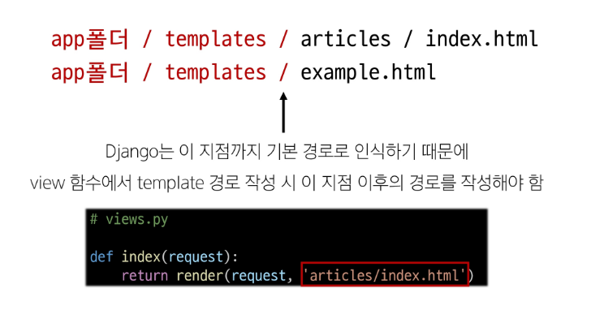

# Web Application
- 인터넷을 통해 사용자에게 제공되는 소프트웨어 프로그램을 구축하는 과정
- 다양한 디바이스(모바일, PC 등)에서 웹 브라우저를 통해 접근하고 사용할 수 있음


## 웹의 동작 방식


#### Client
- 클라이언트
- 서비스를 요청하는 주체 (웹 사용자의 인터넷이 연결된 장치, 웹 브라우저)

#### Server
- 서버
- 클라이언트의 요청에 응답하는 주체(웹 페이지, 앱을 저장하는 컴퓨터)


# Framework
## Web Framework
- 웹 애플리케이션을 빠르게 개발할 수 있도록 도와주는 도구
- 개발에 필요한 기본 구조, 규칙, 라이브러리 등을 제공

## Django framework
- python 기반의 대표적인 웹 프레임워크
  - 다양성 : python 기반으로 웹, 모바일 앱 백엔드, API 서버 및 빅데이터 관리 등 광범위 서비스에 적합
  - 확장성 : 대량의 데이터에 대해 빠르고 유연하게 확장 가능
  - 보안 : 취약점으로부터 보호하는 보안 기능이 기본적으로 내장되어 있음
  - 커뮤니티 지원 : 개발자를 위한 지원, 문서 및 업데이트를 제공하는 활성화 된 커뮤니티

# 가상환경 _ 중요!!
- Python 애플리케이션과 그에 따른 패키지들을 격리하여 관리할 수 있는 독립적인 실행 환경
1. 가상환경 venv 생성
   - venv라는 이름의 가상환경 생성 - 관례
```bash
$python -m venv venv
```

2. 가상환경 활성화
   - 활성화 명령어는 OS에 따라 다름 
```bash
$source venv/Scripts/activate
```

3. 설치된 패키지 목록 확인
```bash
$pip list
```

4. 설치된 패키지 목록 생성
   - 현재 Python 환경에 설치된 모든 패키지와 그 버전을 텍스트 파일로 저장
   - requirements.txt : 생성될 파일 이름 - 관례
```bash
$pip freeze > requirements.txt
```

**패키지 목록 기반 설치**
- 생성된 requirements.txt로 다른 환경에서 동일한 환경 구성
- 가상환경 활성화 후 requirenebts.txt에 작성된 목록을 기반으로 설치
```bash
$pip install -r requirements.txt
```

## 패키지 목록 파일 특징 및 주의사항
- 주요 특징
  - 가상환경의 패키지 목록을 쉽게 공유 가능
  - 프로젝트의 의존성을 명확히 문서화
  - 동일한 개발 환경을 다른 시스템에서 재현 가능
- 사용 시 주의사항
  - 활성화된 가상환경에서 실행해야 정확한 패키지 목록 생성
  - 시스템 전역 패키지와 구분 필요

## 의존성 패키지
- 한 소프트웨어 패키지가 다른 패키지의 기능이나 코드를 사용하기 때문에 그 패키지가 존재해야만 제대로 작동하는 관계
- 사용하려는 패키지가 설치되지 않았거나, 호환되는 버전이 아니면 오류가 발생하거나 예상치 못한 동작을 보일 수 있음


## 가상환경 주의사항 및 권장사항
1. 가상 환경에 "들어가고 나오는" 것이 아니라 사용할 Python 환경을 "On/Off"로 전환하는 개념
  -  가상환경 활성화는 현재 터미널 환경에만 영향을 끼침
  -  새 터미널 창을 열면 다시 활성화해야함
2. 가상환경을 "방"이 아니라 "도구 세트"
  - 활성화는 특정 도구 세트를 선택하는 것
3. 프로젝트마다 별도의 가상환경 사용
4. 일반적으로 가상환경 폴터 venv는 관련된 프로젝트와 동일한 경로에 위치
5. 가상환경 폴더 venv는 gitignore에 작성되어 원격 저장소에 공유되지 않음
  - 저장소 크기를 중려 효율적인 협업과 배포를 가능하게 하기 위함(requirements.txt를 공유)


## Django 프로젝트 생성 및 서버 실행
```bash
// 프로젝트 생성
$django-admin startproject firstpjt .

// 서버 실행
$python manage.py runserver
```

# Design Pattern
## 디자인 패턴
- 소프트웨어 설계에서 발생하는 문제를 해결하기 위한 일반적인 해결책
- 공통적인 문제를 해결하는 데 쓰이는 형식화 된 관행
  - "애플리케이션의 구조는 이렇게 구성하자"라는 관행

## MVC 디자인 패턴
- Model, View, Controller
- 애플리케이션을 구조화하는 대표적인 패턴
- "데이터" & "사용자 인터페이스" & "비즈니스 로직"을 분리
- 시각적 요소와 뒤에서 실행되는 로직을 서로 영향 없이, 독립적이고 ㅅ ㅟㅂ게 유지 보수할 수 있는 애플리케이션을 만들기 위해
  

## MTV 디자인 패턴
- Model, Template, View
- Django에서 애플리케이션을 구조와하는 패턴
- 기존 MVC 패턴과 동일하나 단순히 명칭을 다르게 정의한 것

# Project & App
## Django project
- 애플리케이션의 집합
- DB 설정, URL 연결, 전체 앱 설정 등을 처리

## Django application
- 독립적으로 작동하는 기능 단위 모듈
- 각자 특정한 기능을 담당하며 다른 앱들과 함께 하나의 프로젝트를 구성

## 앱 사용 순서
1. 앱 생성
- 앱의 이름은 '복수형'으로 지정하는 것을 권장
```bash
$python manage.py startapp articles
```
2. 앱 등록
- 반드시 앱을 '생성'한 후에 등록해야함


### 프로젝트 구조
- 주요 구조
  - settings.py
    - 프로젝트의 모든 설정을 관리
  - urls.py
    - 요청 들어오는 url에 따라 이에 해당하는 적절한 views를 연결

- 수정할 일 없는 구조
  - __init__.py
    - 해당 폴더를 패키지로 인식하도록 설정하는 파일
  - asgi.py
    - 비동기식 웹 서버와의 연결 관련 설정
  - wsgi.py
    - 웹 서버와의 연결 관련 설정
  - manage.py
    - Django 프로젝트와 다양한 방법으로 상호작용 하는 커맨드라인 유틸리티

### 앱 구조
- 주요 구조
  - admin.py
    - 관리자용 페이지 설정
  - models.py
    - DB와 관련된 Model을 정의
    - MTV 패턴의 M
  - views.py
    - HTTP 요청을 처리하고 해당 요청에 대한 응답을 반환
    - url, model, template과 연계
    - MTV 패턴의 V
- 수정할 일 없는 구조
  - apps.py
    - 앱의 정보가 작성된 곳
  - tests.py
    - 프로젝트 테스트 코드를 작성하는 곳

## Django 요청 & 응답
1. URLs


2. View


3. Template


- Django에서 template을 인식하는 경로 규칙




## 요청과 응답 과정 정리


# Django 프로젝트 생성 루틴 + git
1. 가상환경 생성
2. 가상환경 활성화
3. Django 설치
4. 패키지 목록 파일 생성(패키지 설치시마다 진행)


5. .gitignore 파일 생성 (첫 add 전)
6. git 저장소 생성 (git init)
7. Django 프로젝트 생성


### Trailing Comma  후행쉼표


## Django의 규칙
1. urls.py에서 각 url 문자열 경로는 반드시 '/'로 끝남
2. views.py에서 모든 view 함수는 첫번째 인자로 요청 객체를 받음
   - 매개변수 이름은 반드시 request로 지정
3. Django는 특정 경로에 있는 template 파일만 읽어올 수 있음
   - 특정 경로 : app폴터/templates