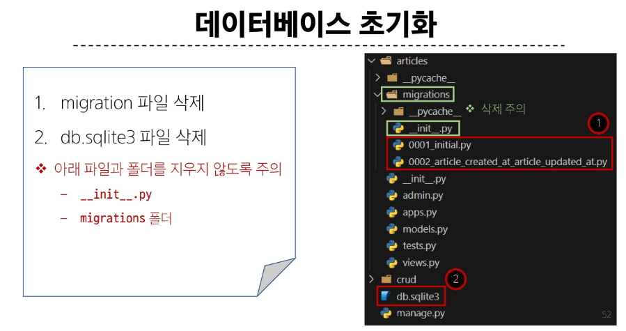

# Django Model
- DB의 테이블을 정의하고 데이터를 조작할 수 있는 기능들을 제공
  - 테이블 구조를 설계하는 청사진
  - 파이썬을 이용해 클래스로 테이블을 만들기(DB의 설계도)

```python
from django.db import models

class Article(models.Model):
    title = models.CharField(max_length=10)
    content = models.TextField()
```
- django.db.models 모듈의 Model이라는 부모 클래스를 상속받음
- 클래스 변수명
  - 테이블의 각 필드(열) 이름
- Model Field
  - 데이터베이스 데이블의 열(column)을 나타내는 구성 요소
  - 데이터의 유형과 제약조건을 정의

# Model Field_ 중요!!
- DB 테이블의 필드(열)을 정의하며,
- 해당 필드에 저장되는 데이터 타입(Field types)과 제약조건(Field options)을 정의

## Field types
- 데이터베이스에 저장될 데이터의 종류를 정의(models 모듈이 클래스로 정의돼 있음)

- 문자열 필드
  - CharField, TextField
- 숫자 필드
  - IntegerField, FloatField
- 날짜/시간 필드
  - DateField, TimeField, DateTimeField
- 파일 관련 필드
  - FileField, ImageField


### CharField()
- 제한된 길이의 문자열을 저장(필드의 최대 길이를 결정하는 max_length는 필수 옵션)
### TextField()
- 길이 제한이 없는 대용량 텍스트를 저장(무한대는 아니며 사용하는 시스템에 따라 달라짐)

## Field options
- 필드의 동작과 제약조건을 정의
  
- null
  - 데이터베이스에서 NULL 값을 허용할 지 여부를 결정 (기본값 : False)
- blank
  - form에서 빈 값을 허용할 지 여부를 결정 (기본값 : False)
- default
  - 필드의 기본값을 설정

### 제약조건_Constraint
- 특정 규칙을 강제하기 위해 테이블의 열이나 행에 적용되는 규칙이나 제한사항

## Migrations
- model 클래스의 변경사항(필드 생성, 수정 삭제 등)을 DB에 최종 반영하는 방법

### DateTimeField의 필드옵션(optional)
- auto_now
  - 데이터가 저장될 때마다 자동으로 현재 날짜 시간을 저장
- auto_now_add
  - 데이터가 처음 생성될 때만 자동으로 현재 날짜 시간을 저장

## model class에 변경사항이 생긴다면, 반드시 새로운 설계도를 생성해야 하고 이를 DB에 반영해야 한다.
1. model class 변경
2. makemigrations
3. migrate


# Automatic admin interface
- Django가 추가 설치 및 설정 없이 자동으로 제공하는 관리자 인터페이스

1. admin 계정 생성

```python
$python manage.py createsuperuser
```
2. admin에 모델 클래스 등록

```python
from django.contrib import admin
from .models import Article

admin.site.register(Article)
```


