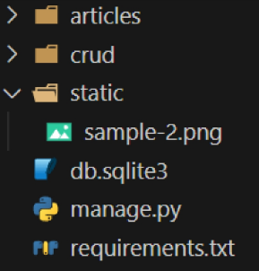

# Static files
### 정적 파일
- 서버 측에서 변경되지 않고 고정적으로 제공되는 파일
- 이미지, JS, CSS 파일 등

## 웹 서버와 정적 파일
- 웹 서버의 기본동작은 특정위치(URL)에 있는 자원을 요청(HTTP request) 받아서 응답(HTTP response)을 처리하고 제공하는 것
- 이는 "자원에 접근 가능한 주소가 있다."라는 의미
- 웹 서버는 요청 받은 URL로 서버에 존재하는 정적 자원을 제공함
- **정적 파일을 제공하기 위한 경로(URL) 가 있어야 함_ 중요!

## Static files 기본 경로
- app 폴더/static/
  - articles/static/articles/ 경로에 이미지 파일 배치(없기 때문에 새로 생성)
  - static files 경로는 DTL의 static tag를 사용해야함
  - built-in-tag가 아니기 때문에 load tag를 사용해 import 후 사용 가능

## STATIC_URL
- 기본 경로 및 추가 경로에 위치한 정적 파일을 참조하기 위한 URL
  - 실제 파일이나 디렉토리 경로가 아니며, URL로만 존재

### 만들어지는 주소
URL + STATIC_URL + 정적파일 경로

## Static files 추가 경로
- STATICFILES_DIRS에 문자열 값으로 추가 경로 설정
  - STATICFILES_DIRS
    - 정적 파일의 기본 경로 외에 추가적인 경로 목록을 정의하는 리스트

1. 임의의 추가 경로 설정

2. 추가 경로에 이미지 파일 배치

3. static tag를 사용해 이미지 파일에 대한 경로 제공

# 정적 파일을 제공하려면 요청에 응답하기 위한 URL이 필요

# Media Files
- 사용자가 웹에서 업로드하는 정적 파일(user-uploaded)
## ImageField()
- 이미지 업로드에 사용하는 모델 필드
- 이미지 객체가 직접 DB에 저장되는 것이 아닌 '이미지 파일의 경로'문자열이 저장됨

## 미디어 파일을 제공하기 전 준비사항
1. settings.py에 MEDIA_ROOT, MEDIA_URL 설정
   - MEDIA_ROOT : 미디어 파일들이 위치하는 디렉토리의 절대 경로
 - 
2. 작성한 MEDIA_ROOT와 MEDIA_URL에 대한 URL 지정
   - MEDIA_URL : MEDIA_ROOT에서 제공되는 미디어 파일에 대한 주소를 생성
   - STATIC_URL과 동일한 역할
 - 

### MEDIA_ROOT와 MEDIA_URL에 대한 URL 지정
  - 업로드 된 파일의 URL == settings.MEDIA_URL
  - MEDITA_URL을 통해 참조하는 파일의 실제 위치 == settings.MEDIA_ROOT

## 이미지 업로드
1. blank=True 속성을 작성해 빈 문자열이 저장될 수 있도록 제약 조건 설정
   - 게시글 작성 시 이미지 업로드 없이도 작성할 수 있도록 하기 위함

* 기존 필드 사이에 작성해도 실제 테이블 생성 시에는 가장 우측(뒤)에 추가됨

2. migration 진행
   - ImageFirld를 사용하려면 반드시 pillow 라이브러리가 필요

3. form 요소의 enctype 속성 추가 

* enctype은 데이터 전송방식을 결정하는 속성

4. ModelForm의 2번쨰 인자로 요청 받은 파일 데이터 작성
   - ModelForm의 상위 클래스 BaseModelForm의 생성자 함수의 2번째 위치 인자로 파일을 받도록 설정되어 있음

## 업로드 이미지 제공
- url 속성을 통해 업로드 파일의 경로 값을 얻을 수 있음
- article.image.url
  - 업로드 파일의 경로
- article.image
  - 업로드 파일의 이름

- 이미지를 업로드 하지 않은 게시물은 detail 템플릿을 렌더링할 수 없음
- 이미지 데이터가 있는 경우만 이미지를 출력할 수 있도록 처리하기
  

## 업로드 이미지 수정
- 수정 페이지 form 요소에 enctype 속성 추가

- uqdate view 함수에서 업로드 파일에 대한 추가 코드 작성

