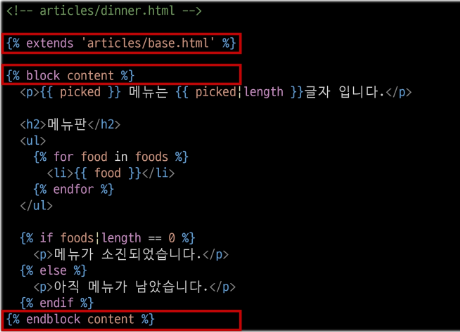
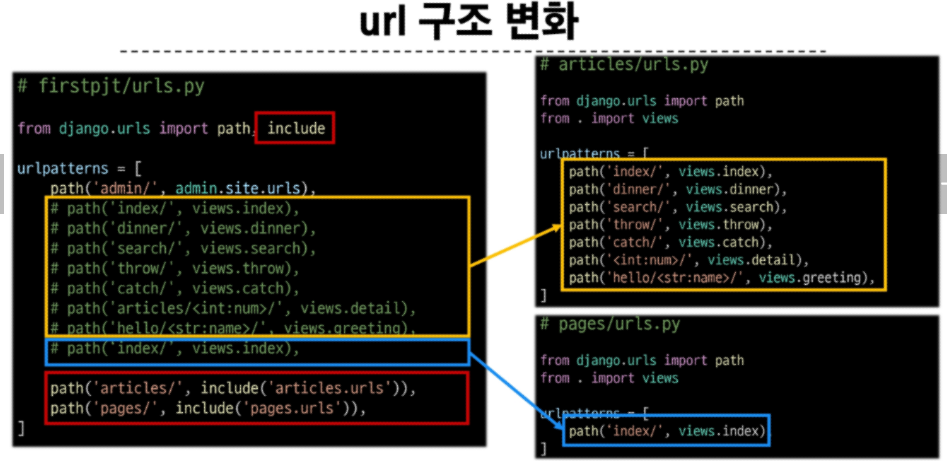
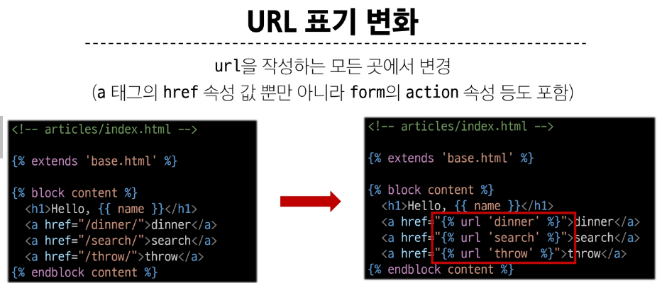

# Django Template system
- 데이터 표현을 제어하면서, 표현과 관련된 부분을 담당

# Django Template Language(DTL)
- Template에서 조건, 반보그 변수 등의 프로그래밍적 기능을 제공하는 시스템

## 1. Variable_ 변수
- render 함수의 세번째 인자로 딕셔너리 데이터를 사용
- 딕셔너리 key에 해당하는 문자열이 template에서 사용 가능한 변수명이 됨
- dot('.')를 사용하여 변수 속성에 접근할 수 있음

```bash
{{variable}}
```

## 2. Filters
- 표시할 변수를 수정할 때 사용 ( 변수 + '|' + 필터)
- chained(연결)이 가능하며 일부 필터는 인자를 받기도 함
- 약 60개의 built-in template filters를 제공 

```bash
{{variable|filter}}
```

## 3. Tags
- 반복 또는 논리를 수행하여 제어 흐름을 만듦
- 일부 태그는 시작과 종료 태그가 필요
- 약 24개의 buit-in template tags를 제공

```bash
{}
```

## 4. Comments_ 주석
- DTL에서의 주석

```bash
{# name #}  // 중괄호 1개
```


# 템플릿 상속
- 페이지의 공통 요소를 포함하고, 하위 템플릿이 재정의 할 수 있는 공간을 정의하는 기본 'skeleton' 템플릿을 작성하여 상속 구조를 구축

1. skeleton 역할을 하게 되는 상위 템플릿(base.html) 작성
2. 기존 하위 템플릿 변환




## 중요! 'extends' tag
- 자식(하위)템플릿이 부모 템플릿을 확장한다는 것을 알림
  - 반드시 자식 템플릿 최상단에 작성되어야 함 (2개 이상 사용 불가)

## 'block' tag
- 하위 템플릿에서 재정의 할 수 있는 블록을 정의
  - 상위 템플릿에 작성하며 하위 템플릿이 작성할 수 있는 공간을 지정

# HTML form(요청과 응답)
- HTTP 요청을 서버에 보내는 가장 편리한 방법

### 'form' element
- 사용자로부터 할당된 데이터를 서버로 전송
  - 웹에서 사용자 정보를 입력하는 여러방식(text, password, checkbox 등)을 제공

### 'action' & 'method'
- form의 핵심 속성 2가지
- '데이터를 어디(action)로 어떤 방식(method)로 요청할 지

- action
  - 입력 데이터가 전송될 URL을 지정(목적지)
  - 만약 이 속성을 지정하지 않으면 데이터는 현재 form이 있는 페이지의 URL로 보내짐
- method
  - 데이터를 어떤 방식으로 보낼 것인지 정의
  - 데이터의 HTTP request methods (Get, Post)를 지정

### 'input' element
- 사용자의 데이터를 입력 받을 수 있는 요소(type 속성 값에 따라 다양한 유형의 입력 데이터를 받음)
  - 핵심 속성 - 'name'
    - input의 핵심 속성
    - 사용자가 입력한 데이터에 붙이는 이름(key)
    - 데이터를 제출했을 때 서버는 name 속성에 설정된 값을 통해서만 사용자가 입력한 데이터에 접근할 수 있음

## HTTP request 객체
- form으로 전송한 데이터 뿐 아니라 Django로 들어오는 모든 요청 관련 데이터가 담겨 있음(view 함수의 첫번째 인자로 전달됨 )


# URL
## URL dispatcher
- URL 패턴을 정의하고 해당 패턴이 일치하는 요청을 처리할 view 함수를 연결(매핑)

## Variable Routing
- URL 일부에 변수를 포함시키는 것
- (변수는 view 함수의 인자로 전달할 수 있음)

```bash
<path_converter:variable_name>
```

## App URL mapping
- 각 앱에 URL을 정의
  -  프로젝트와 각 앱이 URL을 나누어 관리를 편히 함





### include()
- 프로젝트 내부 앱들의 URL을 참조할 수 있도록 매핑하는 함수
  - URL의 일치하는 부분까지 잘라내고, 남은 문자열 부분은 후속 처리를 위해 include된 URL로 전달

### Naming URL patterns
- URL에 이름을 지정하는 것
- 적용
  - path 함수의 name 키워드 인자를 정의

