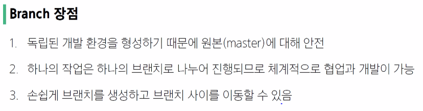
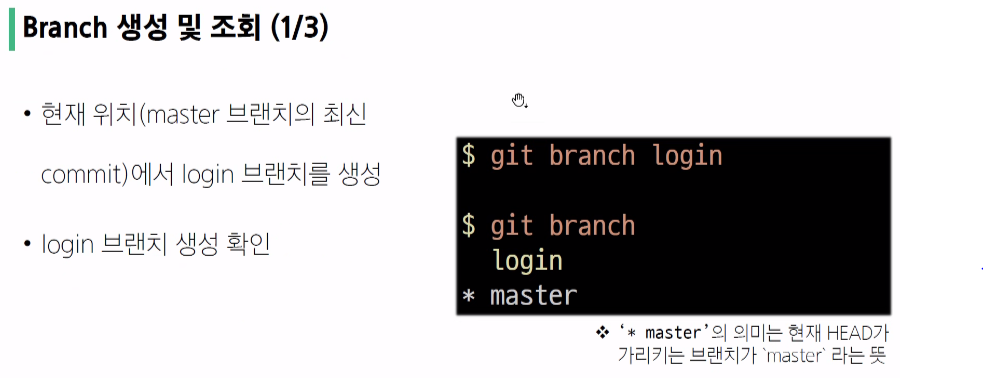
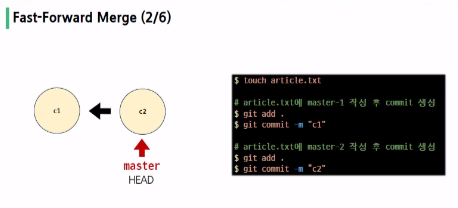

# Branch



## Master(main) 브랜치


## 브랜치 명령어


## 브랜치 이동 명령어


### HEAD
현재 브랜치나 commit을 가리키는 포인터(현재 내가 바라보는 위치)

## git switch 주의사항


## Branch senario
```bash
$git init
```


## Branch 생성 및 조회



## branch 이동


## branch에서 commit 생성
- 로그인으로 이동


## Fast-Forward 동작 원리


## Fast-Forward-Merge




## 3-Way Merge 동작 - 충돌 발생


