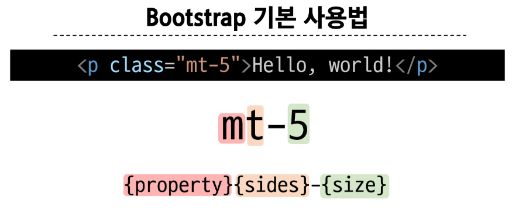
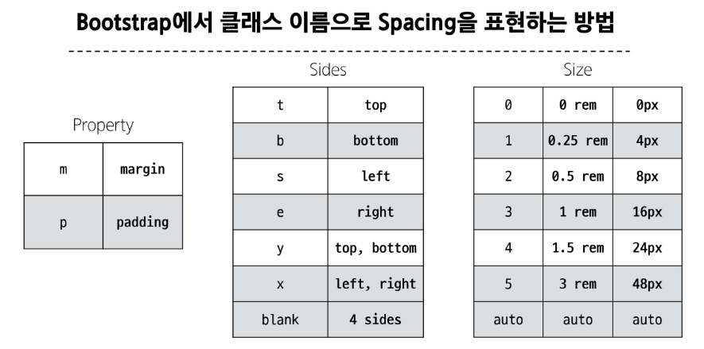
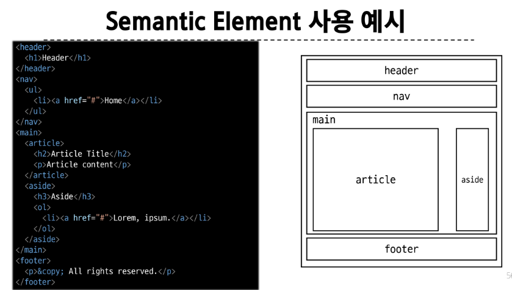
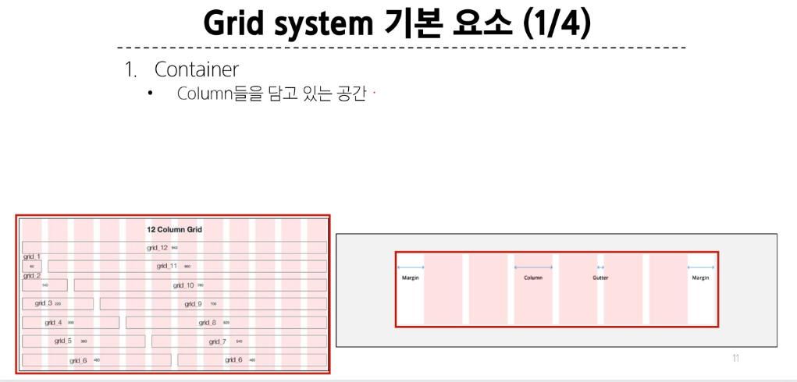
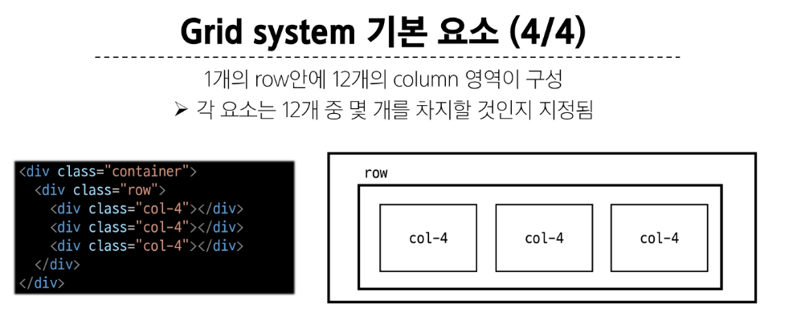
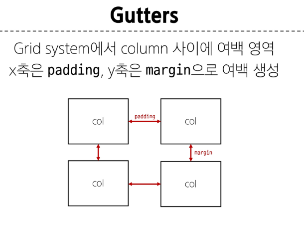
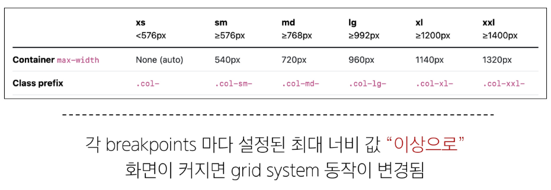
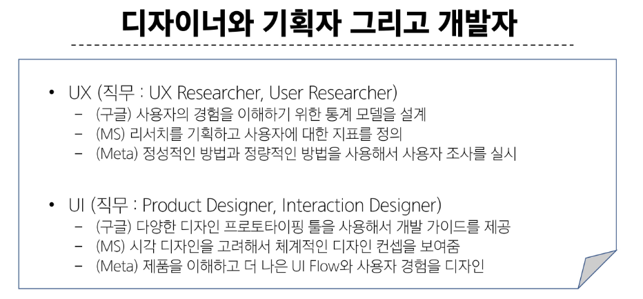

# Bootstrap
- CSS 프론트엔드 프레임워크(Toolkit)
- 미리 만들어진 다양한 디자인 요소들을 제공하여 웹 사이트를 빠르고 쉽게 개발할 수 있도록 함

## CDN - Content Delivery Network
- 지리적 제약 없이 빠르고 안전하게 콘텐츠를 전송할 수 있는 전송 기술
- 서버와 사용자 사이의 물리적인 거리를 줄여 콘텐츠 로딩에 소요되는 시간 최소화(웹 페이지 로드 속도를 높임)
- 지리적으로 사용자와 가까운 CDN 서버에 콘텐츠를 저장해서 사용자에게 전달

**Bootstrap에는 특정한 규칙이 있는 클래스 이름으로 스타일 및 레이아웃이 미리 작성되어 있음**

## Reset CSS
- 모든 HTML 요소 스타일을 일관된 기준으로 재설정하는 간결하고 압축된 규칙 세트
- HTML Element, Table, List 등의 요소들에 일관성 있게 스타일을 적용 시키는 기본 단계
- 모두 똑같은 스타일 상태로 만들고 스타일 개발을 시작하자는 의의.

#### Normalize CSS
- Reset CSS 방법 중 대표적인 방법
- 웹 표준 기준으로 브라우저 중 하나가 불일치 하다면 차이가 있는 브라우저를 수정하는 방법
  - 경우에 따라 IE 또는 EDGE 브라우저는 표준에 따라 수정할 수 없는 경우도 있는데, 이 경우 IE 또는 EDGE의 스타일을 나머지 브라우저에 적용시킴

### Semantic Web
#### HTML Semantic Element
- 기본적인 모양과 기능 이외에 의미를 가지는 HTML 요소
- 검색 엔진 및 개발자가 웹 페이지 콘텐츠를 이해하기 쉽도록

### OOCSS - Object Oriented CSS
- 객체 지향적 접근법을 적용하여 CSS를 구성하는 방법론

#### OOCSS 기본 원칙
1. 구조와 스킨을 분리  - 재사용 가능성을 높임
- 모든 버튼의 공통 구조를 정의하고 각각의 스킨(배경색과 폰트 색)을 정의
2. 컨테이너와 콘텐츠를 분리
- 객체에 직접 적용하는 대신 객체를 둘러싸는 컨테이너에 스타일을 적용
- 스타일을 정의할 때 위치에 의존적인 스타일을 사용하지 않도록 함
- 콘텐츠를 다른 컨테이너로 이동시키거나 재배치할 때 스타일이 깨지는 것을 방지

## Bootstrap을 사용하는 이유
- 가장 많이 사용되는 CSS 프레임워크
- 사전에 디자인된 다양한 컴포넌트 및 기능
  - 빠른 개발과 유지보수
- 손쉬운 반응형 웹 디자인 구현
- 커스터마이징이 용이
- 크로스 브라우징 지원
  - 모든 주요 브라우저에서 작동하도록 설계되어 있음

# emmet 기술 - 빠른 작성을 위한 팁  
  div.contatiner
  ul>li*3
  - emmet 기술
  - https://docs.emmet.io/cheat-sheet/

### Bootstrap Grid system
- **웹 페이지의 레이아웃을 조정하는 데 사용되는 12개의 컬럼으로 구성된 시스템**
  - 12개인 이유
    1. 약수가 많다.
    2. 동시에 적당히 큰 수

- Grid System 목적
  - 반응형 디자인을 지원해 웹 페이지를 모바일, 태블릿, 데스크탑 등 다양한 기기에서 적절하게 표시할 수 있도록 도움

##### gutters

### 반응형 웹 디자인 - Responsive Web Design
- 디바이스 종류나 화면 크기에 상관없이 어디서든 일관된 레이아웃 및 사용자 경험을 제공하는 디자인

#### Grid system breakpoints
- 12개의 column과 6개 breakpoints를 사용하여 반응형 웹 디자인을 구현
- 웹 페이지를 다양한 화면 크기에서 적절하게 배치하기 위한 분기점
  - 화면 너비에 따라 6개의 분기점 제공(xs, sm, md, lg, xl, xxl)

### CSS Layout 종합 정리
- 어떤 레이아웃 기술이 사용됐는지 생각해보기 
1. Grid system
2. Flexbox
3. Position

## UX &UI
## UX(User Experience)
- 제품이나 서비스를 사용하는 사람들이 느끼는 전체적인 경험과 만족도를 개선하고 최적화하기 위한 디자인과 개발 분야

## UI(User Interface)
- 서비스와 사용자 간의 상호작용을 가능하게 하는 디자인 요소들을 개발하고 구현하는 분야
  - 리모컨, ATM, 웹 사이트
