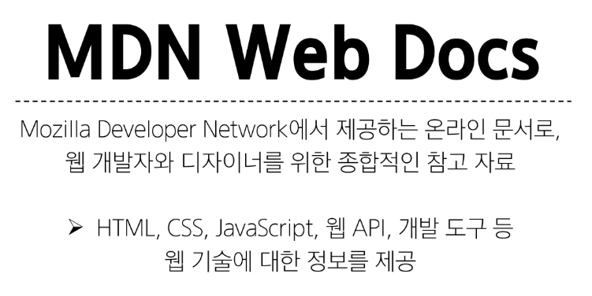

# Web
- Web site, Web application 등을 통해 사용자들이 정보를 검색하고 상호 작용하는 기술
#### Web site
- 인터넷에서 여러개의 Web page가 모인 것으로, 사용자들에게 정보나 서비스를 제공하는 공간
#### Web page
- HTML, CSS등의 웹 기술을 이용하여 만들어진, "Web site"를 구성하는 하나의 요소
#### World wide web
- 인터넷으로 연결된 컴퓨터들이 정보를 공유하는 거대한 정보 공간


- web page 구성요소


# 웹 구조화
## HTML
- HyperText Markup Language
- 웹 페이지의 의미와 구조를 정의하는 언어
#### Hypertext
- 웹 페이지를 다른 페이지로 연결하는 링크
- 참조를 통해 사용자가 한 문서에서 다른 문서로 즉시 접근할 수 있는 텍스트
- 비선형성 / 상호 연결성 / 사용자 주도적 탐색

#### Markup Language
- 태그 등을 이용하여 문서나 데이터의 구조를 명시하는 언어
- Markup Language 예시


```bash
- <!DOCTYPE html>
  - 해당 문서가 html 문서라는 것을 나타냄

- <html></html>
  - 전체 페이지의 콘텐츠를 포함

- <title></title>
  - 브라우저 탭 및 즐겨찾기 시 표시되는 제목으로 사용

- <head></head>
  - HTML 문서에 관련된 설명, 설정 등 컴퓨터가 식별하는 메타데이터를 작성
  - 사용자에게 보이지 않음

- <body></body>
  - HTML 문서의 내용을 나타냄
  - 페이지에 표시되는 모든 콘텐츠를 작성
  - 한 문서에 하나의 body요소만 존재
```
- HTML Element(요소)
  - 하나의 요소를 여는 태그와 닫는 태그 그리고 그 안의 내용으로 구성됨
  - 닫는 태그는 태그 이름 앞에 슬래시가 포함됨 
    - 닫는 태그가 없는 태그도 존재 


- HTML Attributes(속성)
  - 사용자가 원하는 기준에 맞도록 요소를 설정하거나 다양한 방식으로 요소의 동작을 조절하기 위한 값
  - 목적
    - 나타내고 싶지 않지만 추가적인 기능, 내용을 담고 싶을 때 사용
    - CSS에서 스타일 적용을 위해 해당 요소를 선택하기 위한 값으로 활용됨

  - 속성 작성 규칙
  1. 속성은 요소 이름과 속성 사이에 공백이 있어야 함
  2. 하나 이상의 속성들이 있는 경우엔 속성 사이에 공백으로 구분
  3. 속성 값은 열고 닫는 따옴표로 감싸야 함.


- 자주 사용하는 태그
  - "a 태그"
  - "img 태그"

### HTML Text structure
- HTML의 주요 목적 중 하나는 텍스트 구조와 의미를 제공하는 것

- 대표적인 HTML Text structure
```bash
- Heading & Paragraphs
  - h1~6, p

- Lists
  - ol, ul, li

- Emphasis & Importance
  - em, strong
```
- 예시


## HTML 스타일 가이드

```bash
- 대소문자 구분
  - HTML은 대소문자를 구분하지 않지만, 소문자 사용을 강력히 권장
  - 태그명과 속성명 모두 소문자로 작성

- 속성 따옴표
  - 속성 값에는 큰 따옴표(")를 사용하는 것이 일반적

- 공백 처리
  - HTML은 연속된 공백을 하나로 처리
  - Enter키로 줄 바꿈을 해도 브라우저에서 인식하지 않음
    (줄 바꿈 태그를 사용해야 함)

- **에러 출력 없음**
  - HTML은 문법 오류가 있어도 별도의 에러 메시지를 출력하지 않음

- 코드 구조와 포맷팅
  - 일관된 들여쓰기를 사용 (보통 2칸 공백)
  - 각 요소는 한 줄에 하나씩 작성
  - 중첩된 요소는 한 단계 더 들여쓰기
```

## CSS 스타일 가이즈
```bash
- 코드 구조와 포맷팅
  - 일관된 들여쓰기를 사용 (보통 2칸 공백)
  - 선택자와 속성은 각각 새 줄에 작성
  - 중괄호 앞에 공백 넣기
  - 속성 뒤에는 콜론(:)과 공백 넣기
  - 마지막 속성 뒤에는 세미콜론(;) 넣기

- 선택자 사용
  - class 선택자를 우선적으로 사용
  - id, 요소 선택자 등은 가능한 피할 것
    - 여러 선택자들과 함계 사용할 경우 우선순위 규칙에 따라 예기치 못한 스타일 규칙이 적용되어 전반적인 유지보수가 어려워지기 때문

- 속성과 값
  - 속성과 값은 소문자로 작성
  - 0 값에는 단위를 붙이지 않음

- 명명 규칙
  - 클래스 이름은 의미 있고 목적을 나타내는 이름을 사용
  - 케밥 케이스(kebab-case)를 사용
  - 약어보다는 전체 단어를 사용

- CSS 적용 스타일
  - 인라인(inline) 스타일은 되도록 사용하지 말 것
    - CSS와 HTML 구조 정보가 혼합되어 작성되기 때문에 코드를 이해하기 어렵게 만듦
```

# 웹 스타일링
## CSS
- Cascading Style Sheet
- 웹 페이지의 디자인과 레이아웃을 구성하는 언어

- CSS 구문
  - ';'은 선언의 종료


### CSS 적용방법
#### 인라인(Inline) 스타일
- HMTL 요소 안에 style 속성 값으로 작성


#### 내부(Internal) 스타일 시트
- head 태그 안에 style 태그에 작성 

#### 외부(External) 스타일 시트
- 별도 CSS 파일 생성 후 HTML link 태그를 사용해 불러오기


### CSS Selectors 종류
```bash
- 기본 선택자
  - 전체(*) 선택자 : HTML 모든 요소를 선택
  - 요소(tag) 선택자 : 지정한 모든 태그를 선택
  - 클래스(class) 선택자('.' (dot)) : 주어진 속성을 가진 모든 요소를 선택
  - 아이디(id) 선택자('#') : 주어진 아이디 속성을 가진 요소 선택(문서에는 주어진 아이디를 가진 요소가 하나만 있어야 함)
  - 속성(attr) 선택자 등

- 결합자(Combinators)
  - 자손 결합자("" (space)) : 첫 번째 요소의 자손 요소들 선택 
   예) p span은 <p> 안에 있는 모든 <span>를 선택(하위 레벨 상관 없이)
  - 자식 결합자(">") : 첫 번쨰 요소의 직계 자식만 선택
   예) ul > li은 <ul> 안에 있는 모든 <li>를 선택(한 단계 아래 자식들만)
```

#### Specificity_ 명시도
- 결과적으로 요소에 적용할 CSS 선언을 결정하기 위한 알고리즘
- CSS Selector에 가중치를 계산하여 어떤 스타일을 적용할 지 결정
  - 동일한 요소를 가리키는 2개 이상의 CSS 규칙이 있는 경우, 가장 높은 명시도를 가진 Selector가 승리하여 스타일이 적용됨

- Cascade_ 계단식
  - 한 요소에 동일한 가중치를 가진 선택자가 적용될 때, CSS에서 마지막에 나오는 선언이 사용됨
- 명시도가 높은 순
  1. Importance
    - !important
  2. Inline 스타일
  3. 선택자
    - id 선택자 > **class 선택자** > 요소 선택자
  4. 소스 코드 선언 순서

- !impotant
  - 다른 우선순위 규칙보다 우선하여 적용하는 키워드
  - Cascade 구조를 무시하고 강제로 스타일을 적용하는 방식이므로 특수한 경우에만 사용

#### CSS 상속
- CSS는 상속을 통해 부모 요소의 속성을 자식에게 상속해 재사용성을 높임
  - 상속 되는 속성
    - Text 관련 요소(font, color, text-align), opacity, visibility 등
  - 상속 되지 않는 속성
    - Box model 관련 요소(width, height, border, box-sizing ...)
    position 관련 요소(position, top/right/bottom/left, z-index) 등


### CSS Box Model
- 웹 페이지의 모든 HTML 요소를 감싸는 사각형 상자 모델


#### 박스 타입
1. Block box
2. Inline box

- 박스 타입에 따라 페이지에서의 배치 흐름 및 다른 박스와 관련항 박스가 동작하는 방식이 달라짐

#### 박스 표시(Display) 타입
```bash
1. Outer display type - 박스가 문서 흐름에서 어떻게 동작할 지를 결정
- 속성
  - block 특징
    - 항상 새로운 행으로 나뉨
    - width와 height 속성 사용 가능
    - padding, margin, border로 인해 다른 요소를 상자로부터 밀어냄
    - width 속성을 지정하지 않으면 박스는 inline 방향으로 사용가능한 공간을 모두 차지함
      - 상위 컨테이너 너비 100%로 채우는 것
    - 대표적인 block 타입 태그
      - h1~6, p, div
  
  - inline 특징
    - 새로운 행으로 넘어가지 않음
    - width와 height 속성을 사용할 수 없음
    - 수직 방향
      - padding, margin, border가 적용되지만 다른 요소를 밀어낼 수는 없음
    - 수직 방향
      - padding, margins, borders가 적용되어 다른 요소를 밀어낼 수 있음
    - 대표적인 inline 타입 태그
      - a, img, span, strong, em
```

```bash
2. Inner display type
```