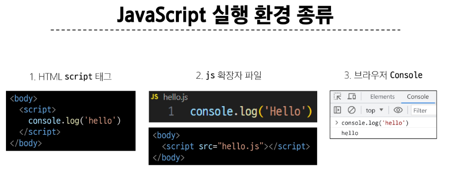
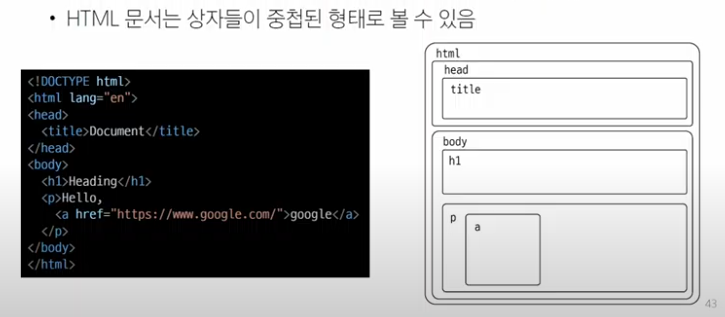
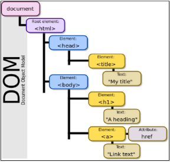
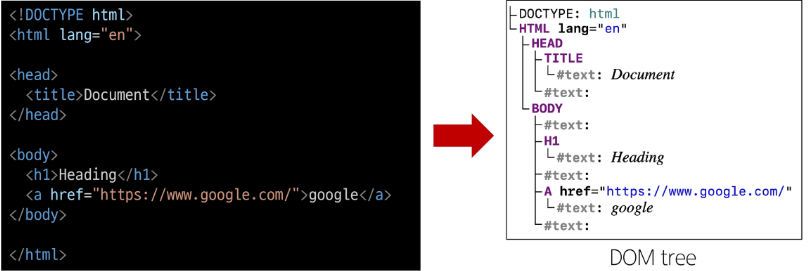
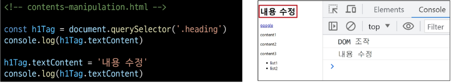
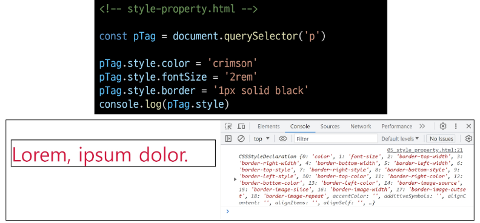

## Javascript 변수 작성 법
- 반드시 문자, 달러('$') 또는 밑줄('_')로 시작
- 대소문자를 구분
- 예약어 사용 불가
  - for, if function 등

### Naming case
- 카멜 케이스(camelCase)
  - 변수, 객체, 함수에 사용
- 파스칼 케이스(PascalCase)
  - 클래스, 생성자에 사용
- 대문자 스네이크 케이스(SNAKE_CASE)
  - 상수(constants)에 사용


## 변수 선언 키워드
1. let
   - 블록 스코프(block scope)를 갖는 지역 변수를 선언
   - 재할당 가능
   - 재선언 불가능
   - ES6에서 추가

```JS
let number - 10 // 1. 선언 및 초기값 할당
number = 20 // 2. 재할당

let number = 10 // 1. 선언 및 초기값 할당
let number = 20 // 2. 재선언 불가능
```

2. const
   - 블록 스코프를 갖는 지역 변수를 선언
   - 재할당 불가능
   - 재선언 불가능
   - ES6에서 추가
```JS
const number = 10 // 1. 선언 및 초기값 할당
number = 10 // 2. 재할당 불가능

const number - 10 // 1. 선언 및 초기값 할당
const number = 20 // 2. 재선언 불가능

const number // const' declarations must be initialized
```


### 블록 스코프(block scope)
- if, for, 함수 등의 '중괄호({}) 내부'를 가리킴
- 블록 스코프를 가지는 변수는 블록 바깥에서 접근 불가능

## 변수 선언 키워드
- const를 기본으로 사용
- 필요한 경우에만 let으로 전환
  - 재할당이 필요한 경우
  - let을 사용하는 것은 해당 변수가 의도적으로 변경될 수 있음을 명확히 나타냄
  - 코드의 유연성을 확보하면서도 const의 장점을 최대한 활용할 수 있음
### const를 기본으로 사용해야하는 이유
- 코드의 의도 명확화
  - 해당 변수가 재할당되지 않을 것임을 명확히 표현
  - 개발자들에게 변수의 용도와 동작을 더 쉽게 이해할 수 있게 해줌
- 버그 예방
  - 의도치 않은 변수 값 변경으로 인한 버그를 예방
  - 큰 규모의 프로젝트나 팀 작업에서 중요

# DOM
## 웹 브라우저에서의 JavaScript
웹 페이지의 동적인 기능을 구현



## DOM
### The Document Object Model
웹 페이지(Document)를 구조화된 객체로 제공하여 프로그래밍 언어가 페이지 구조에 접근할 수 있는 방법을 제공
- 문서 구조, 스타일, 내용 등을 변경할 수 있도록 함

### Document structure

- 브라우저가 문서를 표현하기 위해 사용하는 데이터 구조는 위 이미지 모양
- 각 상자는 객체이며 개발자는 이 객체와 상호작용, 어떤 HTML 태그를 나타내는지, 어떤 콘텐츠가 포함되어 있는지 등을 알아낼 수 있음
- 이 표현을 Document Object Model, 또는 줄여 DOM이라 부름

### DOM API
- 다른 프로그래밍 언어가 웹 페이지에 접근 및 조작할 수 있도록 페이지 요소들을 객체 형태로 제공하며 이에 따른 메서드 또한 제공

### DOM 특징
- DOM에서 모든 요소, 속성, 텍스트는 하나의 객체
- 모두 document 객체의 하위 객체로 구성됨


### DOM tree
- 브라우저는 HTML 문서를 해석하여 DOM tree라는 객체 트리로 구조화
- 객체 간 상속 구조가 존재



## DOM 핵심
문서의 요소들을 객체로 제공하여 다른 프로그래밍 언어에서 접근하고 조작할 수 있는 방법을 제공하는 API


## document 객체
- 웹페이지 객체
- DOM Tree의 진입점
- 페이지를 구성하는 모든 객체 요소를 포함

# DOM 선택
## DOM 조작 시 기억해야할 것
웹 페이지를 동적으로 만들기 == 웹 페이지를 조작하기

- 조작순서
1. 조작 하고자 하는 요소를 선택(또는 탐색)
2. 선택된 요소의 콘텐츠 또는 속성을 조작

## 선택 메서드
- document.querySelector()
  - 요소 한 개 선택
- document.querySelectorAll()
  - 요소 여러 개 선택

## **중요! document.querySelector(selector)
- 제공한 선택자와 일치하는 element 한 개 선택
- 제공한 선택자를 만족하는 첫 번쨰 element 객체를 반환(없다면 null 반환)
## **중요! document.querySelectorAll(selector)
- 제공한 선택자와 일치하는 여러 element를 선택
- 제공한 선택자를 만족하는 NodeList를 반환

# DOM 조작
1. 속성(attribute) 조작
   - 클래스 속성 조작
   - 일반 속성 조작
2. HTML 콘텐츠 조작
3. DOM 요소 조작
4. 스타일 조작

## 클래스 속성 조작
'classList' property
요소의 클래스 목록을 DOMTokenList(유사 배열)형태로 반환

### classList 메서드
- element.classList.add()
  - 지정한 클래스 값을 추가
- element.classList.remove()
  - 지정한 클래스 값을 제거
- element.classList.toggle()
  - 클래스가 존재한다면 제거하고 false를 반환
  - 존재하지 않으면 클래스를 추가하고 true를 반환

```JS
console.log(변수.classList) // 변수 요소의 클래스 목록 확인
```

### 일반 속성 조작 메서드
- Element.getAttribute()
  - 해당 요소에 지정된 값을 반환 (조회)
- Element.setAttribute(name, value)
  - 지정된 요소의 속성 값을 설정
  - 속성이 이미 있으면 기존 값을 갱신 (그렇지 않으면 지정된 이름과 값으로 새 속성이 추가)
- Element.removeAttribute()
  - 요소에서 지정된 이름을 가진 속성 제거

## HTML 콘텐츠 조작
'textContent' property
요소의 텍스트 콘텐츠를 표현

```HTML
<p>lorem</p>
```




## DOM 요소 조작
- document.createElement(tagName)
  - 작성한 tagNmae의 HTML 요소를 생성하여 반환
- Node.appendChild()
  - 한 Node를 특정 부모 Node의 자식 NodeList 중 마지막 자식으로 삽입
  - 추가된 Node 객체를 반환
- Node.removeChild()
  - DOM에서 자식 Node를 제거
  - 제거된 Node를 반환

## style 조작
'style' property
해당 요소의 모든 style 속성 목록을 포함하는 속성



## 용어정리
### Node
- DOM의 기본 구성 단위
- DOM 트리의 각 부분은 Node라는 객체로 표현됨
  - Document Node -> HTML 문서 전체를 나타내는 노드
  - Element Node -> HTML 요소를 나타내는 노드 (예를 들어 <p>)
  - Text Node -> HTML 테그스 (Element Node 내의 텍스트 컨텐츠를 나타냄)
  - Attribute Node -> HTML 요소의 속성을 나타내는 노드

### NodeList
- DOM 메서드를 사용해 선택한 Node의 목록
- 배열과 유사한 구조를 가짐
- Index로만 각 항목에 접근 가능
- JavaScript의 배열 메서드 사용 가능
- querySelectorAll()에 의해 반환되는 NodeList는 DOM의 변경사항을 실시간으로 반영하지 않음
  - DOM이 나중에 변경되더라도 이전에 이미 선택한 NodeList 값은 변하지 않음

### Element
- Node의 하위 유형
- Element는 DOM 트리에서 HTML 요소를 나타내는 특별한 유형의 Node
- 예를 들어, <p>, <div>, <span>, <body>등의 HTML 태그들이 Element 노드를 생성
- Node의 속성과 메서드를 모두 가지고 있으며 추가적으로 요소 특화된 기능 (예: className, innerHTML, id 등)을 가지고 있음

- 모든 Element는 Node지만, 모든 Node가 Element인 것은 아님

### Parsing
브라우저가 문자열을 해석하여 DOM Tree로 만드는 과정 - 구문 분석, 해석

### 세미콜론 (semicolon)
- 자바스크립트는 문장 마지막 세미콜론(';')을 선택적으로 사용 가능
- 세미콜론이 없으면 ASI에 의해 자동으로 세미콜론이 삽입됨
  - ASI (Automatic Semicolon Insertion, 자동 세미콜론 삽입 규칙)
- JavaScript를 만든 Brendan Eich 또한 세미콜론 작성을 반대

### 변수 선언 키워드 - 'var'
- ES6 이전에 변수 선언에 사용했던 키워드
- 재할당 가능
- 재선언 가능
- 함수 스코프(function scope)를 가짐
- "호이스팅" 되는 특성으로 인해 예기치 못한 문제 발생 가능
  - 선언하기 전 사용할 수 있음
- 변수 선언 시 var, const, let 키워드 중 하나를 사용하지 않으면 자동으로 var로 선언됨

### 함수 스코프 (function scope)
- 함수의 중괄호 내부를 가리킴
- 함수 스코프를 가지는 변수는 함수 바깥에서 접근 불가능

### 호이스팅
- 변수 선언이 끌어올려 지는 형상
  - var로 선언한 변수는 선언 위치와 상관없이 함수 시작 지점, 전역에서는 코드가 시작될 때 처리됨
- 변수에 무언가를 할당하기 전까진 undefined를 가짐
```JS
console.log(name) // undefined
var name = '홍길동' // 선언 및 할당

// 위 코드와 동일하게 동작
var name
console.log(name) // undefined

var name = '홍길동'
```
- let과 const로 선언된 변수도 기술적으로는 호이스팅 되지만, 변수가 만들어지는 내부 과정이 다르기 때문에 이 문제를 방지할 수 있음
```JS
console.log(age) // ReferenceError : Cannot axxess 'age' before initialization
let age = 30

console.log(height) // ReferenceError : Cannot access 'height' before initialization
const height = 170
```