# event
- 무언가 일어났다는 신호, 사건
- 모든 DOM 요소는 이러한 event를 만들어 냄
- DOM 요소에서 event가 발생하면, 해당 event는 연결된 이벤트 처리기(event handler)에 의해 처리 됨

### event handler
- 특정 이벤트가 발생했을 때 실행되는 함수
- 사용자의 행동에 어떻게 반응할 지를 JavaScript 코드로 표현한 것

### .addEventListener()
- 특정 이벤틀를 DOM 요소가 수신할 때마다 콜백 함수를 호출
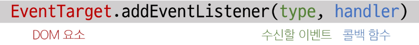
- "대상에 특정 Event가 발생하면, 지정한 이벤트를 받아 할 일을 등록한다."

```JS
.addEventlistener(type, handler)

element.addEventListener('click', function (event) {
  // 이벤트 처리 로직
})
```

- type
  - 수신할 이벤트 이름
  - 문자열로 작성 (ex. 'click')
- handler
  - 발생한 이벤트 객체를 수신하는 콜백 함수
  - 이벤트 핸들러는 자동으로 event 객체를 매개변수로 받음

#### 활용
- 버튼을 클릭하면 버튼 요소 출력하기
- 버튼에 이벤트 처리기를 부착하여 클릭 이벤트가 발생하면 이벤트가 발생한 버튼 정보를 출력
- 요소에 addEventListener를 연결하게 되면 내부의 this 값은 연결된 요소를 가리키게 됨 (event 객체의 currentTarget 속성 값과 동일)

```html
<button id='btn'>버튼</button>
```
```JS
// 1. 버튼 선택
const btn = document.quertSelector('#btn')

// 2. 콜백 함수
const detectClick = function (event) {
  console.log(event) // PointerEvent
  console.log(event.currentTarget) // <button id='btn'>버튼</button>
  console.log(this) // <button id='btn'>버튼</button>
}

// 3. 버튼에 이벤트 핸들러를 부착
btn.addEventListener('click', detectClick)
```

#### addEventListener의 콜백 함수 특징
- 이벤트 핸들러 내부의 this는 이벤트 리스너에 연결된 요소(currentTarget)를 가리킴
- 이벤트가 발생하면 event 객체가 생성되어 첫 번째 인자로 전달
  - event 객체가 필요 없는 경우 생략 가능
- 반환 값 없음


## 버블링
- form > div > p 형태의 중첩된 구조에 각각 이벤트 핸들러가 연결되어 있을 때 만약 <p>요소를 클릭한다면 부모 요소 div 와 form에 할당된 모든 핸들러가 동작한다.
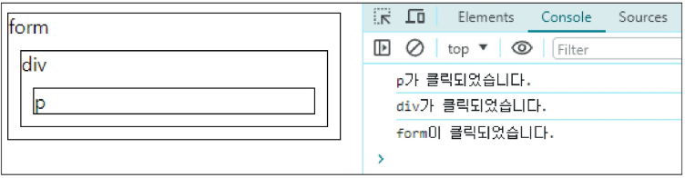

- "한 요소에 이벤트가 발생하면, 이 요소에 할당된 핸들러가 동작하고, 이어서 부모 요소의 핸들러가 동작하는 현상"
- 가장 최상단의 조상 요소(document)를 만날 때까지 이 과정이 반복되면서 요소 각각에 할당된 핸들러가 동작
- 이벤트가 제일 깊은 곳에 있는 요소에서 시작해 부모 요소를 거슬러 올라가며 발생하는 것이 마치 물속 거품과 닮아서 버블링이라 명명
- 최하위의 <p>요소를 클릭하면 p -> div -> form 순서로 3개의 이벤트 핸들러가 모두 순차적으로 동작

### 이벤트가 정확히 어디서 발생했는지 접근할 수 있는 방법
- event.currentTarget
  - '현재' 요소
  - 항상 이벤트 핸들러가 연결된 요소만을 참조하는 속성
  - 'this'와 같음
  - 핸들러가 연결된 outerouter 요소만을 가리킴
- event.target
  - 이벤트가 발생한 가장 안쪽의 요소(target)를 참조하는 속성
  - 실제 이벤트가 시작된 요소
  - 버블링이 진행 되어도 변하지 않음
  - 실제 이벤트가 발생하는 요소를 가리킴

#### 'target' & 'currentTarget'
- 핸들러는 outerouter에만 연결되어 있지만 하위 요소 outer와 inner를 클릭해도 해당 핸들러가 동작함
- 클릭 이벤트가 어디서 발생했든 상관 없이 outerouter까지 이벤트가 버블링 되어 핸들러를 실행시키기 때문
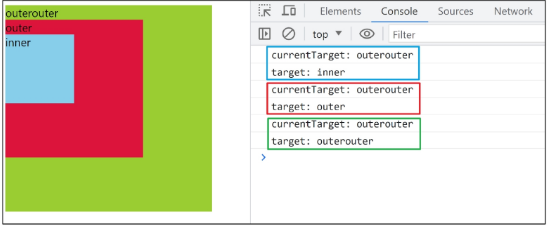


## 캡처링(capturing)
- 이벤트가 하위 요소로 전파되는 단계 (버블링과 반대)
- table의 하위 요소 td를 클릭하면 이벤트는 먼저 최상위 요소부터 아래로 전파됨 (캡처링)
- 실제 이벤트가 발생한 지점(event.target)에서 실행된 후 다시 위로 전파 (버블링)
  - 이 전파 과정에서 상위 요소에 할당된 이벤트 핸들러들이 호출되는 것
- 캡처링은 실제 개발자가 다루는 경우가 거의 없으므로 버블링에 집중
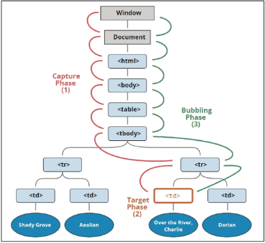

### **중요! 버블링의 필요성
- 각자 다른 동작을 수행하는 버튼이 여러개가 있다고 가정했을 때 각 버튼마다 서로 다른 이벤트 핸들러를 할당하는 것이 아닌 각 버튼의 공통 조상인 div 요소에 이벤트 핸들러 단 하나만 할당한다.
- 요소의 공통 조상에 이벤트 핸들러를 하나만 할당하면, 여러 버튼 요소에서 발생하는 이벤트를 한꺼번에 다룰 수 있음
- 공통 조상에 할당한 핸들러에서 event.target을 이용하면 실제 어떤 버튼에서 이벤트가 발생했는 지 알 수 있기 때문

#### 'currentTarget' 주의사항
- console.log()로 evnet 객체를 출력할 경우 currentTarget 키의 값은 null을 가짐
- currentTarget은 이벤트가 처리되는 동안에만 사용할 수 있기 때문
- 대신 console.log(event.currentTarget)을 사용하여 콘솔에서 확인 가능
- currentTarget 이후의 속성 값들은 'target'을 참고해서 사용
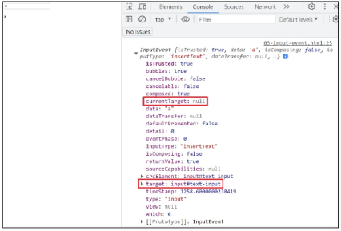

## event handler 활용 실습
1. click 이벤트
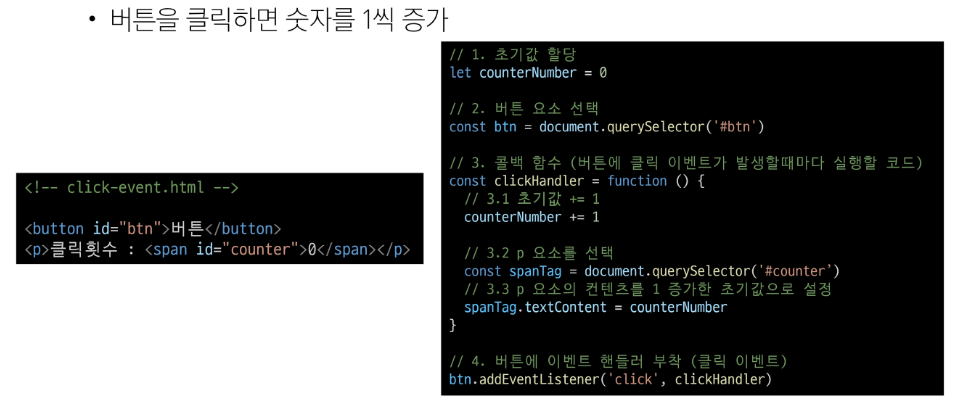

2. input 이벤트
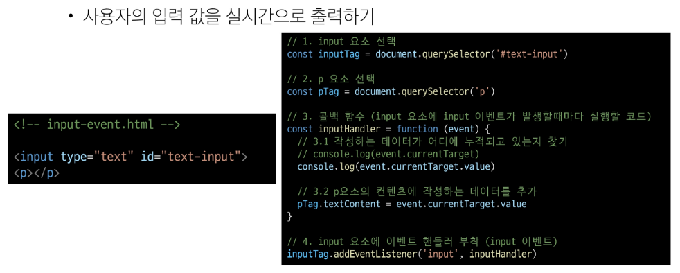

3. click & input 이벤트
- 사용자의 입력 값을 실시간으로 출력
- '+' 버튼을 클릭하면 출력한 값의 CSS 스타일을 변경하기
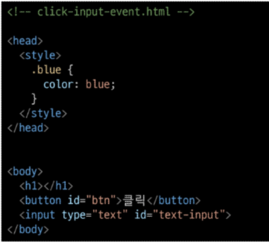
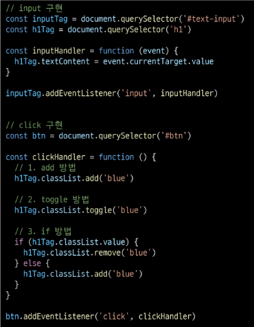

4. todo
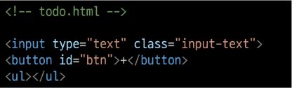
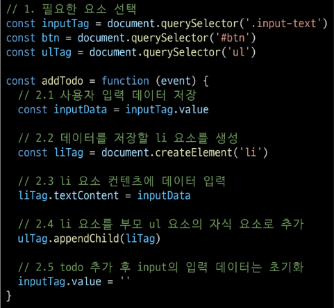
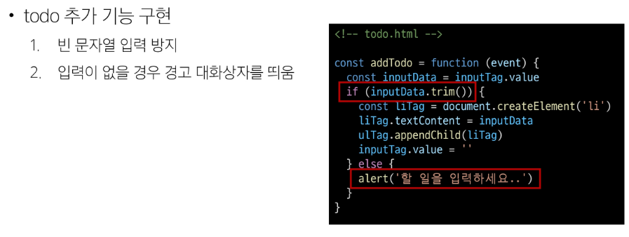

5. 로또 번호 생성기
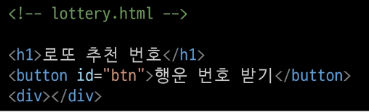
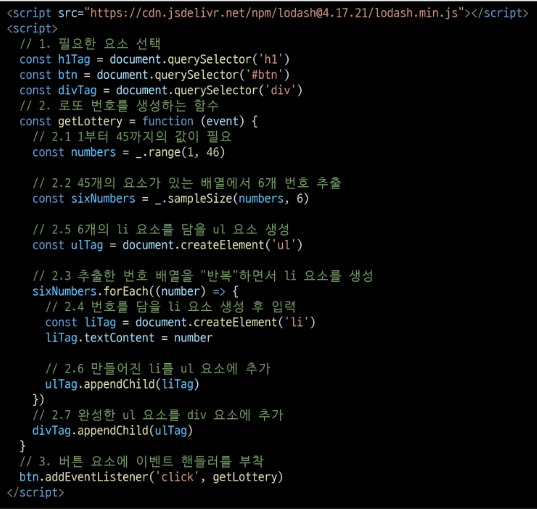

### 이벤트 기본 동작 취소하기
- HTML의 각 요소가 기본적으로 가지고 있는 이벤트가 때로는 방해가 되는 경우가 있어 이벤트의 기본 동작을 취소할 필요가 있음
- 예시
  - form요소의 제출 이벤트를 취소하여 페이지 새로고침을 막을 수 있음
  - a 요소를 클릭할 때 페이지 이동을 막고 추가 로직을 수행할 수 있음

### .preventDefault()
해당 이벤트에 대한 기본 동작을 실행하지 않도록 지정

### 이벤트 동작 취소 실습
- copy 이벤트 동작 취소
  - 콘텐츠를 복사하는 것을 방지
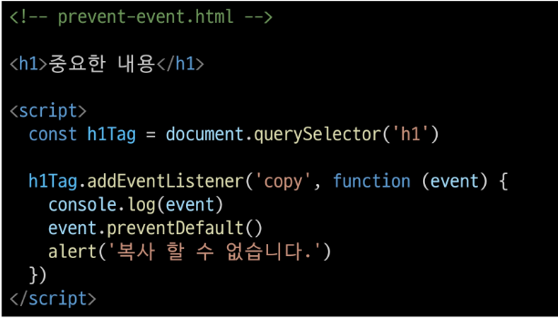

- form 제출 시 페이지 새로고침 동작 취소
  - form 요소의 submit 동작(action 값으로 요청)을 취소 시킴
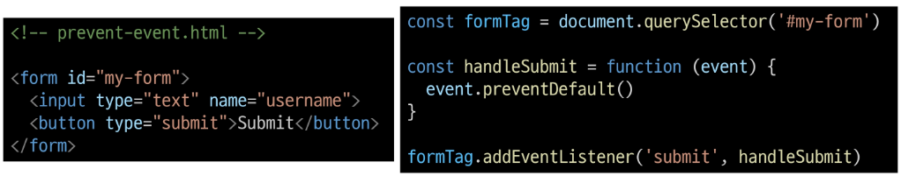


### addEventListener와 화살표 함수 관계
#### addEventListener에서의 화살표 함수 주의사항
- 화살표 함수는 자신만의 this를 생성하지 않음
- 대신, 화살표 함수가 정의된 곳의 상위 스코프의 this를 그대로 사용
- 대부분의 경우, 이는 전역 객체(브라우저에서는 window)를 가리키게 됨
- 해결책
    1. 일반 함수로 사용하기
    2. 화살표 함수일 경우 event.currentTarget을 사용하기
    ```JS
    element.addEventListener('click', function () {
      console.log(this) // <button id="function">function</button>
    })

    element.addEventListener('click', () => {
      console.log(this) // window
    })
    ```
