# 데이터 타입
## 원시 자료형(Primitive type)
Number, String, Boolean, null, undefined
- 변수에 값이 직접 저장되는 자료형 (불변, 값이 복사)
- 변수에 할당될 때 값이 복사됨
  - 변수 간에 서로 영향을 미치지 않음
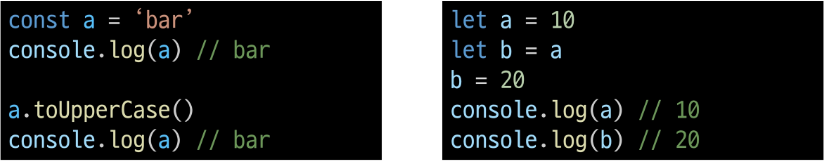

## 참조 자료형(Reference type)
Objects (Object, Array, Function)
- 객체의 주소가 저장되는 자료형 (가변, 주소가 복사)
- 객체를 생성하면 객체의 메모리 주소를 변수에 할당
  - 변수 간에 서로 영향을 미침
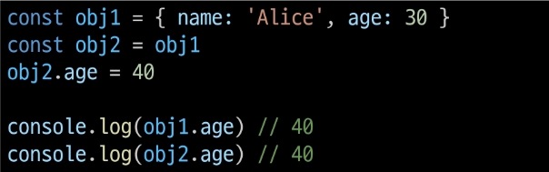


### Number
정수 또는 실수형 숫자를 표현하는 자료형

### String
텍스트 데이터를 표현하는 자료형
- '+' 연산자를 사용해 문자열끼리 결합
- 뺄셈, 곱셈, 나눗셈 불가능

### Template literals (템플릿 리터럴)
- 내장된 표현식을 허용하는 문자열 작성 방식
- Backtick(``)을 이용하며, 여러 줄에 걸쳐 문자열을 정의할 수도 있고 JavaScript의 변수를 문자열 안에 바로 연결할 수 있음
- 표현식은 '$'와 중괄호({expression})로 표기
- ES6+ 부터 지원


### null 과 undefined
null
- 프로그래머가 의도적으로 '값이 없음'을 나타낼 때 사용
- null의 타입은 'object'

undefined
- 시스템이나 JavaScript 엔진이 '값이 할당되지 않음'을 나타낼 때 사용

### Boolean
- 조건문 또는 반복문에서 Boolean이 아닌 데이터 타입은 '자동 형변환 규칙에 따라 true 또는 false로 변환됨

### 자동형변환
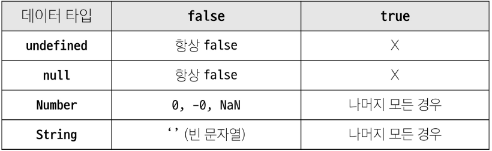

# 연산자
## 할당 연산자
단축 연산자 지원

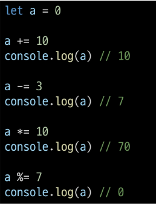

## 증가 & 감소 연산자
- 증가 연산자 ('++')
  - 피연산자를 증가(1을 더함)시키고 연산자의 위치에 따라 증가하기 전이나 후의 값을 반환
- 감소 연산자 ('--')
  - 피연사자를 감소(1을 뺌)시키고 연산자의 위치에 따라 감소하기 전이나 후의 값을 반환
- '+=' 또는 '-='와 같이 더 명시적인 표현으로 작성하는 것을 권장
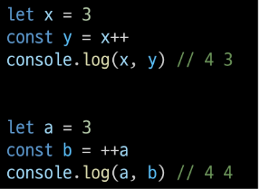

## 비교연산자
- 피연산자들(숫자, 문자, Boolean 등)을 비교하고 결과 값을 boolean으로 반환하는 연산자
- '<', '>'

## 동등 연산자 (==)
- 두 피연산자가 같은 값으로 평가되는 지 비교 후 boolean 값을 반환
- '암묵적 타입 변환'을 통해 타입을 일치시킨 후 같은 값인 지 비교
- 두 피연산자가 모두 객체일 경우 메모리의 같은 객체를 바라보는 지 판별
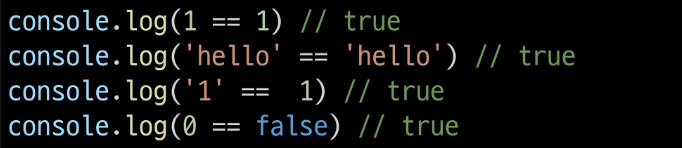

## 일치 연산자 (===)
- 두 피연산자의 값과 타입이 모두 같은 경우 true를 반환
- 같은 객체를 가리키거나, 같은 타입이면서 같은 값인지를 비교
- 엄격한 비교가 이뤄지며 암묵적 타입 변환이 발생하지 않음
- 특수한 경우를 제외하고는 동등 연사자가 아닌 일치 연산자 사용 권장
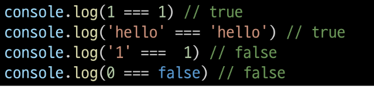

## 논리 연산자
- and 연산
  - &&
- or 연산
  - ||
- not 연산
  - !
- 단축 평가 지원

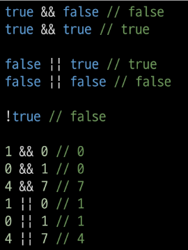


# 조건문
## if
조건 표현식의 결과값을 boolean 타입으로 변환 후 참/거짓을 판단
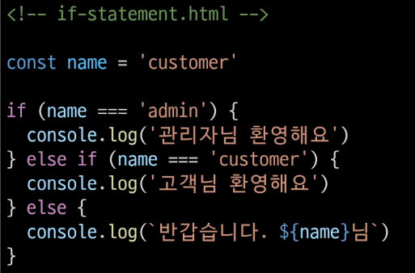

## 삼항 연산자
- condition
  - 평가할 조건 (true 또는 false로 평가)
- expression1
  - 조건이 true일 경우 반환할 값 또는 표현식
- expression2
  - 조건이 false일 경우 반환할 값 또는 표현식 


- 간단한 조건부 로직을 간결하게 표현할 때 유용
- 복잡한 로직이나 대다수의 경우에는 가독성이 떨어질 수 있으므로 적절한 상황에서만 사용할 것
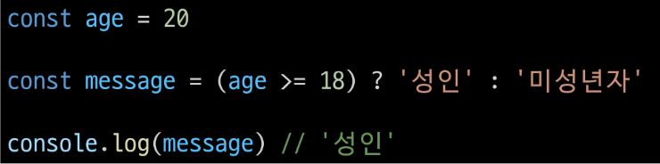


# 반복문
## while
조건문이 참이면 문장을 계속해서 수행
```JS
while (조건문) {
  // do something
}
```


## for
특정한 조건이 거짓으로 판별될 때까지 반복
```JS
for ([초기문]; [조건문]; [증감문]) {
  // do something
}
```
### for 동작 원리
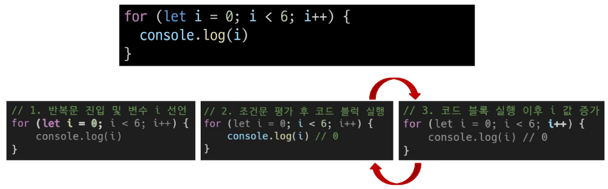


### for...in
객체의 열가 가능한 속성(property)에 대해 반복
```JS
for (variable in object) {
  statement
}

// 예시
const fruits = {a: 'apple', b: 'banana'}

for (const property in object) {
  console.log(property) // a,b
  console.log(object[property]) // apple, banana
}
```

### for...of
반복 가능한 객체(배열, 문자열 등)에 대해 반복
```JS
for (variable of iterable) {
  statement
}

// 예시
const numbers = [0, 1, 2, 3]

for (const number of numbers) {
  console.log(number) // 0, 1, 2, 3
}
```

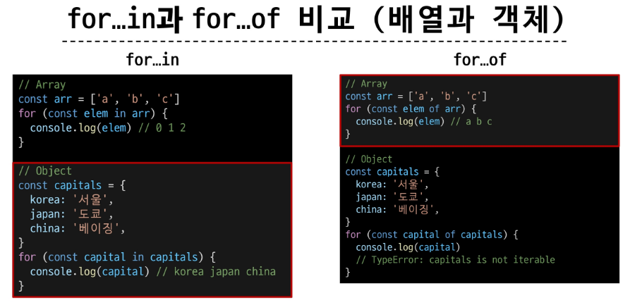

### **배열 반복과 for...in
- 객체 관점에서 배열의 인덱스는 "정수 이름을 가진 열거 가능한 속성"
- for...in은 정수가 아닌 이름과 속성을 포함하여 열거 가능한 모든 속성을 반환
- 내부적으로 for...in은 배열의 반복자가 아닌 속성 열거를 사용하기 때문에 특정 순서에 따라 인덱스를 반환하는 것을 보장할 수 없음

- for...in은 인덱스의 순서가 중요한 배열에서는 사용하지 않음
- 배열에서는 for문, for...of를 사용
- 객체 관점에서 배열의 인덱스는 정수 이름을 가진 속성이기 때문에 인덱스가 출력됨 (순서 보장 X)
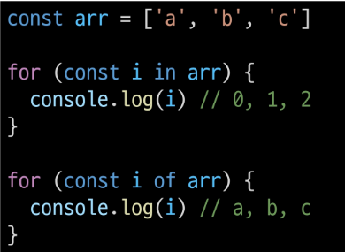

### **반복문 사용 시 const 사용 여부
- for문
  - for (let i = 0; i < arr.length; i++) {...}의 경우에는
  - 최초 정의한 i를 "재할당" 하면서 사용하기 때문에 const를 사용하면 에러 발생
- for...in, for...of
  - 재할당이 아니라, 매 반복마다 다른 속성 이름이 변수에 지정되는 것이므로 const를 사용해도 에러가 발생하지 않음
  - 단, const 특징에 따라 블록 내부에서 변수를 수정할 수 없음

### 반복문 정리
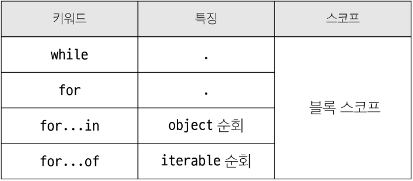


## NaN을 반환하는 경우
1. 숫자로서 읽을 수 없음 (Number(undefined))
2. 결과가 허수인 수학 계산식 (Math.sqrt(-1))
3. 피연산자가 NaN(7**NaN)
4. 정의할 수 없는 계산식 (0 * Infinity)
5. 문자열을 포함하면서 덧셈이 아닌 계산식 ('가' / 3)