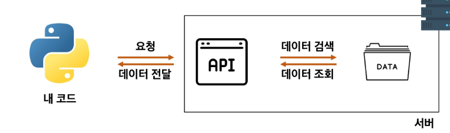

- [관통프로젝트 연습](#관통프로젝트-연습)
  - [실습01](#실습01)
  - [실습02](#실습02)
      - [데이터 사이언스](#데이터-사이언스)
      - [정보를 추출하는 5가지 단계](#정보를-추출하는-5가지-단계)
      - [데이터 수집](#데이터-수집)
      - [csv란](#csv란)
      - [\*\*데이터 사이언스에서 자주 활용하는 파이썬 패키지](#데이터-사이언스에서-자주-활용하는-파이썬-패키지)
# 관통프로젝트 연습


** 인터넷 날씨 정보를 가져와 정보 출력

서버와 클라이언트
- 서버 : 요청을 받아서 처리해주거나, 원하는 값을 돌려주는 역할
- 클라이언트 : 정보를 요청하는 역할

클라이언트가 서버에 요청하는 두 가지 방법
1. 웹 브라우저(크롬)을 켜서 주소창에 url(주소) 입력
2. 서버에 정보를 요청하는 파이썬 코드 작성


requests : 브라우저처럼 파이썬에서 서버에 요청을 보낼 수 있는 패키지

```python
$ pip install requests
```
존재하지 않는 패키지를 import 하려하면 오류 밑줄이 뜸.


url
- 요청을 보내는 서버의 주소

requests.get(url)
- 해당 서버(url)에 데이터를 달라고 요청을 보내는 함수

.json()
- 내부 데이터를 json(딕셔너리와 비슷) 형태로 변환해주는 함수


*** API
- 클라이언트가 원하는 기능을 수행하기 위해서 서버 측에 만들어 놓은 프로그램
  기능 예시 : 데이터 저장, 조회,  수정, 삭제 등
- 서버 측에 특정 주소로 요청이 오면 정해진 기능을 수행하는 API를 미리 만들어 둡니다.
  클라이언트는 서버가 미리 만들어 놓은 주소로 요청을 보냄





오픈 API
- 외부에서 사용할 수 있도록 무료로 개방된 API
- 사용법은 공식문서(Docs)에 명시돼 있음.

- 너무 많은 계정에서 동시 요청하면 서버가 견디지 못하기에 
**오픈API는 API KEY를 활용하여 사용자를 확인

- 서버에 요청할 때 마다 해당 API key를 함꼐 보내 정상적인 사용자인 것을 확인 받음.
- 일부 오픈 API는 사용량이 제한돼 있다.
-- 따라서 일일 및 월간 사용량 제한을 확인해야한다. 사용량이 초과될 경우 요금이 청구될 수 있다.


JSON
JavaScript Object Notation의 약자_ 자바스크립트 객체 표기법
- 데이터를 저장하거나 전송할 때 많이 사용되는 경량의 텍스트 기반의 데이터 형식
- 통신 방법이나 프로그래밍 문법이 아니라 단순히 데이터를 표현하는 방법 중 하나

** 특징
  - 데이터는 중괄호{}로 둘러싸인 - 키-값 상의 집합으로 표현
  - 키 = 문자열 / 값 = 다양한 데이터 유형을 가질 수 있다.
  - 값은 쉼표(,)로 구분됨

** 참고
- 파싱(Parksing): 데이터를 의미 있는 구조로 분석하고 해석하는 과정
- json.loads() : JSON 형식의 문자열을 파싱하여 python Dictionary로 변환


## 실습01
날씨 데이터 수집

- OpenWeatherMap API


```python
import requests
from pprint import pprint
city = 'Seoul,KR'
api_key = 'API_KEY' # 본인 API KEY

# 공식문서 API 활용법 url
url = f'https://api.openweathermap.org/data/2.5/weather?lat={lat}&lon={lon}&appid={api_key}'

response = requests.get(url).json()
pprint(response)
```

## 실습02
#### 데이터 사이언스
- 다양한 데이터로부터 새로운 지식과 정보를 추출하기 위해
- 과학적 방법론, 프로세스, 알고리즘, 시스템을 동원하는 융합 분야
- 컴퓨터 과학, 통계학, 수학 등 다양한 학문의 원리와 기술을 활용


#### 정보를 추출하는 5가지 단계
1. 문제 정의 : 해결하고자 하는 문제 정의
2. 데이터 수집 : 문제 해결에 필요한 데이터 수집
3. 데이터 전처리(정제) : 실질적인 분석을 수행하기 위해 데이터를 가공하는 단계
   - 수집한 데이터의 오류 제거(결측치, 이상치), 데이터 형식 변환 등
4. 데이터 분석 : 전처리가 완료된 데이터에서 필요한 정보를 추출하는 단계
5. 결과 해석 및 공유 : 의사 결정에 활용하기 위해 결과를 해석하고 시각화 후 공유하는 단계


#### 데이터 수집
- 웹 스크래핑(Web scraping) : 웹 페이지에서 데이터를 추출하는 기술
- 웹 크롤링(Web crawling) : 웹 페이지를 자동으로 탐색하고 데이터를 수집하는 기술
    - robots.txt : 웹 페이지의 어디까지 수집하는 것이 허용되는지 명시한 파일
- Open API 활용 : 공개된 API를 통해 데이터를 수집
- 데이터 공유 플랫폼 활용 : 다양한 사용자가 데이터를 공유하고 활용할 수 있는 온라인 플랫폼
    - 종류 : 캐글(Kaggle), Data.world, 데이콘(Dacon), 공공데이터포털 등

#### csv란
- 몇 가지 필드를 쉼표(,)로 구분한 텍스트 데이터 및 텍스트 파일
- 일반적으로 표 형식의 데이터를 CSV 형태로 많이 사용
- 저장, 전송 및 처리 속도가 빠르며, 처리 가능한 프로그램이 다양함

#### **데이터 사이언스에서 자주 활용하는 파이썬 패키지

- 데이터 처리 및 데이터 분석
    - Numpy : 수학 계산용 패키지. Pandas와 Matplotlib를 사용하기 위해 활용되는 패키지
      - 다차원 배열을 쉽게 처리하고 효율적으로 사용할 수 있도록 지원하는 파이썬 패키지
        - 장점 
          - Numpy 행렬 연산은 데이터가 많을수록 Python 반복문에 비해 빠르다
          - 다차원 행렬 자료 구조를 제공하여 개발하기 편하다.
        - 특징
          - CPython(공식 사이트의 Python) 에서만 사용 가능
          - 행렬 인덱싱(Array Indexing)기능 제공
  

    - Pandas : 원하는 데이터만 추출하거나 데이터를 분석할 때 활용되는 패키지
      - Numpy의 한계
        - 유연성(데이터에 레이블을 붙이거나 누락된 데이터로 작업)이 부족함
        - 그룹화, 피벗 등 구조화가 부족함
      - Pandas는 프로그래밍 버전의 엑셀을 다루듯 고성능의 데이터 구조를 만들 수 있다.
      - Numpy 기반으로 만들어진 패키지, Series(1차원 배열)과 DataFrame(2차원 배열)이란 효율적인 자료구조 제공


- 데이터 시각화
    - Matplotlib : 그래프를 그려주는 패키지  | PYPI.org

##### 도전과제 내용
```python
# CSV 파일 경로
csv_path = "C:/Users/SSAFY/Desktop/PJT/pjt/pjt02/버전1_금융/archive/NFLX.csv"
# copy file path를 이용하면 경로가 '\' 로 표기되기 때문에 '/'로 바꿔줘야 돌아감

# CSV 파일 읽어오기 (첫 번째, 마지막 열 제외)
df = pd.read_csv(csv_path, usecols=range(0,5))

# 'Date' 컬럼을 datetime 형식으로 변환
df['Date'] = pd.to_datetime(df['Date'])

# 2021년 데이터만 필터링
df_2021 = df[df['Date'].dt.year >= 2021]

# 그래프에 그리드를 추가하여 시각적으로 보기 좋게 만듭니다.
plt.grid(True)

# 'Close' 컬럼의 최고값과 최저값 계산_내장함수 max, min
max_close = df_post_2021['Close'].max()
min_close = df_post_2021['Close'].min()

# 월별로 그룹화하여 'Close' 컬럼의 평균값 계산
df_monthly_avg = df_post_2021.groupby(df['Date'].dt.to_period('M')).agg({'Close': 'mean'})
# 그룹화 후 인덱스 리셋
df_monthly_avg = df_monthly_avg.reset_index()
# 'Date' 컬럼을 문자열로 변환
df_monthly_avg['Date'] = df_monthly_avg['Date'].astype(str)

# strfrtime 사용해서 평균 계산 시 astype(str)과 reset_indexing을 하지 않아도 된다.
df_monthly_avg = df_post_2021.groupby(df_post_2021['Date'].dt.strftime("%Y-%m")).mean()


# 범례 설정을 위해 plot에서 라벨링을 해줘야 범례가 등장한다.
plt.plot(df_post_2022['Date'], df_post_2022['High'], label = 'High')
plt.plot(df_post_2022['Date'], df_post_2022['Low'], label = 'Low')
plt.plot(df_post_2022['Date'], df_post_2022['Close'], label = 'Close')
plt.legend()
```