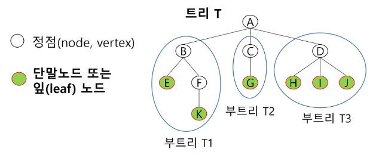
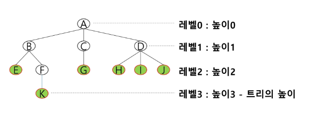
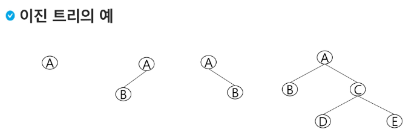
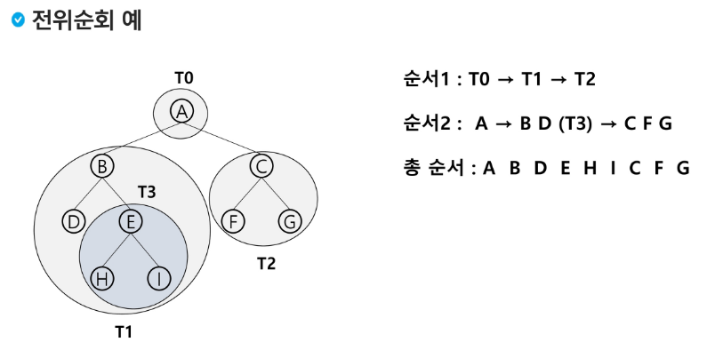
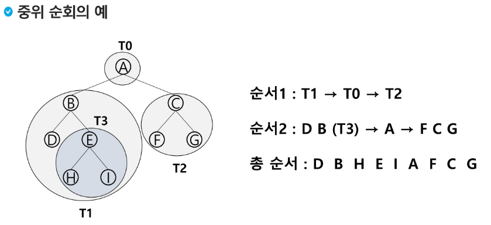
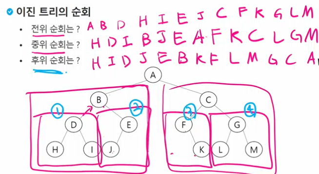
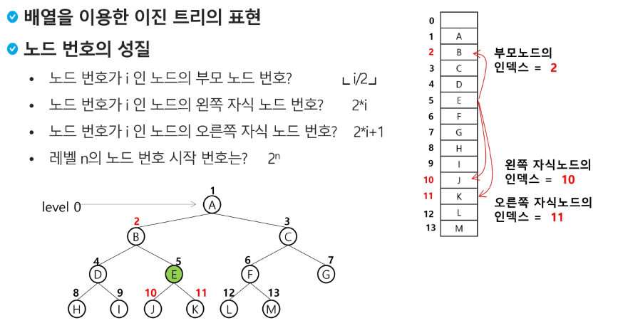
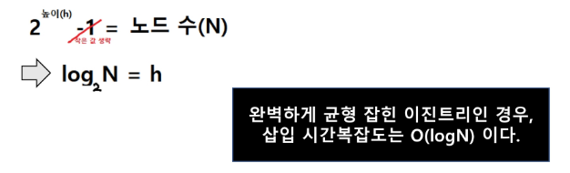
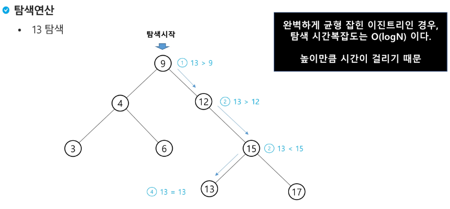
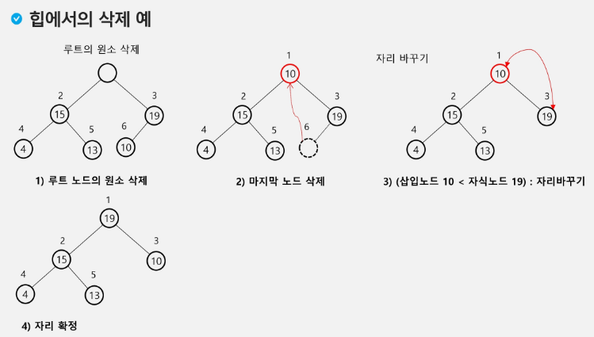

# Tree 트리

## 트리의 개념
- 비선형 구조
- 원소들 간에 1:n 관계를 가지는 자료구조
- 원소들 간에 계층관계를 가지는 계층형 자료구조
- 상위 원소에서 하위 원소로 내려가면서 확장되는 트리(나무)모양의 구조

## 트리의 정의
- 한 개 이상의 노드로 이루어진 유한 집합이며 다음 조건을 만족한다.
  - 노드 중 최상위 노드를 루트(root)라 한다.
  - 나머지 노드들은 n(>=0)개의 분리 집합 T1,...,TN으로 분리될 수 있다.
- 이들 T1,...TN은 각각 하나의 트리가 되며(재귀적 정의) 루트의 부 트리(subtree)라 한다.
  


## 트리 용어 정리
- 간선(edge) - 노드를 연결하는 선, 부모 노드와 자식 노드를 연결
- 노드(node) - 트리의 원소
  - 트리 T의 노드 - A, B, C, D, E, F, G, H, I, J, K
  - 루트 노드(root node) - 트리의 시작 노드 - A
  - 형제 노드(sibling node) - 같은 부모 노드의 자식 노드들
    - B, C, D는 형제 노드
    - **형제 노드 및 대각선의 노드끼리 연결할 수 없기 때문에 트리는 싸이클이 없다**
  - 조상 노드 - 간선을 따라 루트 노드까지 이르는 경로에 있는 모든 노드들
    - K의 조상 노드 : F, B, A
  - 서브 트리(subtree) - 부모 노드와 연결된 간선을 끊었을 때 생성되는 트리
  - 자손 노드 - 서브 트리에 있는 하위 레벨의 노드들
    - B의 자손 노드 - E, F, K
- 차수(degree)
  - 노드의 차수 : 노드에 연결된 자식 노드의 수
    - B의 차수 = 2 / C의 차수 = 1
  - 트리의 차수 : 트리에 있는 노드의 차수 중에서 가장 큰 값
    - 트리 T의 차수 = 3
  - 단말 노드(리프 노드) : 차수가 0인 노드. 자식 노드가 없는 노드
- 높이
  - 노드의 높이 : 루트에서 노드에 이르는 간선의 수. 노드의 레벨
    - B의 높이 = 1 / F의 높이 = 2
  - 트리의 높이 : 트리에 있는 노드의 높이 중에서 가장 큰 값. 최대 레벨
    - 트리 T의 높이 = 3



# 이진 트리
- 모든 노드들이 2개의 서브트리를 갖는 특별한 형태의 트리
- 각 노드가 자식 노드를 최대한 2개까지만 가질 수 있는 트리 - 0, 1, 2
  - 왼쪽 자식 노드(left child node)
  - 오른쪽 자식 노드(right shild node)



## 이진 트리의 특성
**중요**
- 레벨 i에서의 노드의 최대 개수는 2^i개
  - i층 까지 최대 노드의 개수 합 : (2^i+1) - 1
- 높이가 h인 이진트리가 가질 수 있는 노드의 최소 개수는 (h+1)개_h개+루트노드 가 되며,
- 최대 개수는 (2^h+1 -1)개가 된다.

## 이진 트리 종류
### 포화 이진 트리(Full Binary Tree)
- 모든 레벨에 노드가 포화상태로 차 있는 이진 트리 - 모든 노드의 자식이 2개
- 높이가 h일때, 최대의 노드 개수인 (2^h+1 -1)의 노드를 가진 이진 트리
  - 높이 3일때 2^(3+1) -1 = 15개
- 루트를 1번으로 하여 (2^h+1 -1)까지 정해진 위치에 대한 노드 번호를 가짐

### 완전 이진 트리(Complete Binary Tree)
- 높이가 h이고 노드 수가 n개일 때 (단, 2^h <= n <= 2^h+1 -1),
- 포화 이진 트리의 노드 번호 1번부터 n번까지 빈 자리가 없는 이진 트리
  - 순서대로 좌측부터 맞는 번호에 채워진 경우

### 편향 이진 트리(Skewed Binary Tree)
- 높이 h에 대한 최소 개수의 노드를 가지면서 한쪽 방향의 자식 노드만을 가진 이진 트리
  - 왼쪽 편향 이진 트리
  - 오른쪽 편향 이진 트리

## 순회(traversal) - 이거 시험
- 순회(traversal)란 트리의 **각 노드를 중복되지 않게 한 번씩 전부 방문(visit)** 하는 것을 말하는데 트리는 비 선형 구조이기 때문에 선형구조에서와 같이 선후 연결 관계를 알 수 없다.
- 순회(traversal) : 트리의 노드들을 체계적으로 방문하는 것
- 3가지의 기본적인 순회 방법
  - 전위순회(preorder traversal) : VLR
    - 부모노드 방문 후, 자식 노드를 좌, 우 순서로 방문한다.
  - 중위순회(inorder traversal) : LVR
    - 왼쪽 자식노드, 부모노드, 오른쪽 자식노드 순으로 방문한다.
  - 후위순회(postorder traversal) : LRV
    - 자식노드를 좌우 순서로 방문한 후, 부모 노드로 방문한다.

### 전위 순회(preorder traversal)
- 수행 방법 본-왼-우
  1. 현재 노드 n을 방문하여 처리한다 -> V
  2. 현재 노드 n의 왼쪽 서브트리로 이동한다. -> L
  3. 현재 노드 n의 오른쪽 서브트리로 이동한다. -> R
- 전위 순회 알고리즘
```py
def preorder_traverse(T):
  if T:   # T is not None
    visit(T)  # print(T.item)
    preorder_traverse(T.left)
    preorder_traverse(T.right)
```



### 중위 순회(inorder traversal)
- 수행 방법 왼-본-우
  1. 현재 노드 n의 왼쪽 서브트리로 이동한다. -> L
  2. 현재 노드 n을 방문하여 처리한다 -> V
  3. 현재 노드 n의 오른쪽 서브트리로 이동한다. -> R
- 중위 순회 알고리즘
```py
def inorder_traverse(T):
  if T:
    inorder_traverse(T.left)
    visit(T)    # print(T.item)
    inorder_traverse(T.right)
```



### 후위 순회(postorder traversal)
- 수행 방법 - 자식노드부터 왼-우-본
  1. 현재 노드 n의 왼쪽 서브트리로 이동한다. -> L
  2. 현재 노드 n의 오른쪽 서브트리로 이동한다. -> R
  3. 현재 노드 n을 방문하여 처리한다 -> V
- 후위 순회 알고리즘
```py
def postorder_traverse(T):
  if T:
    postorder_traverse(T.left)
    postorder_traverse(T.right)
    visit(T)
```



## 이진 트리의 표현
- 배열을 이용한 이진 트리의 표현
  - 이진 트리에 각 노드 번호를 부여
  - 루트는 1번
  - 레벨 n에 있는 노드에 대하여 왼쪽부터 오른쪽으로 2^n 부터 2^n+1 -1까지 번호 차례로 부여




## 이진 탐색 트리(BST-Binary Search Tree)
- Data들을 빠르게 검색할 수 있도록 체계적으로 저장해 두고, **최대 O(logn)의 빠른 속도로 값을 검색**할 수 있는 자료구조
- 빠르게 검색될 수 있도록, 특정 규칙을 갖는 이진트리 형태로 값을 저장해둔다.

- 리스트 vs BST
  - BST는 리스트보다 더 빠른 삽입 / 삭제 / 탐색이 가능하다.
  - 리스트 성능
    - 삽입 : O(n), 단 맨 끝 삽입은 O(1)
    - 삭제 : O(n), 단 맨 끝 삽입은 O(1)
    - 탐색 : O(n)
  - BST 성능
    - 삽입 : 평균 O(logN)
    - 삭제 : 평균 O(logN)
    - 탐색 : 평균 O(logN)
- 평균이 매우 좋다.(무조건 좋은 것이 아닌 평균이 좋다.)
- **파이선 공식 Library에는 이진탐색 트리가 내장돼있지 않아 직접 구현해야 한다.**


- 삽입을 위해 root부터 바닥 노드까지 탐색, 본인 위치 찾기
  - 이는 트리의 높이(h)만큼 탐색시간이 걸린다.
  - 만약 편향된 이진트리는 리스트와 같기 때문에 시간 복잡도 O(n) _ 최악의 경우





- 성능 요약
  - 탐색, 삽입, 삭제 시간은 트리의 높이 만큼 시간이 걸린다.
    - O(h), h : BST의 길피(height)
  - 평균의 경우
    - 이진 트리가 균형적으로 생성되어 있는 경우
    - O(logn)
  - 최악의 경우
    - 한쪽으로 치우친 경사 이진트리(편향)
    - o(n)
    - 순차탐색과 시간복잡도가 같다.(리스트)

- 삭제 연산
  1. 리프노드 삭제 - 그냥 삭제
  2. 자식이 하나 -> 자식-부모 연결 후 삭제
  3. 자식이 둘이면 -> 삭제하고자 하는 노드의 왼쪽 서브트리의 가장 큰값 / 오른쪽 서브트리의 가장 작은값

# 힙
- 완전 이진 트리에 있는 노드 중에서 키 값이 가장 큰 노드나 키값이 가장 작은 노드를 찾기 위해서 만든 잘구조
- 힙의 키를 우선순위로 활용하여 **우선순위 큐**를 구현할 수 있다.  **중요!**
- 
- 최대힙(max heap)
  - 키 값이 가장 큰 노드를 찾기 위한 완전 이진 트리
  - 부모노드의 키 값 > 자식 노드의 키 값
  - 루트 노드 : 키 값이 가장 큰 노드
- 최소 힙(min heap)
  - 키 값이 가장 작은 노드를 찾기 위한 완전 이진 트리
  - 부모노드의 키 값 < 자식 노드의 키 값
  - 루트 노드 : 키 값이 가장 작은 노드

## 힙 연산 - 삭제
- 힙에서는 루트 노드의 원소만을 삭제할 수 있다.
- 루트 노드의 원소를 삭제하여 반환한다.
- 힙의 종류에 따라 최대값 또는 최소값을 구할 수 있다.


**자식 노드 둘 중에 최대힙일 경우는 더 큰값을, 최소힙일 경우 더 작은 값을 부모노드와 자리 바꾸기**