# State Management (상태관리)
Vue 컴포넌트는 이미 반응형 상태를 관리하고 있음
> 상태 === 데이터

### 컴포넌트 구조의 단순화
- "단방향 데이터 흐름"의 간단한 표현
- 상태 (State)
  - 앱 구동에 필요한 기본 데이터
- 뷰 (View)
  - 상태를 선언적으로 매핑하여 시각화
- 기능 (Actions)
  - 뷰에서 사용자 입력에 대해 반응적으로 상태를 변경할 수 있게 정의된 동작
<!-- <figure class="half"> -->
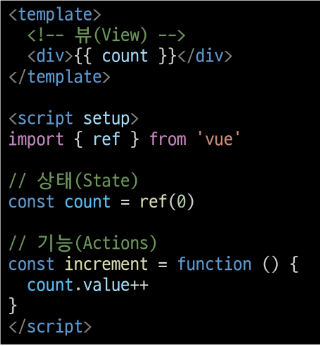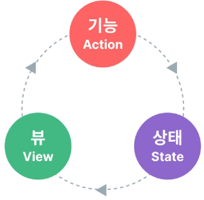

### 상태 관리의 단순성이 무너지는 시점
- 여러 컴포넌트가 상태를 공유할 때
  1. 여러 뷰가 동일한 상태에 종속되는 경우
    - 공유 상태를 공통 조상 컴포넌트로 "끌어올린" 다음 props로 전달하는 것
    - 하지만 계층 구조가 깊어질 경우 비효율적, 관리가 어려워짐
  2. 서로 다른 뷰의 기능이 동일한 상태를 변경시켜야 하는 경우
    - 발신(emit)된 이벤트를 통해 상태의 여러 복사본을 변경 및 동기화 하는 것
    - 마찬가지로 관리의 패턴이 깨지기 쉽고 유지 관리할 수 없는 코드가 됨
- 해결책
  - 각 컴포넌트의 공유 상태를 추출하여, 전역에서 참조할 수 있는 저장소에서 관리
  - 컴포넌트 트리는 하나의 큰 View가 되고 모든 컴포넌트는 트리 계층 구조에 관계없이 상태에 접근하거나 기능을 사용할 수 있음

## Pinia
Vue 공식 상태 관리 라이브러리

### Pinia 설치
- Vite 프로젝트 빌드 시 Pinia 라이브러리 추가
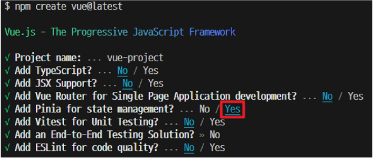

- stores 폴더 신규 생성

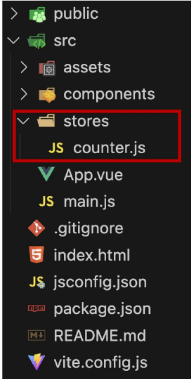

### Pinia 구성 요소
1. store
   - 중앙 저장소
   - 모든 컴포넌트가 공유하는 상태, 기능 등이 작성됨
   - defineStore()의 반환 값의 이름은 user와 store를 사용하는 것을 권장
   - defineStore()의 첫 번째 인자는 애플리케이션 전체에 걸쳐 사용하는 store의 고유 ID
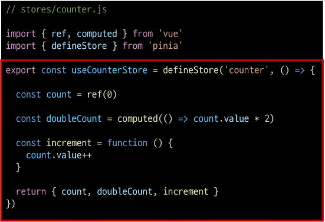
2. state
  - 반응형 상태 (데이터)
  - ref() === state
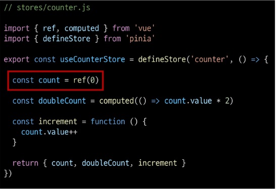
3. getters
  - 계산된 값
  - computed() === getters
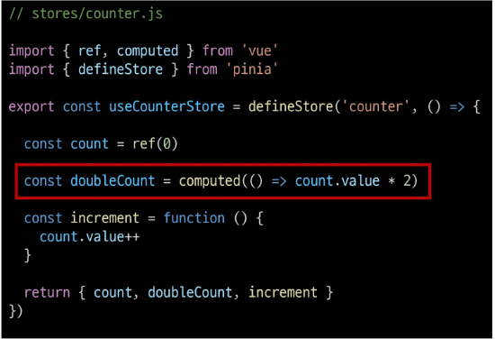
4. actions
  - 메서드
  - function() === actions
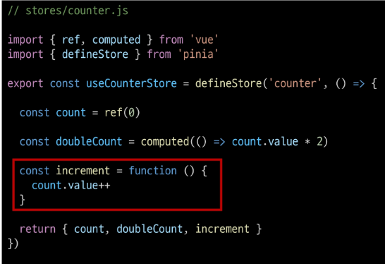
5. plugin
  - 애플리케이션의 상태 관리에 필요한 추가 기능을 제공하거나 확장하는 도구나 모듈
  - 애플리케이션의 상태 관리를 더욱 간편하고 유연하게 만들어주며 패키지 매니저로 설치 이후 별도 설정을 통해 추가 됨

#### Setup Stores의 반환 값
- pinia의 상태들을 사용하려면 반드시 반환해야 함
- store에서는 공유 하지 않는 private한 상태 속성을 가지지 않음
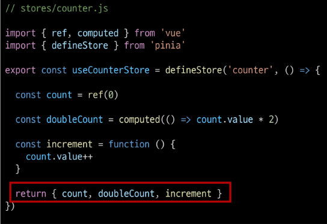

### Pinia 구성 요소 활용
#### State
- 각 컴포넌트 깊이에 관계 없이 store 인스턴스로 state에 접근하여 직접 읽고 쓸 수 있음
- 만약 store에 state를 정의하지 않았다면 컴포넌트에서 새로 추가할 수 없음
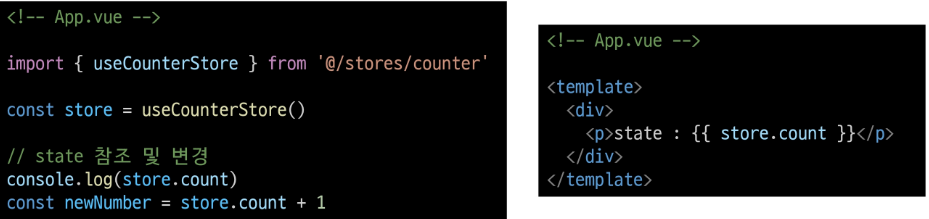

#### Getters
- store의 모든 getters 또한 state 처럼 직접 접근할 수 있음
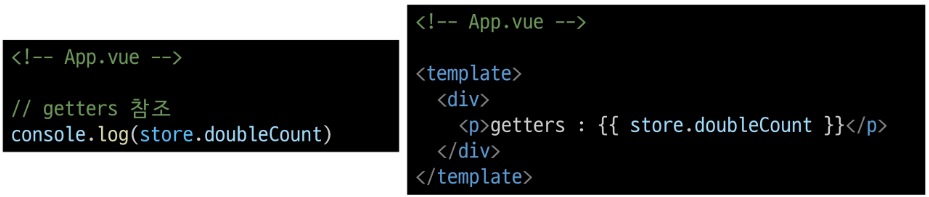

### Actions
- store의 모든 actions 또한 직접 접근 및 호출할 수 있음
- getters와 달리 state 조작, 비동기, API 호출이나 다른 로직을 진행할 수 있음
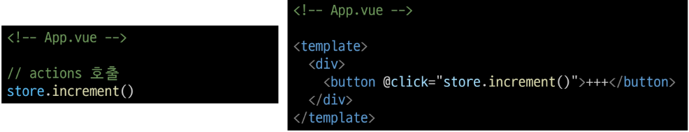

# Pinia를 활용한 Todo 프로젝트 구현
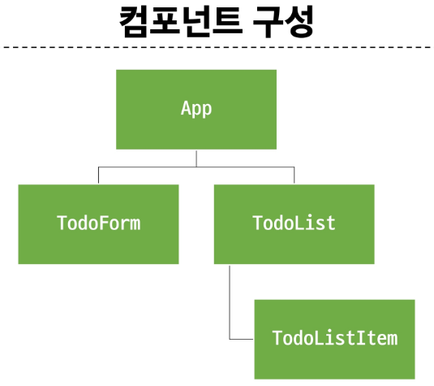

## 사전준비
- 초기 생성된 컴포넌트 모두 삭제 (App.vue 제외)
- src/assets 내부 파일 모두 삭제
- main.js에서 main.css import 코드 삭제

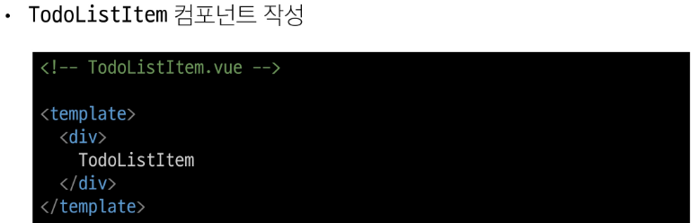
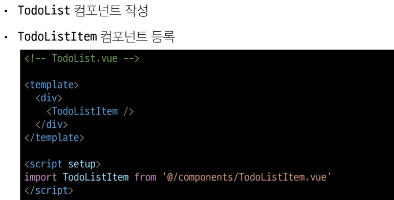
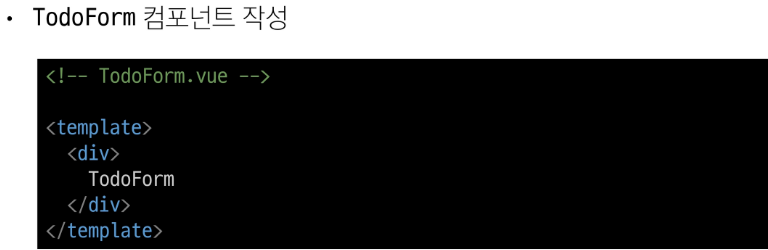
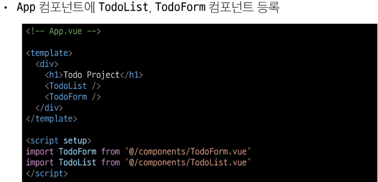

## Read Todo (Todo 조회)
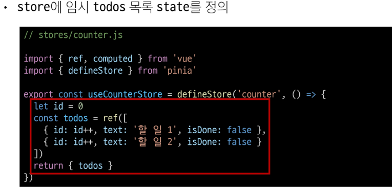
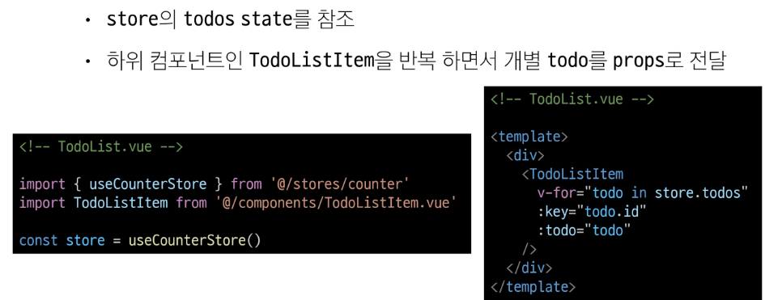
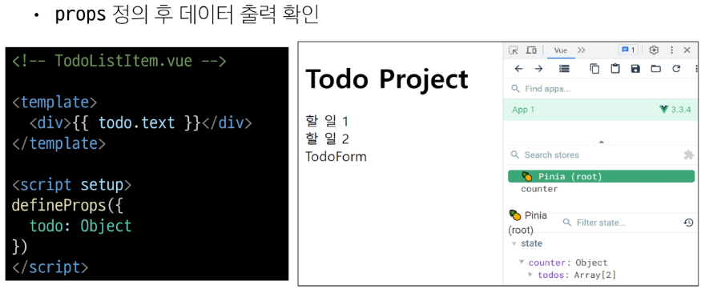

## Create Todo (Todo 생성)
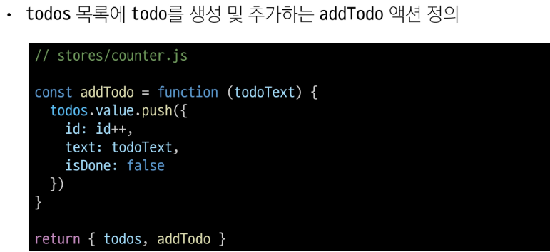
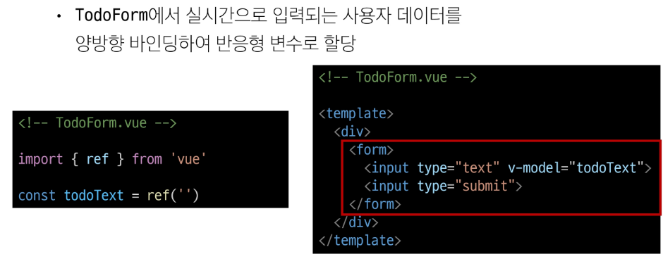
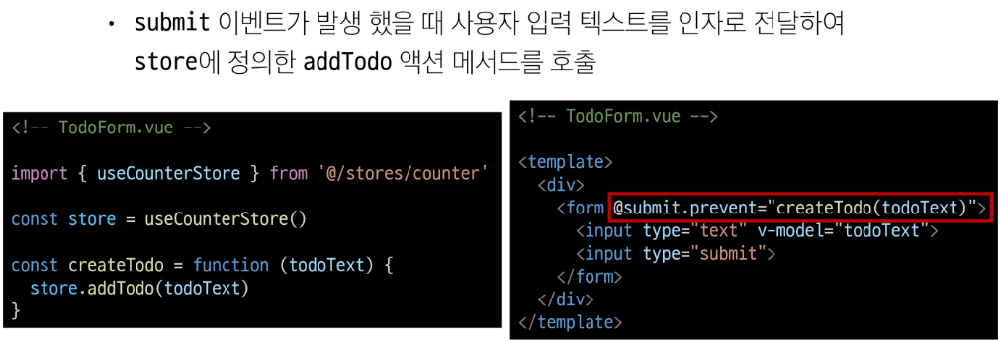
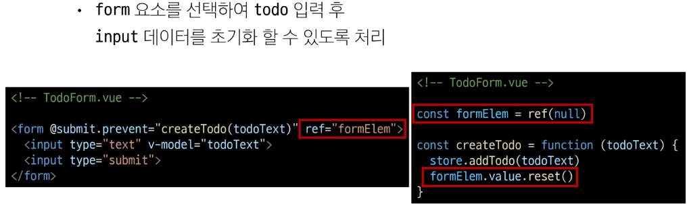

- 결과
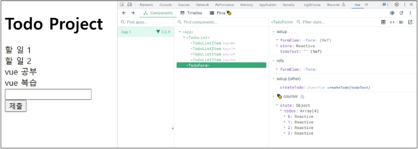

## Delete Todo (Todo 삭제)

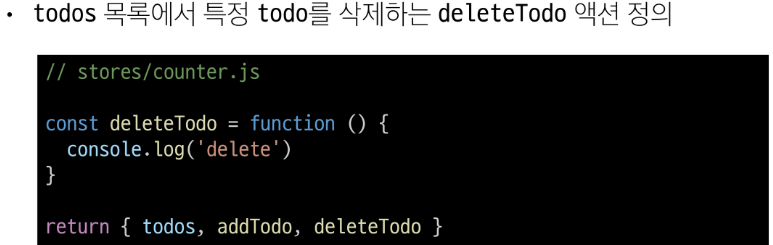
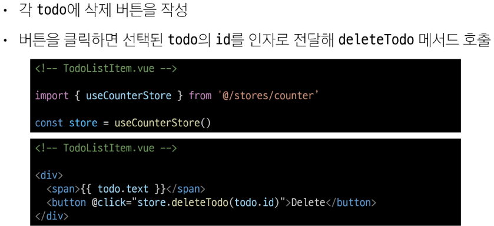
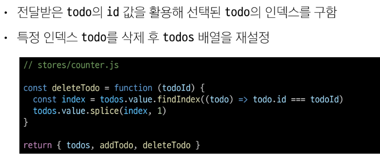
- 결과
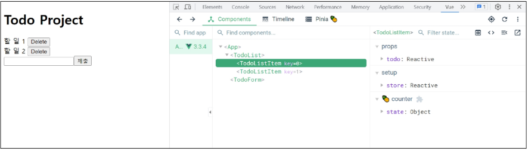

## Update Todo (Todo 수정)
- "각 todo 상태의 isDone 속성을 변경하여 todo의 완료 유무 처리하기"
- 완료된 todo에는 취소선 스타일 적용하기
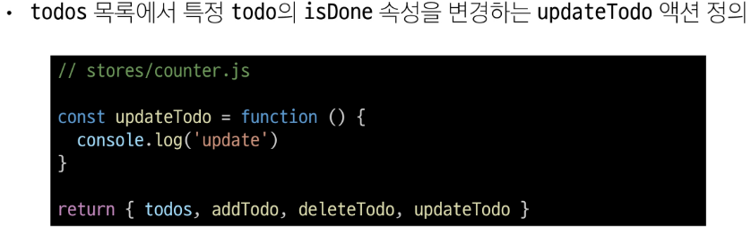
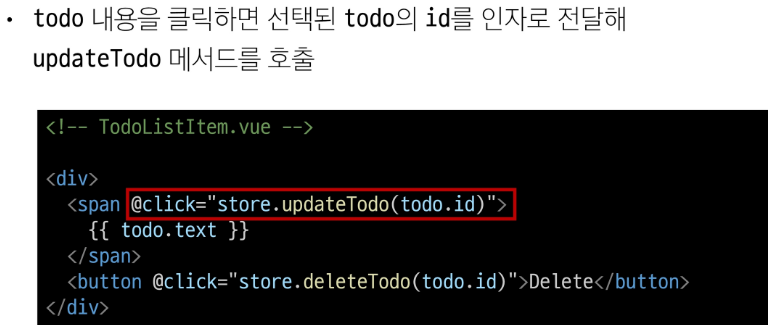
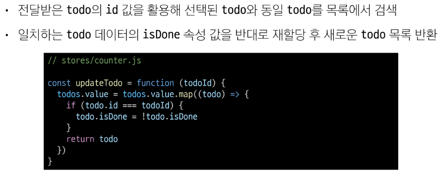

- 결과
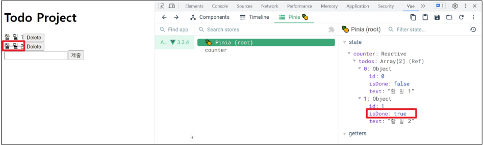

## Counting Todo
## 완료된 todo 개수 계산
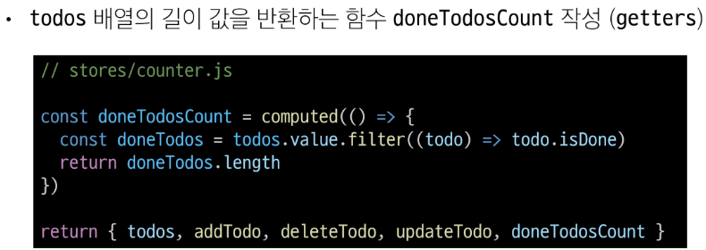
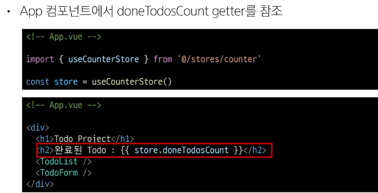

## Local Storage
- 브라우저 내에 key-value 쌍을 저장하는 웹 스토리지 객체
- 페이지를 새로 고침하고 브라우저를 다시 실행해도 데이터가 유지
- 쿠키와 다르게 네트워크 요청 시 서버로 전송되지 않음
- 여러 탭이나 창 간에 데이터를 공유할 수 있음

- 웹 애플리케이션에서 사용자 설정, 상태 정보, 캐시 데이터 등을 클라이언트 측에서 보관하여 웹사이트의 성능을 향상시키고 사용자 경험을 개선하기 위해 사용

### pinia-plugin-persistedstate
- pinia의 플로그인(plugin) 중 하나
- 웹 애플리케이션의 상태(state)를 브라우저의 local storage나 session storage에 영구적으로 저장하고 복원하는 기능을 제공

### pinia-plugin-persistedstate 설정
- 설치 및 등록

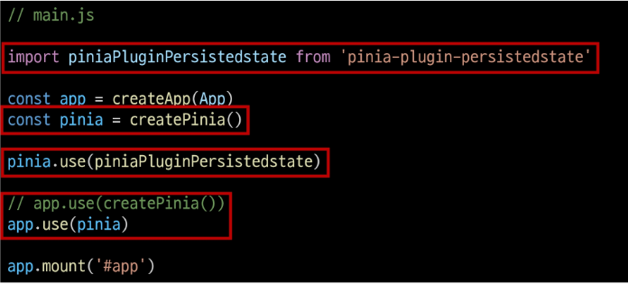

- defineStore()의 3번째 인자로 관련 객체 추가
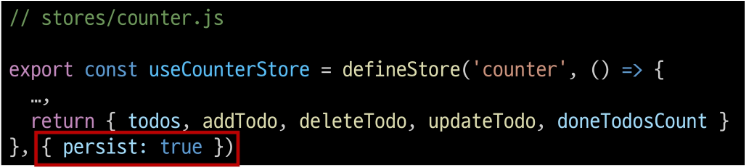
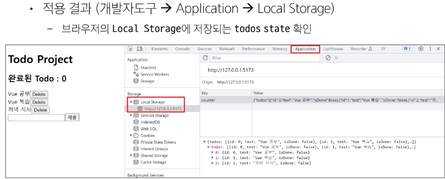
