# Template Syntax
- DOM을 기본 구성 요소 인스턴스의 데이터에 선언적으로 바인딩(Vue Instance와 DOM을 연결)할 수 있는 HTML 기반 템플릿 구문(확장된 문법 제공)을 사용

1. Text Interpolation
- 데이터 바인딩의 가장 기본적인 형태
- 이중 중괄호 구문(콧수염 구문)을 사용
- 콧수염 구문은 해당 구성 요소 인스턴스의 msg 속성 값으로 대체
- msg 속성이 변경될 때마다 업데이트 됨
```js
<p>Message: {{ msg }}</p>
```

2. Raw HTML
- 콧수염 구문은 데이터를 일반 텍스트로 해석하기 때문에 실제 HTML을 출력하려면 v-html을 사용해야 함
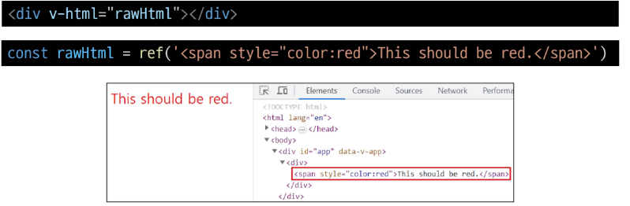

3. Attribute Bindings
- 콧수염 구문은 HTML 속성 내에서 사용할 수 없기 때문에 v-bind를 사용
- HTML의 id 속성 값을 vue의 dynamicID 속성과 동기화 되도록 함
- 바인딩 값이 null이나 undefined인 경우 렌더링 요소에서 제거됨
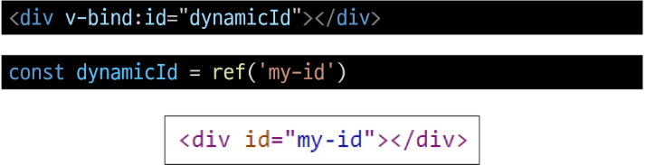

4. JavaScript Expressions
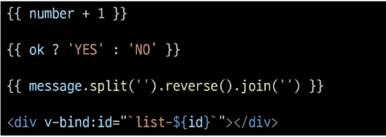
- Vue는 모든 데이터 바인딩 내에서 JavaScript 표현식의 모든 기능을 지원
- Vue 템플릿에서 JavaScript 표현식을 사용할 수 있는 위치
  1. 콧수염 구문 내부
  2. 모든 directive의 속성 값 ("v-"로 시작하는 특수 속성)  
- Expressions 주의사항
  - 각 바인딩에는 하나의 단일 표현식만 포함될 수 있음
  - 표현식은 값으로 평가할 수 있는 코드 조각 (return 뒤에 사용할 수 있는 코드여야 함)
  - 작동하지 않는 경우
   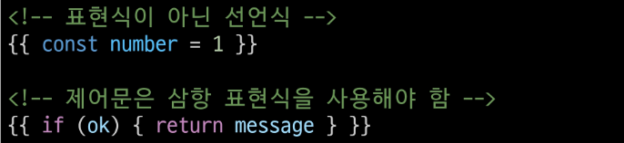


## Directive
- 'v-' 접두사가 있는 특수 속성
- Directive의 속성 값은 단일 JavaScript 표현식이어야 함 (v-for, v-on 제외)
- 표현식 값이 변경될 때 DOM에 반응적으로 업데이트를 적용
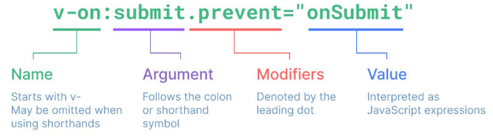

### Directive - "Arguments"
- 일부 directive는 directive 뒤에 콜론 (":")으로 표시되는 인자를 사용할 수 있음
- 아래 예시의 href는 HTML <a> 요소의 href 속성 값을 myUrl 값에 바인딩 하도록 하는 v-bind의 인자

- 아래 예시의 click은 이벤트 수신할 이벤트 이름을 작성하는 v-on의 인자


### Directive - "Modifiers"
- ". (dot)"로 표시되는 특수 접미사로, directive가 특별한 방식으로 바인딩되어야 함을 나타냄
- 아래 예시의 .prevent는 발생한 이벤트에서 event.preventDefault()를 호출하도록 v-on에 지시하는 modifier


## Dynamically data binding

### v-bind
- 하나 이상의 속성 또는 컴포넌트 데이터를 표현식에 동적으로 바인딩

### Attribute Bindings (속성 바인딩)
- HTML의 속성 값을 Vue의 상태 속성 값과 동기화 되도록 함
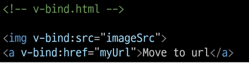
- v-bind shortand (약어)
  - ':' (colon)
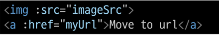

### Dynamic attribute name (동적 인자 이름)
- 대괄호 ([])로 감싸서 directive argument에 JavaScript 표현식을 사용할 수 있음
- 표현식에 따라 동적으로 평가된 값이 최종 argument값으로 사용됨
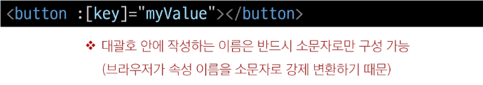


### Class & Style Bindings
- class와 style은 모두 HTML 속성이므로 다른 속성과 마찬가지로 v-bind를 사용하여 동적으로 문자열 값을 할당할 수 있음
- Vue는 class 및 style속성 값을 v-bind로 사용할 때 객체 또는 배열을 활용하여 작성할 수 있도록 함
- 단순히 문자열 연결을 사용하여 이러한 값을 생성하는 것은 번거롭고 오류가 발생하기가 쉽기 때문

### Binding HTML Classes - Binding to Objects
- 객체를 :class에 전달하여 클래스를 동적으로 전환할 수 있음
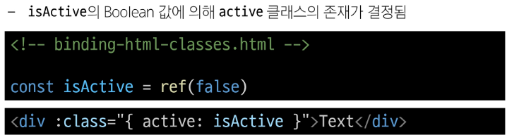 

- 객체에 더 많은 필드를 포함하여 여러 클래스를 전환할 수 있음
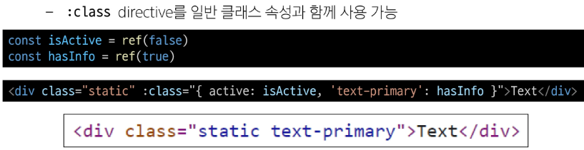

- 반드시 inline 방식으로 작성하지 않아도 됨
- 반응형 변수를 활용해 객체를 한 번에 작성하는 방법
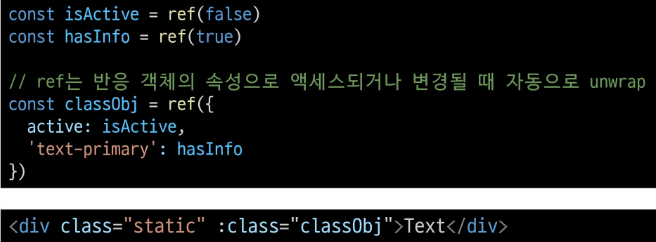


### Binding HTML Classes - Binding to Arrays
- :class를 배열에 바인딩하여 클래스 목록을 적용할 수 있음
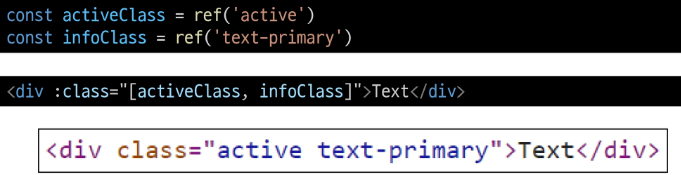

- 배열 구문 내에서 객체 구문을 사용하는 경우
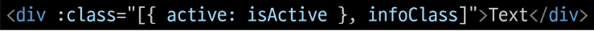


### Binding Inline Styles - Binding to Objects
- :style은 JavaScript 객체 값에 대한 바인딩을 지원 (HTML style 속성에 해당)
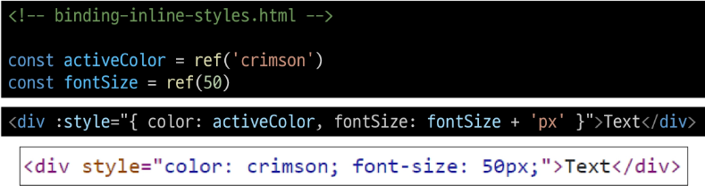

- 실제 CSS에서 사용하는 것처럼 :style은 kebab-cased 키 문자열도 지원 (단, camelCase 작성을 권장)
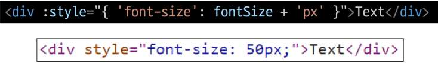

- 반드시 inline 방식으로 작성하지 않아도 됨
- 반응형 변수를 활용해 객체를 한 번에 작성하는 방법
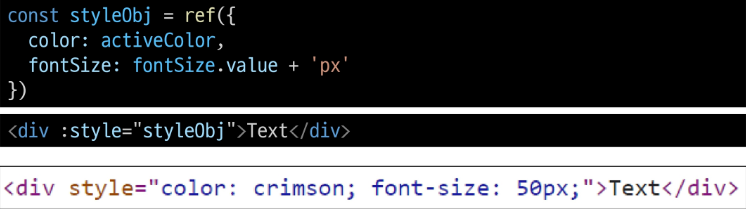


### Binding Inline Styles - Binding to Arrays
- 여러 스타일 객체를 배열에 작성해서 :style을 바인딩할 수 있음
- 작성한 객체는 병합되어 동일한 요소에 적용
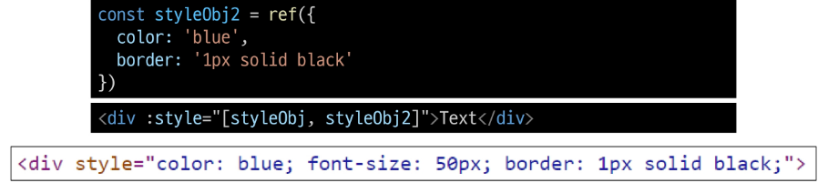


## Event Handling
### v-on
- DOM 요소에 이벤트 리스너를 연결 및 수신
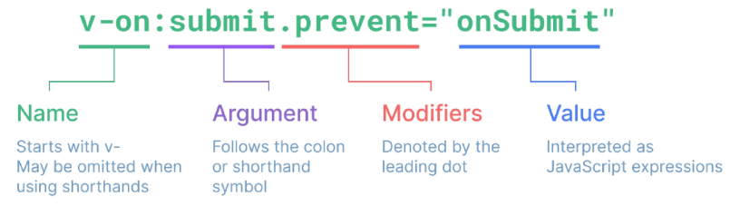

- handler 종류
  1. Inline handlers : 이벤트가 트리거 될 때 실행 될 JavaScript 코드
  2. Method handlers : 컴포넌트에 정의된 메서드 이름
```js
v-on:event="handler"
```

- v-on shortand (약어)
  - '@'
```js
@event="handler"
```

## Handlers
### 1. Inline handlers
- Inline handlers는 주로 간단한 상황에 사용
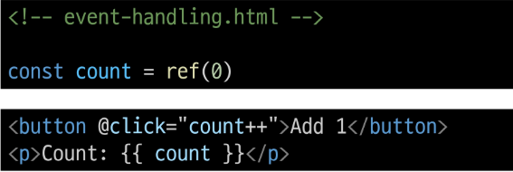

#### Inline Handlers에서의 메서드 호출
- 메서드 이름에 직접 바인딩하는 대신 Inline Handlers에서 메서드를 호출할 수도 있음
- 이렇게 하면 기본 이벤트 대신 사용자 지정 인자를 전달할 수 있음
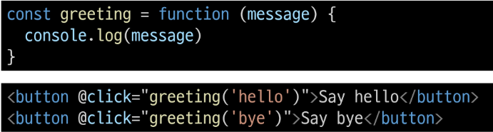

#### Inline Handlers에서의 event 인자에 접근하기
- Inline Handlers에서 원래 DOM 이벤트에 접근하기
- $event 변수를 사용하여 메서드에 전달
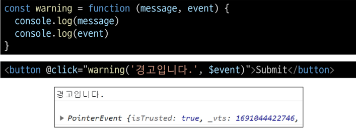


### 2. Method Handlers
- Inline handlers로는 불가능한 대부분의 상황에서 사용
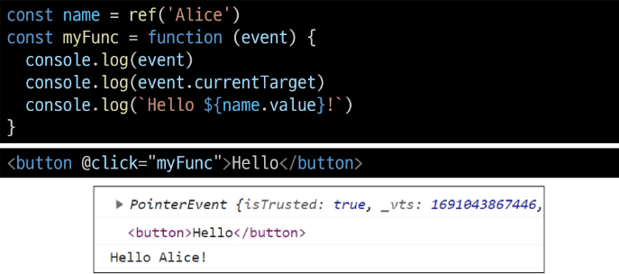

- Method Handlers는 이를 트리거하는 기본 DOM Event 객체를 자동으로 수신
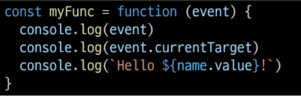


## Modifiers
### Event Modifiers
- Event Modifiers를 활용해 event.preventDefault()와 같은 구문을 메서드에서 작성하지 않도록 함
- stop, prevent, self 등 다양한 modifiers를 제공
- 메서드는 DOM 이벤트에 대한 처리보다는 데이터에 관한 논리를 작성하는 것에 집중할 것


### Key Modifiers
- 키보드 이벤트를 수신할 때 특정 키에 관한 별도 modifiers를 사용할 수 있음
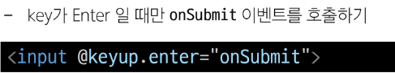


## Form Input Bindings (폼 입력 바인딩)
- form을 처리할 때 사용자가 input에 입력하는 값을 실시간으로 JavaScript 상태에 동기화해야 하는 경우 (양방향 바인딩)
- 양방향 바인딩 방법
  1. v-bind와 v-on을 함께 사용
  2. v-model 사용

### 1. v-bind with v-on
1. v-bind를 사용하여 input 요소의 value 속성 값을 입력 값으로 사용
2. v-on을 사용하여 input 이벤트가 발생할 때마다 input 요소의 value 값을 별도 반응형 변수에 저장하는 핸들러 호출
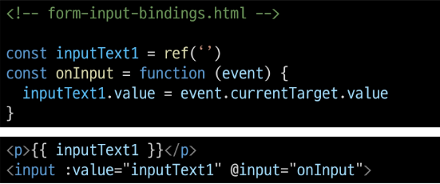


### 2. v-model
- form input 요소 또는 컴포넌트에서 양방향 바인딩을 만듦
- 사용자 입력 데이터와 반응형 변수를 실시간 동기화
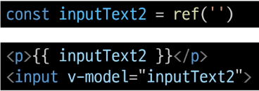

- 사용자 입력 데이터와 반응형 변수를 실시간 동기화
- IME가 필요한 언어(한국어, 중국어, 일본어 등)의 경우 v-model이 제대로 업데이트 되지 않음
- 해당 언어데 대해 올바르게 응답하려면 1번 방법인 v-bind와 v-on 방법을 사용해야 함


- v-model은 단순 Text input 뿐만 아니라 Checkbox, Radio, Select 등 다양한 타입의 사용자 입력 방식과 함께 사용 가능
1. 단일 체크박스와 boolean 값 활용
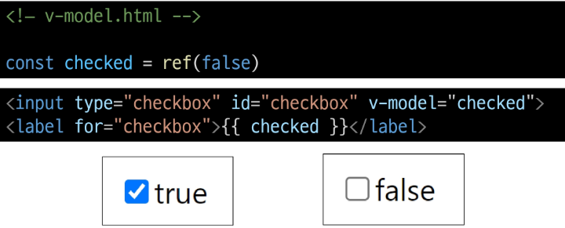

2. 여러 체크박스와 배열 활용
   - 해당 배열에는 현재 선택된 체크박스의 값이 포함됨
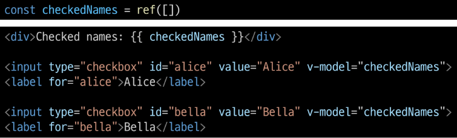

### Select 활용
- select에서 v-model 표현식의 초기 값이 어떤 option과도 일치하지 않는 경우 select 요소는 "선택되지 않은(inselected)" 상태로 렌더링 됨
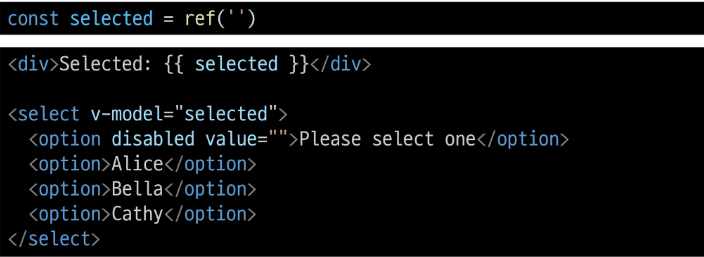

### 접두어 '$' 가 붙은 변수
- Vue 인스턴스 내에서 제공되는 내부 변수
- 사용자가 지정한 반응형 변수나 메서드와 구분하기 위함
- 주로 Vue 인스턴스 내부 상태를 다룰 때 사용

### IME (Input Method Editor)
- 사용자가 입력 장치에서 기본적으로 사용할 수 없는 문자(비영어권 언어)를 입력할 수 있도록 하는 운영 체제 구성 프로그램
- 일반적으로 키보드 키보다 자모가 더 많은 언어에서 사용해야 함
- IME가 동작하는 방식과 Vue의 양방향 바인딩(v-model) 동작 방식이 상충하기 때문에 한국어 입력 시 예상대로 동작하지 않았던 것