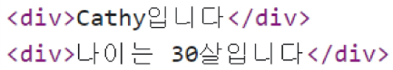

# Vue.js
- 사용자 인터페이스를 구축하기 위한 JavaScript 프레임워크
- 최신 버전은 "Vue 3"

## Vue를 학습하는 이유
1. 낮은 학습 곡선
   - 간결하고 직관적인 문법을 가지고 있어 빠르게 익힐 수 있음
   - 잘 정리된 문서를 기반으로 어렵지 않게 학습할 수 있음
2. 확장성과 생태계
   - 다양한 플러그인과 라이브러리를 제공하는 높은 확장성
   - 전세계적으로 활성화된 커뮤니티를 기반으로 많은 개발자들이 새로운 기능을 개발하고 공유하고 있음
3. 유연성 및 성능
   - 작은 규모의 프로젝트부터 대규모의 애플리케이션까지 다양한 프로젝트에 적합
4. 가장 주목받는 Client-side framework


### Vue의 2가지 핵심 기능
1. 선언적 렌더링 (Declarative Rendering)
   - 표준 HTML을 확장하는 Vue "템플릿 구문"을 사용하여 JavaScript 상태(데이터)를 기반으로 화면에 출력될 HTML을 선언적으로 작성
2. 반응성 (Reactivity)
   - JavaScript 상태 변경을 추적하고, 변경사항이 발생하면 자동으로 DOM을 업데이트

### Vue의 주요 특징 정리
1. 반응형 데이터 바인딩
   - 데이터 변경 시 자동 UI 업데이트
2. 컴포넌트 기반 아키텍처
   - 재사용 가능한 UI 조각
3. 간결한 문법과 직관적인 API
   - 낮은 학습 곡선
   - 높은 가독성
4. 유연한 스케일링
   - 작은 프로젝트부터 대규모 애플리케이션까지 적합

### Component
- 재사용 가능한 코드 블록
- UI를 독립적이고 재사용 가능한 일부분으로 분할하고 각 부분을 개별적으로 다룰 수 있음
- 자연스럽게 애플리케이션은 중첩된 Component의 트리 형태로 구성됨



# Vue Application
## Vue를 사용하는 방법
1. 'CDN' 방식
2. 'NPM' 설치 방식
   - CDN 방식 이후 진행


```html
<!-- first-vue.html -->

<div id="app">
  <h1>{{ message }}</h1>
  <button v-on:clisk="count++">
    Count is: {{ count }}
  </button>
</div>
```

- CDN 작성
- Application instance
  - CDN에서 Vue를 사용하는 경우 전역 Vue 객체를 불러오게 됨
  - 구조분해할당 문법으로 Vue 객체의 createApp 함수를 할당
- Application instance
  - 모든 Vue 애플리케이션은 createApp 함수로 새 Application instance를 생성하는 것으로 시작함
- Root Component
  - createApp 함수에는 객체(컴포넌트)가 전달됨
  - 모든 App에는 다른 컴포넌트들을 하위 컴포넌트로 포함할 수 있는 Root(최상위) 컴포넌트가 필요(현재는 단일 컴포넌트)
- Mounting the App (앱 연결)
  - HTML 요소에 Vue Application instance를 탑재(연결)
  - 각 앱 인스턴스에 대해 mount()는 한 번만 호출할 수 있음
```JS
<script src="https://unpkg.com/vue@3/dist/vue.global.js"></script>
<script>
  const { createApp, ref } = Vue

  const app = createApp({
    setup() {
      const message = ref('Hello vue!') 
      const count = ref(0)

      return {
        message,
        count
      }
    }
  })

  app.mount('#app')
</script>
```


## 반응형 상태
### ref()
- 반응형 상태(데이터)를 선언하는 함수 (Declaring Reactive State)
- .value 속성이 있는 ref 객체로 래핑(wrapping)하여 반환하는 함수
- ref로 선언된 변수의 값이 변경되면, 해당 값을 사용하는 템플릿에서 자동으로 업데이트
- 인자는 어떠한 타입도 가능

- 반응형을 가지는 참조 변수를 만드는 것 (ref === reactive reference)

### Vue 기본 구조
- createApp()에 전달되는 객체는 Vue 컴포넌트
- 컴포넌트의 상태는 setup() 함수 내에서 선언되어야 하며 객체를 반환해야함

### 템플릿 렌더링
- 반환된 객체의 속성은 템플릿에서 사용할 수 있음
- Mustache syntax(콧수염 구문)를 사용하여 메시지 값을 기반으로 동적 텍스트를 렌더링
```html
<div id="app">
  <h1>{{ message }}<h1>
</div>
```
- 콘텐츠는 식별자나 경로에만 국한되지 않으며 유효한 JavaScript 표현식을 사용할 수 있음
```html
<h1>{{ message.split('').reverse().join('') }}</h1>
```

### Event Listeners in Vue
- 'v-on' directive를 사용하여 DOM 이벤트를 수신할 수 있음
- 함수 내에서 반응형 변수를 변경하여 구성 요소 상태를 업데이트

```html
<!-- event-listener.html -->

<div id="app">
  <button v-on:clisk="increment">{{ count }}</button>
</div>
```
```js
const { createApp, ref } = Vue

const app = createApp({
  setup() {
    const count = ref(0)
    const increment = function () {
      count.value++
    }
    return {
      count,
      increment
    }
  }
})
```

## Template Syntax
- DOM을 기본 구성 요소 인스턴스의 데이터에 선언적으로 바인딩(Vue Instance와 DOM을 연결)할 수 있는 HTML 기반 템플릿 구문(확장된 문법 제공)을 사용

1. Text Interpolation
```html
<p>Message: {{ msg }}</p>
```
- 데이터 바인딩의 가장 기본적인 형태
- 이중 중괄호 구문 (콧수염 구문)을 사용
- 콧수염 구문은 해당 구성 요소 인스턴스의 msg 속성 값으로 대체
- msg 속성이 변경될 때마다 업데이트 됨
2. Raw HTML
```html
<div v-html="rawHtml"></div>
```
```js
const rawHtml = ref('<span style="color:red">This should be red.</span>')
```

- 콧수염 구문은 데이터를 일반 텍스트로 해석하기 때문에 실제 HTML을 출력하려면 v-html을 사용해야 함
3. Attribute Bingings
```html
<div v-bind:id="dynamicId"></div>
```
```js
const dynamicId = ref('my-id')
```
- 콧수염 구문은 HTML 속성 내에서 사용할 수 없기 때문에 v-bind를 사용
- HTML의 id 속성 값을 vue의 dynamicId 속성과 동기화 되도록 함
- 바인딩 값이 null이나 undefined인 경우 렌더링 요소에서 제거됨
4. JavaScript Expressions
```js
{{ number + 1 }}

{{ ok? 'YES' : 'NO' }}

{{ message.split('').reverse().join('') }}

<div v-bind:id="`list-${id}`"></div>
```
- Vue는 모든 데이터 바인딩 내에서 JavaScript 표현식의 모든 기능을 지원
- Vue 템플릿에서 JavaScript 표현식을 사용할 수 있는 위치
  1. 콧수염 구문 내ㅂ부
  2. 모든 directive의 속성 값("v-"로 시작하는 특수 속성)

### Expressions 주의사항
- 각 바인딩에는 하나의 단일 표현식만 포함될 수 있음
  - 표현식은 값으로 평가할 수 있는 코드 조각 (return 뒤에 사용할 수 있는 코드여야 함)
- 작동하지 않는 경우
```html
<!-- 표현식이 아닌 선언식 -->
{{ const number = 1 }}

<!-- 제어문은 삼항 표현식을 사용해야 함 -->
{{ if (ok) { return message } }}
```

### Ref Unwrap 주의사항
- 템플릿에서의 unwrap은 ref가 최상위 속성인 경우에만 적용가능
- 예시
```js
const object = { id: ref(0) }

{{ object.id + 1 }}

// [object Object]1
```
- object는 최상위 속성이지만 object.id는 그렇지 않음
- 표현식을 평가할 때 object.id가 unwrap 되지 않고 ref 객체로 남아 있기 때문
- 이를 해결하기 위해 "id를 최상위 속성하는 분해 과정"이 필요
```js
const object = { id: ref(0)}
const { id } = object

{{ id + 1 }}   // 1
```

- 단, ref가 "{{}}"의 최종 평가 값인 경우는 unwrap 가능
```js
{{ object.id }} // 0
{{ object.id.value }} // 0 서로 동일
```
