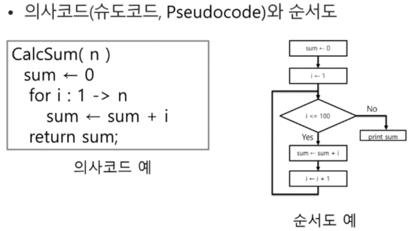

# 알고리즘
- 문제를 해결하기 위한 절차나 방법

### 의사코드(슈도코드, Pseudocode)




### 무엇이 좋은 알고리즘인가?
  1. 정확성 : 얼마나 정확하게 동작하는가
  2. 작업량 : 얼마나 적은 연산으로 원하는 결과를 얻어내는가
  3. 메모리 사용량 : 얼마나 적은 메모리를 사용하는가
  4. 단순성 : 얼마나 단순한가
  5. 최적성 : 더 이상 개선할 여지없이 최적화되었는가

- 알고리즘의 작업량을 표현할 때 시간복잡도로 표현한다.
- 시간 복잡도(Time complexity)
  - 실제 걸리는 시간을 측정
  - 실행되는 명령문의 개수를 계산

    - 빅-오(O) 표기법
      - 시간 복잡도 함수 중에서 가장 큰 영향력을 주는 n에 대한 항만을 표시
      - 계수는 생략

## 배열
- 일정한 자료형의 변수들을 하나의 이름으로 열거하여 사용하는 자료구조
#### 배열의 필요성
- 프로그램 내에서 여러개의 변수가 필요할 떄, 일일이 다른 변수명을 이용하여 자료에 접근하는 것은 매우 비효율적이다.
- 배열을 사용하면 하나의 선언을 통해서 둘 이상의 변수를 선언할 수 있다.
- 단순히 다수의 변수 선언을 의미하는 것이 아니라, 다수의 변수로는 하기 힘든 작업을 배열을 활용해 쉽게 할 수 있다.


```py
# 첫 줄에 양수의 개수 N이 주어진다. ( 5 <= N <= 1000)
# 다음 줄에 빈칸으로 구분된 N개의 양수 Ai가 주어진다.(1 <= Ai <= 1000000)

N = int(input())
arr = list(map(int, input().split()))
# 함수들이 여러단계로 붙어있을 땐 가장 안쪽부터 시작(input)
```


### 정렬
- 2개 이상의 자료를 특정 기준에 의해 작은 값부터 큰값(오름차순) 그 반대의 순서(내림차순)으로 재배열하는 것
#### 키
- 자료를 정렬하는 기준이 되는 특정 값


## 버블 정렬_ 시간 복잡도 - O(n^2)
- 인접한 두 개의 원소를 비교하며 자리를 계속 교환하는 방식

- 정렬 과정
  - 첫 번째 원소부터 인접한 원소끼리 계속 자리를 교환하면서 맨 마지막 자리까지 이동한다.
  - 한 단계가 끝나면 가장 큰 원소가 마지막 자리로 정렬된다.
  - 교환하며 자리를 이동하는 모습이 물 위에 올라오는 거품 모양과 같다고 하여 버블 정렬이라고 한다.


#### 버블정렬 코드(오름차순)
```python
BubbleSort(a, N) # 정렬할 List, N 원소 수
  for i in range(N-1, 0, -1): # 범위의 끝 위치
    for j in range(0. i):   # 비교할 왼쪽 원소
      if a[j] > a[j+1]:
        a[j], a[j+1] = a[j+1], a[j] # 위치 바꾸기
```

## 카운팅정렬_ 시간 복잡도 O(n + k) : n 은 리스트 길이, k는 정수의 최댓값

- 항목들의 순서를 결정하기 위해 집합에 각 항목이 몇 개씩 있는지 세는 작업을 하여, 선형 시간에 정렬하는 효율적인 알고리즘

  - 제한사항
    - 정수나 정수로 표현할 수 있는 자료에 대해서만 적용 가능
      : 각 항목의 발생 횟수를 기록하기 위해, 정수 항목으로 인덱스 되는 카운트들의 배열을 사용하기 떄문이다.
    - 카운트들을 위한 충분한 공간을 할당하려면 집합 내의 가장 큰 정수를 알아야 한다.

1. Data에서 각 항목들의 발생 횟수를 세고, 정수 자체가 인덱스가 되는 카운트 배열 counts에 저장한다.

```python
# counts = []
# counts[0] = 0의 발생 횟수 ,,, counts[i] = i의 발생 횟수
# Data배열에서 등장할 때 마다
# counts[i] += 1

counts = [0]*5
for x in Data:
  counts[x] += 1
```

2. 정렬된 집합에서 각 항목의 앞에 위치할 항목의 개수를 반영
   - 2의 자리에 2보다 작은 애들의 합을 추가하여 삽입
   - 개수를 세고 각 자리별로 더 작은 수들의 개수를 누적하여 저장
  - Data가 있을 때 카운팅 정렬을 사용하려면
  - counts와 Temp arr를 생성
```py
# 전체 개수 = N
# i는 1에서부터 마지막 인덱스까지 순회한다.
# 나보다 작은 애의 개수를 가져오고
for i in range(1. N-1):
  # counts[i] = counts[i-1] + counts[i] 인덱스 위치의 개수에 그 전까지의 개수를 합한다.
  counts[i] += counts[i-1]
```

3. counts[1]을 감소시키고 Temp에 1을 삽입한다. 
```bash
정렬된 결과를 저장하는 Temp라는 빈 배열을 생성
Data의 맨 마지막 원소(j)부터 앞으로 이동
마지막 인덱스의 원소에 맞는 counts의 자리로 가서 그 전까지의 개수(위치 거리)를 파악 counts[j-1]
이를 통해 적어도 j가 들어갈 마지막 위치를 알 수 있기 때문에,
새로운 Temp 배열의 [j-1]에 j를 삽입
counts[0]을 마지막으로 -1하고 Temp[0] 삽입
모든 수를 훑고 Temp 업데이트를 마치면 정렬 작업 종료
```

```python
# 카운팅 정렬 알고리즘

def Counting_Sort(DATA, TEMP, k):
# DATA[] -- 입력 배열(0 to k)
# TEMP[] -- 정렬된 배열
# COUNTS[] -- 카운트 배열
    COUNTS = [0]*(k+1)

    for i in range(0, len(DATA)):
      COUNTS[DATA[i]] += 1
    
    for i in range(1, k+1):
      COUNTS[i] += COUNTS[i-1]

    for i in range(len(TEMP)-1, -1, -1):
      COUNTS[DATA[i]] -= 1
      TEMP[COUNTS[DATA[i]]] = DATA[i]
    
    print(*TEMP)
```

```python
# 카운팅 정렬 예시
DATA = [0, 4, 1, 3, 1, 2, 4, 1]
COUNTS = [0]*5       # DATA가 0~4까지의 정수

N = len(DATA)       # DATA의 크기
TEMP = [0] * N       # 정렬된 결과 저장

# 1단계 : DATA 원소 별 개수 세기
for x in DATA:              # DATA의 원소 x를 가져와서 COUNTS[x]에 기록
    COUNTS[x] += 1

# 2단계 : 각 숫자까지의 누적 개수 구하기
for i in range(1, len(COUNTS)):  # COUNTS[0]~COUNTS[4]까지 누적
    COUNTS[i] += COUNTS[i-1]

# 3단계 : DATA의 맨 뒤부터 TEMP에 자리 잡기
for i in range(N-1, -1, -1): # 거꾸로 맨뒤 인덱스부터 인덱스0까지 순회
    COUNTS[DATA[i]] -= 1    # 누적 개수 1개 감소
    TEMP[COUNTS[DATA[i]]] += DATA[i]

print(*TEMP)
```

## Baby-gin Game
- 0~9 사이의 숫자 카드에서 임의의 카드 6장을 뽑았을 때
  - 3장의 카드가 연속적인 번호를 갖는 경우를 run
  - 3장의 카드가 동일한 번호를 갖는 경우를 triplet
- 6자리의 숫자가 run 혹은 triplet으로만 이루어져 있으면 baby-gin으로 부른다.

### 완전검색
- 완전 검색 방법은 문제의 해법으로 생각할 수 있는 모든 경우의 수를 나열해 보고 확인하는 기법
- Brute-force 혹은 generate-and-test기법이라고 불림
- 모든 경우의 수를 테스트한 후, 최종 해법을 도출한다.
- 상대적으로 수가 작을 때 유용
- 모든 경우의 수를 생성하고 테스트하기 때문에 수행속도는 느림, 그러나 정확성이 높다.
```bash
  자격검정평가 등에서 주어진 문제를 풀 때, 우선 완전 검색으로 접근하여 해답을 도출한 후, 성능 개선을 위해 다른 알고리즘을 사용하고 해답을 확인하는 것이 바람직
```

#### 완전 검색을 활용한 Baby-gin 접근
- 고려할 수 있는 모든 경우의 수 생성 _ 중복 포함하여 모든 경우의 순열 나열
- 해답 테스트 _ 앞의 3자리와 뒤의 3자리를 잘라서 run과 triplet 여부를 테스트

### 순열(Permutation)
- 서로 다른 것들 중 몇 개를 뽑아서 한 줄로 나열하는 것
- 서로 다른 n개 중 r개를 택하는 순열 : nPr
- nPr = n*(n-1)*(n-2)*...*(n-r+1) = n!/(n-r)!
- nPn = n! 

```python
# {1, 2, 3}을 포함하는 모든 순열을 생성하는 함수
for i1 in range(1, 4):
  for i2 in range(1, 4):
    if i2 != i1:
      for i3 in range(1,4):
        if i3 != i1 and i3 != i2:
          print(i1, i2, i3)
```

## 탐욕 알고리즘
- 탐욕 알고리즘은 최적해를 구하는 데 사용되는 근시안적 방법
- 여러 경우 하나를 결정해야 할 때마다 그 순간에 최적이라고 생각되는 것을 선택해 나가는 방식으로 진행하여 최종적인 해답에 도달한다.
- 각 선택의 시점에서 이루어지는 결정은 지역적으로는 최적이지만, 그 선택들을 게속 수집하여 최종적인 해답을 만들었다고 하여, 그것이 최적이라는 보장은 없다.
- 일반적으로, 머릿속에 떠오르는 생각을 검증 없이 바로 구현하면 Greedy 접근이다.
```bash
1. 해 선택: 현재 상태에서 부분 문제의 최적 해를 구한 뒤, 이를 부분해집합(Solution Set)에 추가한다.
2. 실행 가능성 검사: 새로운 부분해 집합이 실행 가능한지를 확인한다. 곧, 문제의 제야 조건을 위반하지 않는 지를 검사한다.
3. 해 검사: 새로운 부분해 집합이 문제의 해가 되는지를 확인한다. 아직 전체 문제의 해가 완성되지 않았다면 '1.'의 해 선택부터 다시 시작한다.
```

#### Baby-gin을 완전검색이 아닌 방법으로 풀이_ 탐욕 알고리즘
```py
num = 456789 # Baby Gin 확인할 6자리 수
c = [0]*12 # 6자리 수로부터 각 자리 수를 추출하여 개수를 누적할 리스트_12칸으로 만드는 것은 더미칸을 통해 인덱싱을 편하게 하기 위함

for i in range(6):
  c[num % 10] += 1
  num //= 10

i = 0
tri = run = 0
while i <10:
  if c[i] >= 3:   # 개수가 3개이상인지 조사(triplet)
    c[i] -= 3   # triplet 조사 후 데이터 삭제
    tri += 1
    continue
  if c[i] >= 1 and c[i+1] >= 1 and c[i+2] >= 1:  # run 조사 후 데이터 삭제
    c[i] -= 1
    c[i+1] -= 1
    c[i+2] -= 1
    run += 1
    continue
  i += 1

if run + tri == 2: print("Baby Gin")
else:
  print("Lose")

```