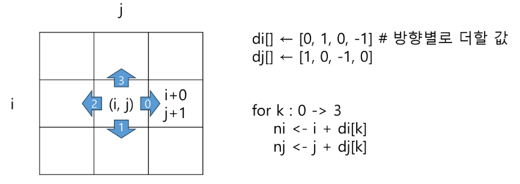
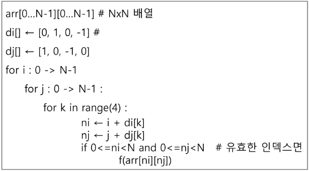
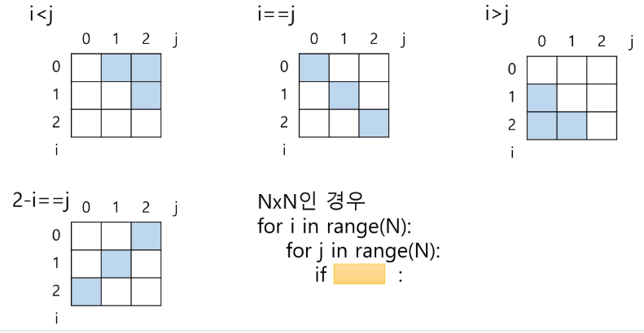
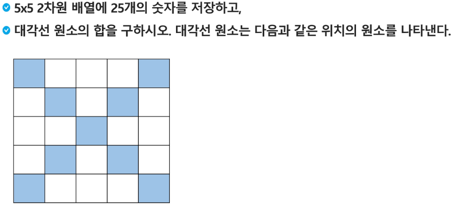
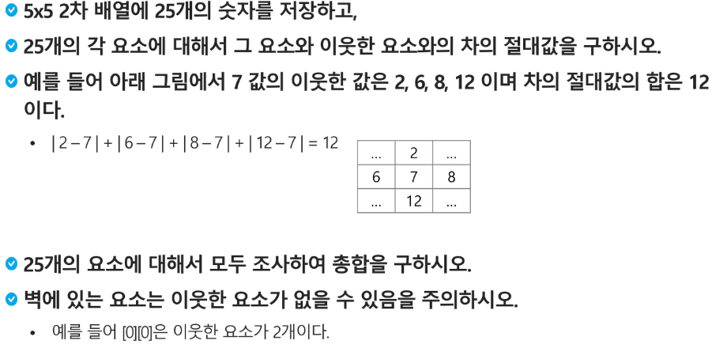

## 2차원 배열
- index와 변수 선언을 통한 초기화를 이용
```python
#E.G. 
# 형태
arr = [[0,1,2,3],[4,5,6,7]]

# input 형태
N = int(input)                               # 3
                                                          # 1 2 3
arr = [list(map(int, input().split())) for _ in range(N)] # 4 5 6
                                                          # 7 8 9
```
```python
# 빈 배열 생성
arr1 = [0]*3
                                   # 0 0 0
arr2 = [[0]*3 for _ in range(2)]   # 0 0 0

# for i in range(2):
#   print(arr2[i])
for i in range(2): # input으로 받을 땐, 0부터 N-1까지
  for j in range(3):    
    print(arr2[i][j], end=' ')      # 0 0 0
  print()                           # 0 0 0
```

### 배열 순회
- n * m 배열의 n*m개의 모든 원소를 빠짐없이 조사하는 방법

#### 행 우선 순회 / 열 우선 순회
```py
# 행 우선순회
# i 행의 좌표
# j 행의 좌표
for i in range(n):
  for j in range(m):
    f(array[i][j]) # f()로 필요한 연산 수행


# 열 우선순회
# i 행의 좌표
# j 행의 좌표
for j in range(m):
  for i in range(n):
    f(array[i][j]) # f()로 필요한 연산 수행
```
#### 지그재그 순회
```py
# i 행의 좌표
# j 행의 좌표

for i in range(n):
  for j in range(m):
    f(array[i][j + (m-1-2*j)*(i%2)]) # 증가 : j / 감소 : m-1-j
```

### 델타를 이용한 2차 배열 탐색
- 2차 배열의 한 좌표에서 4방향의 인접 배열 요소를 탐색하는 방법
- 인덱스 (i,j)인 칸의 상하좌우 칸 (ni, nj)
- 가운데를 인덱스 기준으로 0과 1, -1을 이용해서 인덱스 파악

- pseudocode
 

 #### 전치 행렬
 ```py
# i : 행의 좌표, len(arr)
# j : 열의 좌표, len(arr[0])
arr = [[1,2,3],[4,5,6],[7,8,9]] # 3*3 행렬

for i in range(3):
  for j in range(3):  
    if i < j:
      arr[i][j], arr[j][i] = arr[j][i], arr[i][j]
 ```

 #### i,j값에 따라 원소 접근
 

 ##### 연습
 
 ```python
# 각 대각의 합 - 중앙값
# if i==j:
# if 2-i ==j:
N = int(input())
arr = [list(map(int, input().split())) for _ in range(N)]

s = 0
for i in range(N):
  for j in range(N):
    if i==j:
      s += arr[i][j]
    if (N+1)-i == j:
      s += arr[i][j]    
 ```

 
 ```python
# 배열 전체 순회
# 만약 범위가 넘어가지 않으면(행렬의 범위)
# 그 주위 -1, 0 , 1에 대해 순회하며 각 자리의 값과 기준값([i][j]과의 차를 구함)
N = int(input())
arr = [list(map(int, input().split())) for _ in range(N)]

di = [0, 1, 0, -1]
dj = [1, 0, -1, 0] # 4방위로 돌면서 추가되는 인덱스값에 대한 배열


total = 0 # 모든 원소에 대해 더할 변수를 지정하기 때문에 for문 밖에
for i in range(N):
  for j in range(N): # N*N 배열의 모든 원소에 대해
  s = 0   # 문제에서 원소와 주변 인접 원소의 차의 절대값의 합을 저장하는 변수
    # i, j 원소의 4방향 원소에 대해
    for k in range(4):
      ni = i + di[k]
      nj = j + dj[k]
      if 0 <= ni < N and 0 <= nj < N:
        s += abs(arr[i][j] - arr[ni][nj]) # 실존하는 인접 원소 ni, nj
    total += s
print(total)        
 ```

 ### 부분집합 합(Subset Sum) 문제
 - 유한 개의 정수로 이루어진 집합이 있을 때, 이 집합의 부분집합 중에서 그 집합의 원소를 모두 더한 값이 0이 되는 경우가 있는지를 알아내는 문제
 - 부분집합도 배열로 표현하여 계산
  - 완전검색 기법으로 집합의 모든 부분집합을 생성하고 각 부분집합의 합을 계산

```bash
- 부분집합의 수
집합의 원소가 n개일 때, 공집합을 포함한 부분집합의 수는 2^n개이다.
이는 각 원소를 부분집합에 포함시키거나 포함시키지 않는 2가지 경우를 모든 원소에 적용한 경우의 수와 같다.
```
- loop를 이용하여 부분집합 생성
```python
bit = [0, 0, 0, 0]
for i in range(2):
  bit[0] = i            # 0번 원소
  for j in range(2):
    bit[1] = j          # 1번 원소
    for k in range(2):  
      bit[2] = k        # 2번 원소
      for l in range(2):
        bit[3] = l      # 3번 원소
        print_subset(bit)     # 생성된 부분집합 출력
```
- 비트 연산자


|연산자|설명|
|:-------:|:---------------------------:|
| & |비트 단위로 AND 연산을 한다.|
| \| |비트 단위로 OR 연산을 한다|
| << |피연산자의 비트 열을 왼쪽으로 이동시킨다.|
| >> |피연산자의 비트 열을 오른쪽으로 이동시킨다.|


```bash
<< 연산자
- 1 << n:2^n 즉, 원소가 n개일 경우의 모든 부분집합의 수

& 연산자
- i & (i<<j) : i의 j번째 비트가 1인지 아닌지를 검사
```

- 간결하게 부분집합 생성법
```python
arr = [3,6,7,1,5,4]

n = len(arr)              # n : 원소의 개수

for i in range(1<<n):     # 1<<n : 부분집합의 개수
  for j in range(n)       # 원소의 수만큼 비트를 비교함
    if i & (1<<j):        # i의 j번 비트가 1인 경우
      print(arr[j], end = ",")    # j번 원소 출력
    print()
  print()
```

## 검색
- 목적하는 탐색키를 가진 항목을 저장되어 있는 자료 중에서 찾는 작업
- 검색의 종류
  - 순차 검색
  - 이진 검색
  - 해쉬

### 순차 검색
- 일렬로 되어 있는 자료를 순서대로 검색하는 방법
  - 간단하고 직관
  - 배열이나 연결 리스트 등 순차구조로 구현된 자료구조에서 유용
  - 알고리즘이 단순하여 구현이 쉽지만, 검색 대상의 수가 많은 경우에는 수행시간이 급격히 증가하여 비효율적임

- 2가지 경우
  #### 정렬되어 있지 않은 경우_시간 복잡도 : O(n)
    - 검색 과정
      1. 첫 번째 원소부터 순서대로 검색 대상과 키 값이 같은 원소가 있는지 비교하며 찾는다.
      2. 키 값이 동일한 원소를 찾으면 그 원소의 인덱스를 반환한다.
      3. 자료구조의 마지막에 이를 때까지 검색 대상을 찾지 못하면 검색 실패
      ```py
      for i : 0 -> N-1 # range(N) 모든 원소에 접근하는 방법
        if key = A[i]      
          return i # 각각에 접근하는 작업
      return -1 # for문이 끝나도록 아무것도 없을 경우 -1 반환
      ```
    - 찾고자 하는 원소의 순서에 따라 비교회수가 결정됨
      - 첫 번째 원소를 찾을 때는 1번 비교, 2번째는 2번...
      - 정렬되지 않은 자료에서의 순차 검색의 평균 비교 회수
        = (1/n)*(1+2+3+...+n) = (n+1)/2
    ```py
    # 구현 예
    def sequential_search(a, n, key)
      i <- 0  # i=0_ i를 초기화
      while i<n and a[i] != key: # a[i]가 key와 다르면
        i <- i+1  # 다음 원소로 이동
      # a[i] == key가 종료조건이 돼서 같으면 while문 종료.
      # i<n 즉, 마지막까지 탐색했다면 while문 종료
      if i<n: return i  # 배열이 끝나지 않았는데 종료된 경우 i 반환
      else: return -1
    ```
  #### 정렬되어 있는 경우 _ 시간 복잡도 : O(n)
    - 검색 과정
      1. 자료가 오름차순으로 정렬된 상태에서 검색을 실시한다고 가정한다면,
      2. 자료를 순차적으로 검색하면서 키 값을 비교하여, 원소의 키 값이 검색 대상의 키 값보다 크면 찾는 원소가 없다는 것이므로 더 이상 검색하지 않고 검색을 종료한다.
    - 정렬이 되어있기에, 검색 실패를 반환하는 경우 평균 비교 횟수가 반으로 줄어든다
    ```py
    # 구현 예
    def sequential_search_for(a, n, key)
      for i : 0 -> n-1
        if a[i] == key:
          return i
        elif a[i] > key:
          return -1
      return -1
    ```
    ```py
    def sequential_search_while(a, n, key)
      i <- 0 # 인덱스 초기화
      while i<n and a[i]<key: #마지막 인덱스 내에서 key보다작은 값의경우까지
        # 배열의 인덱스를 검사하고 그 마지막 인덱스까지 검사하는 과정을 짤 때,
        # 항상 key값에 대한 비교보다 인덱스 범위가 조건문에 먼저 나와야한다.
        i <- i+1 # 인덱스 하나 증가(다음 원소로 이동)
      if i<n and a[i] == key:
        return i
      else:
        return -1 
    ```

### 이진 검색(Binary Search)
- 자료의 가운데에 있는 항목의 키 값과 비교하여 다음 검색의 위치를 결정하고 검색을 계속 진행하는 방법
  - 주로 정렬된 정수형 배열에 사용한다.
  - 목적 키를 찾을 때까지 이진 검색을 순환적으로 반복 수행함으로써 검색 범위를 반으로 줄여가면서 보다 빠르게 검색을 수행함
- 이진 검색을 하기 위해서는 자료가 정렬된 상태여야 한다.

- 정렬되어 있는 배열에서 찾는 것이기 때문에, 지속적으로 key값과의 비교를 통해 그 지점을 파악하고 검사한다.

- 구현
  - 검색 범위의 시작점과 종료점을 이용하여 검색을 반복 수행한다.
  - 이진 검색의 경우, 자료에 삽입이나 삭제가 발생했을 때, 배열의 상태를 항상 정렬 상태로 유지하는 추가 작업이 필요하다.

```python
def binarySearch(a, n, key)
  start = 0
  end = N-1
  while start <= end: # 남은 구간이 없을때 종료 (조건을 통해 start와 end를 조정하고자 함.)
    middle = (start +end)//2 # 전체 개수 중 2로 나눈 몫
    if a[middle] == key: # 검색 성공
      return true # return middle _ 인덱스 반환 시
    elif a[middle] > key:
      end = middle -1 # 끝 지점을 한칸 왼쪽으로 이동시켜 평균을 줄임
    else:
      start = middle +1 # 시작 지점을 한칸 왼쪽으로 이동시켜 평균을 줄임
  return false # 검색 실패 _ while문 종료 시
```

- 재귀 함수 이용
```python
def binarySearch(a, low, high, key):
  if low > high:
    return False
  else:
    middle = (low + high)//2
    if key == a[middle]: # 검색 성공
      return True
    elif a[middle] < key:
      return binarySearch2(a, middle+1, high, key)
    elif key < a[middle]:
      return binarySearch(a, low, middle-1, key)

```

### 선택 정렬(Selection Sort) _ 시간 복잡도 O(n^2)
- 주어진 자료들 중 가장 작은 값의 원소부터 차례대로 선택하여 위치를 교환하는 방식

-정렬 과정
  1. 주어진 리스트 중에서 최소값을 찾는다.
  2. 그 값을 리스트의 맨 앞에 위치한 값과 교환한다.
  3. 맨 처음 위치를 제외한 나머지 리스트를 대상으로 위의 과정을 반복한다.
  

```python
def selectionSort(a, N): # a : 정렬 대상, N : 크기
  for i in range(N-1): #_(0부터 N-2까지) 구간 시작 지점을 제외하고 과정을 반복하기 때문에, 마지막 인덱스를 제외하고 인덱스의 시작 위치가 하나씩 증가한다.
    min_idx = i # 기준 위치를 최솟값 위치로 가정
    for j in range(i+1, N): # 남은 원소에 대해 실제 최솟값 위치 검색
      if a[min_idx] > a[j]:
        min_idx = j
    a[i], a[min_idx] = a[min_idx], a[i] # 구간의 최솟값에 따라 바뀐 인덱스에 따라 기준위치(for문 밖 인덱스i의 값)의 값과 자리 바꾸기 
```

### 셀렉션 알고리즘
- 저장되어 있는 자료로부터 k번쨰로 큰 혹은 작은 원소를 찾는 방법을 셀렉션 알고리즘이라 한다.
   - 최소값, 최대값 혹은 중간값을 찾는 알고리즘을 의미
- 선택 과정
  - 셀렉션은 아래와 같은 과정을 통해 이루어짐
     - 정렬 알고리즘을 이용하여 자료 정렬하기
     - 원하는 순서에 있는 원소 가져오기

- k번째로 작은 원소를 찾는 알고리즘 _ 시간 복잡도 O(kn)
```python
def select(arr, k):
  for i in range(0,k):
    min_index = i
    for j in range(i+1, len(arr)):
      if arr[min_index] > arr[j]:
        min_index = j
    a[i], a[min_idx] = a[min_idx], a[i]
  return arr[k-1]
```