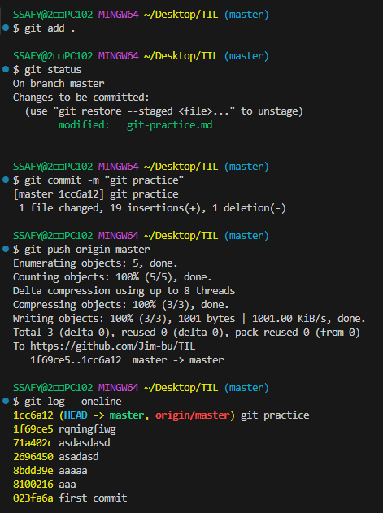

# 목차
- [목차](#목차)
- [git 활용](#git-활용)

# git 활용

1. git 활성화
   ```bash
   git init
   ```
2. git 연결 repository
   ```bash
   git init remote -v  # 현재 repo 연결 상태
   git config --global -l # 초기 이름 계정 설정(1 아님 L 소문자임)
   git remote add origin remote_url
    # origin <- 지정별칭, 아무거나 초기 지정 후 사용
    # remote_url <- github 저장할 repo url
   ```
3. git 활용 현 상태 파악
   ```bash
   git status # 변동 사항 파악
   git log --oneline # git commit 상태 파악
   ```

4. git version
   ```bash
   git add . # 현 상황 전체 변동사항 추가
   git commit -m "파일 이름"
   git push origin master
   ```

5. git 다른 컴퓨터 환경
   ```bash
   git clone # 아무것도 없는 초기 환경에 사용
   git pull # repo 연결 된 상태에서 변동사항 저장
   ```
6. git ignore
   ```bash
   들어가선 안되는 목록들 지정 # git에서 관리하지 못하게 하기 위함
    # https://www.toptal.com/developers/gitignore/
    # gitignore 초기 설정 도와주는 사이트
   ```
7. 주의사항
   ```bash
   README 파일은 commit을 하나 사용하기 때문에 로컬에서 미리 작업한 사항과 충돌이 발생할 수 있음.
   때문에 상황에 따라 체크 여부 판단
   ```
- push 성공 terminal



