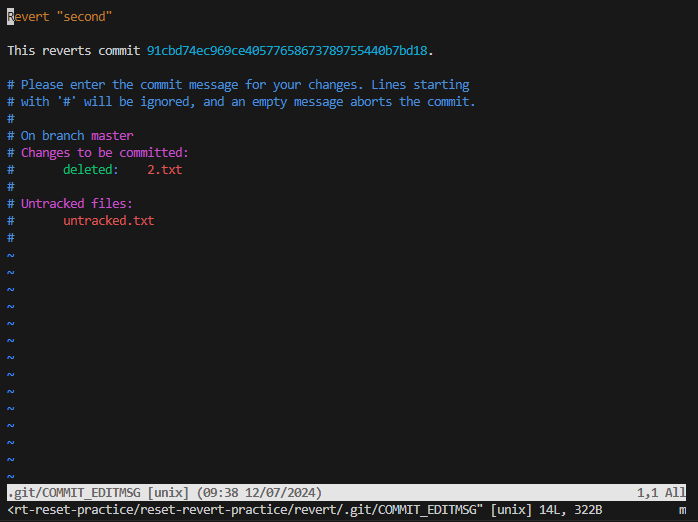
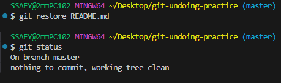

- [git 파일 수정](#git-파일-수정)

# git 파일 수정

## git rivert
1. git revert란
   ```bash
   git revert 과거(특정 commit)을 없었던 일로 만드는 작업
   git revrt <commit id> #주의사항 : -m_메시지가 아니라 commit 아이디(난수)
   ```
2. git revert vim

  ```bash
  화면에서 'i'를 누르면 입력모드인 --INSERT-- 가 생성
  다시 명령모드로 바꾸기 위해선 'esc'
  입력모드에서 이름을 작성한 후
  명령모드로 진입하고 shift + ; >> wq #저장
  ```
3. 추가내용
   ```bash
   git revert 7f6c23c 006dc87 3551584 # 공백을 사용해 여러 commit 한꺼번에 실행 취소
   git revert 355..7f6c24c # '..'을 사용해 범위를 지정하여 여러 commit을 한꺼번에 실행취소
  
   git revert --no-edit 7f6c24c # commit 메시지 작성을 위한 vim 열지 않음
   git revert --no-commit 7f6c24c # 자동으로 commit하지 않고, staging Area에만 올림 (이후 직접 commit 해야함)
   ```


## git reset

1. git reset이란
   ```bash
   git reset [옵션] <commit id> #특정 commit으로 돌아가는 작업 / 특정 commit으로 되돌아 갔을 때, 되돌아간 commit 이후릐 commit은 모두 삭제
      ```

2. reset의 3가지 옵션
   ```bash
    # 삭제되는 기록을 남길지에 대한 옵션
   1. --soft  # 삭제된 commit의 기록을 staging area에 남김
   2. --mixed # 삭제된 commit의 기록을 working directory에 남김(기본 옵션 값)
   3. --hard # 삭제된 commit의 기록을 남기지 않음
   ```


### 참고 _ git reflog
```bash
git reflog # HEAD가 이전에 가리켰던 모든 commit을 보여줌(지워진 commit 조회)
git reset --hard <복구하고자 하는 commit ID>
```


## git restore
```bash
Modified 상태의 파일 되돌리기. 변동사항을 되돌리는 방법
git restore는 덮어쓰는 원리이기 때문에, 수정 취소 후 해당 내용을 복원할 수 없음.
```


## git rm --cached
```bash
git 저장소에 commit이 없는 경우, Staging Area에서 Working Directory로 되돌리기
- add한 파일을 다시 unstage하는 방법
```

## git restore --staged
```bash
git 저장소에 commit이 있을 경우, Staging Area에서 Working Directory로 되돌리기
- commit까지 한 상태에서 add한 파일 unstage하는 방법
```