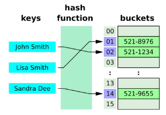

- [데이터 구조](#datastructure)
  - [메서드](#메서드)
    - [실습](#실습) 

# DataStructure
여러 데이터를 효과적으로 사용, 관리하기 위한 구조 (str, list, dict 등)
#### 자료 구조
- 컴퓨터 공학에서는 ‘자료 구조’ 라고 함
- 각 데이터의 효율적인 저장, 관리를 위한 구조를 나눠 놓은 것
    

## 메서드
- 객체에 속한 함수
- 객체의 상태를 조작하거나 동작을 수행

#### 메서드 특징
- 메서드는 클래스(class) 내부에 정의되는 함수
- 클래스는 파이썬에서 ‘타입을 표현하는 방법’이며 이미 은연중에 사용해왔음
- 예를 들어 help 함수를 통해 str을 호출해보면 class 였다는 것을 확인 가능

    ```python
    print(help(str))

    """
    Help on class str in module builtins:

    class str(object)
     |  str(object='') -> str
     |  str(bytes_or_buffer[, encoding[, errors]]) -> str
     |
     |  Create a new string object from the given object. If encoding or
     |  errors is specified, then the object must expose a data buffer
     |  …
    """
    ```
    
> 클래스는 후반부 OOP 수업에서 자세히 다룸

#### 문자열 조회/탐색 및 검증 메서드
|        메서드      	|                                         설명                                        	|
|:------------------:	|:-----------------------------------------------------------------------------------:	|
|      s.find(x)     	|     x의   첫 번째 위치를 반환. 없으면,   -1을 반환                                  	|
|      s.index(x)    	|     x의   첫 번째 위치를 반환. 없으면,   오류 발생                                  	|
|     s.isupper()    	|     대문자 여부                                                                     	|
|     s.islower()    	|     소문자 여부                                                                   	|
|     s.isalpha()    	|     알파벳 문자 여부      *단순 알파벳이 아닌 유니코드 상 Letter (한국어도 포함)    	|


is >> 있는지에 대한 여부(포함)표시이기에 반환값은 True/False다.

#### **중요 문자열 조작 메서드 (새 문자열 반환) 

|                  메서드                 	|                                              설명                                            	|
|:---------------------------------------:	|:--------------------------------------------------------------------------------------------:	|
|       s.replace(old,   new[,count])     	|     바꿀 대상 글자를 새로운 글자로 바꿔서 반환  (대괄호는 선택인자)                                             	|
|             s.strip([chars])            	|     공백이나 특정 문자를 제거  (대괄호는 선택인자)                                                              	|
|     s.split(sep=None,   maxsplit=-1)    	|     공백이나 특정 문자를 기준으로 분리                                                       	|
|       'separator'.join(iterable)      	|     구분자로 iterable의 문자열을 연결한 문자열을 반환                                           |
|              s.capitalize()             	|     가장   첫 번째   글자를   대문자로   변경                                                	|
|                 s.title()               	|     문자열 내 띄어쓰기 기준으로 각 단어의 첫 글자는 대문자로,      나머지는 소문자로 변환    	|
|                 s.upper()               	|     모두   대문자로 변경                                                                     	|
|                 s.lower()               	|     모두   소문자로 변경                                                                     	|
|               s.swapcase()              	|     대↔소문자 서로 변경                                                                      	|

##### .replace(old, new[,count])
- 바꿀 대상 글자를 새로운 글자로 바꿔서 반환

    ```python
    text = 'Hello, world!'
    new_text = text.replace('world', 'Python')
    print(new_text) # Hello, Python!
    
    # 선택인자(,[count]) 개수를 지정하지 않으면, 해당하는 단어 모두를 바꿈
    ```

##### .strip([chars])
- 문자열의 시작과 끝에 있는 공백 혹은 지정한 문자를 제거

    ```python
    text = '   Hello, world!   '
    new_text = text.strip()
    print(new_text) # 'Hello, world!'

    # 선택인자([chars]) 없이 실행하면 공백 제거
    ```

##### .split(sep=None, maxsplit=-1)
- 지정한 문자를 구분자로 문자열을 분리하여 문자열의 리스트로 반환

    ```py
    text = 'Hello, world!'
    words = text.split(',')
    words2 = text.split()
    print(words) # ['Hello', ' world!'] 
    # (',')기준으로 나누기에 world 앞에 공백이 생김
    print(words2) # ['Hello', 'world!'] 
    # 인자에 아무것도 넣지 않으면 공백을 기준으로 분리
    ```

##### ‘separator’.join(iterable)
- iterable 의 문자열을 연결한 문자열을 반환

    ```py
    words = ['Hello', 'world!']
    text = '-'.join(words)
    print(text) # 'Hello-world!'
    # split과 반대의 동작을 하는 메서드 _ 구분자('-')를 추가한 채로 다시 문자열로 돌아감(공백도 가능)
    ```
  

#### 리스트 값 추가 및 삭제 메서드
|          메서드         	|                                                   설명                                                  	|
|:-----------------------:	|:-------------------------------------------------------------------------------------------------------:	|
|        L.append(x)      	|     리스트   마지막에 항목 x를   추가                                                                   	|
|        L.extend(m)      	|     Iterable m의   모든 항목들을 리스트 끝에 추가 (+=과   같은 기능)                                    	|
|     L.insert(i,   x)    	|     리스트   인덱스 i에 항목 x를 삽입                                                                   	|
|        L.remove(x)      	|     리스트   가장 왼쪽에 있는 항목(첫 번째)   x를   제거     항목이 존재하지 않을 경우,   ValueError    	|
|          L.pop()        	|     리스트   가장 오른쪽에 있는 항목(마지막)을   반환 후 제거                                           	|
|         L.pop(i)        	|     리스트의 인덱스 i에   있는 항목을 반환 후 제거                                                      	|
|         L.clear()       	|     리스트의 모든 항목 삭제                                                                             	|

##### .append(x)
- 리스트 마지막에 항목 x를 추가

    ```python
    my_list = [1, 2, 3]
    my_list.append(4)
    print(my_list) # [1, 2, 3, 4]
    print(my_list.append(4)) # None / 반환이 없음
    # append는 추가할 때 인자를 하나만 받을 수 있다.
    ```

##### .extend(iterable)
- 리스트에 다른 반복 가능한 객체의 모든 항목을 추가
    
    ```py
    my_list = [1, 2, 3]
    my_list.extend([4, 5, 6])
    print(my_list) # [1, 2, 3, 4, 5, 6]
    my_list.extend(5) # iterable을 넣지 않은 채로 출력하면 에러가 뜬다(TypeError)
    # extend는 추가할 때 하나의 인자만 받을 수 있다.
    ```

#### 리스트 탐색 및 정렬 메서드
|               문법              	|                                   설명                                 	|
|:-------------------------------:	|:----------------------------------------------------------------------:	|
|     L.index(x)    	|     리스트에   있는 항목 중 가장 왼쪽에 있는 항목 x의 인덱스를 반환    	|
|            L.count(x)           	|     리스트에서 항목   x의 개수를 반환                                  	|
|            L.reverse()          	|     리스트의 순서를 역순으로 변경 (정렬 X)|
|             L.sort()            	|     리스트를 정렬 (매개변수   이용가능)                                	|


##### .reverse()
- 리스트의 순서를 역순으로 변경(정렬 X)

    ```py
    my_list = [1, 3, 2, 8, 1, 9]
    my_list.reverse()
    print(my_list.reverse())  # None 이미 본체를 역순으로 변경했기 때문에 반환값이 없다.
    print(my_list)  # [9, 1, 8, 2, 3, 1]
    ```


##### .sort()
- 원본 리스트를 오름차순으로 정렬

    ```python
    my_list = [3, 2, 1]
    my_list.sort()
    print(my_list)  # [1, 2, 3]

    # 내림차순
    my_list.sort(reverse=True)
    print(my_list)  # [3, 2, 1]
    ```

#### 문자 유형 판별 메서드
#### 문자열에 포함된 문자들의 유형을 판별하는 메서드
- `isdecimal()`
    - 문자열이 모두 숫자 문자(0~9)로만 이루어져 있어야 True
- `isdigit()`
    - isdecimal()과 비슷하지만, 유니코드 숫자도 인식 ('①’ 도 숫자로 인식)
- `isnumeric()`
    - isdigit()과 유사하지만, 몇 가지 추가적인 유니코드 문자들을 인식 <br>(분수, 지수, 루트 기호도 숫자로 인식)

- `isdecimal()` ⊆ `isdigit()` ⊆ `isnumeric()`

|     isdecimal()    	|     isdigit()    	|     isnumeric()    	|                  예시                	|
|:------------------:	|:----------------:	|:------------------:	|:------------------------------------:	|
|         True       	|        True      	|         True       	|       "038",   "੦੩੮",   "０３８"     	|
|        False       	|        True      	|         True       	|          "⁰³⁸", "🄀⒊⒏", "⓪③⑧"         	|
|        False       	|       False      	|         True       	|     "⅛⅘", "ⅠⅢⅧ", "⑩⑬㊿", "壹貳參"    	|
|        False       	|       False      	|        False       	|          "abc", "38.0", "-38"        	|


## 비시퀀스 데이터 구조

### 딕셔너리 `dictionary`
- 고유한 항목들의 정렬되지 않은(순서 x) 컬렉션

#### 딕셔너리 메서드
|            메서드           	|                                                                                설명                                                                              	|
|:---------------------------:	|:----------------------------------------------------------------------------------------------------------------------------------------------------------------:	|
|           D.clear()         	|     딕셔너리 D의   모든 키/값 쌍을 제거                                                                                                                          	|
|           D.get(k)          	|     키 k에   연결된 값을 반환 (키가 없으면 None을 반환)**                                                                                                        	|
|         D.get(k,   v)       	|     키 k에   연결된 값을 반환하거나 키가 없으면 기본 값으로 v를 반환 **                                                                                            	|
|           D.keys()          	|     딕셔너리 D의   키를 모은 객체를 반환 **                                                                                                                        	|
|          D.values()         	|     딕셔너리 D의   값을 모은 객체를 반환 **                                                                                                                        	|
|           D.items()         	|     딕셔너리 D의   키/값 쌍을 모은 객체를 반환 **                                                                                                                  	|
|           D.pop(k)          	|     딕셔너리 D에서   키 k를 제거하고 연결됐던 값을 반환 (없으면   오류)  **                                                                                        	|
|         D.pop(k,   v)       	|     딕셔너리 D에서   키 k를 제거하고 연결됐던 값을 반환 (없으면   v를 반환)**                                                                                      	|
|        D.setdefault(k)      	|     딕셔너리 D에서   키 k와 연결된 값을 반환                                                                                                                     	|
|     D.setdefault(k,   v)    	|     딕셔너리 D에서   키 k와 연결된 값을 반환     k가   D의 키가 아니면 값 v와   연결한 키 k를 D에   추가하고 v를 반환                                            	|
|        D.update(other)      	|     other 내 각 키에 대해 D에   있는 키면 D에 있는 그 키의 값을 other에 있는 값으로 대체.     other에 있는 각 키에 대해 D에   없는 키면 키/값 쌍을 D에   추가    	|


##### .items()
- 딕셔너리 키/값 쌍을 모은 객체를 반환

    ```python
    person = {'name': 'Alice', 'age': 25}
    
    print(person.items())  # dict_items([('name', 'Alice'), ('age', 25)])
                           # items가 튜플의 형태로 묶여서 나온다.


    for item in person.items():
        print(item)
    """
    ('name', 'Alice')
    ('age', 25)
    """
    # 언패킹을 활용해 값들을 튜플이 아닌 형태로 뽑을 수 있다.
    for k, v in person.items():
        print(k, v)
    """
    name Alice
    age 25
    """
    ```


### 세트 `set`
- 고유한 항목들의 정렬되지 않은 컬렉션 (순서x, 중복x)
- a = {} (형태는 중괄호로 표기된다.) 가 아닌 a = set() 형태로 만들어야 한다.

#### 세트 메서드
|           메서드          	|                                설명                               	|
|:-------------------------:	|:-----------------------------------------------------------------:	|
|          s.add(x)         	|     세트 s에 항목   x를 추가. 이미   x가 있다면 변화 없음         	|
|          s.clear()        	|     세트 s의   모든 항목을   제거                                 	|
|         s.remove(x)       	|     세트 s에서   항목 x를 제거. 항목   x가 없을 경우 Key error    	|
|           s.pop()         	|     세트 s에서   랜덤하게 항목을 반환하고,   해당 항목을 제거     	|
|        s.discard(x)       	|     세트 s에서   항목 x를 제거                                    	|
|     s.update(iterable)    	|     세트 s에   다른 iterable 요소를   추가                        	|
##### .pop()
- 세트에서 <span style='color:red;'>임의의</span> 요소를 제거하고 <span style='color:red;'>반환</span>

    ```py
    my_set = {'a', 'b', 'c', 1, 2, 3}
    
    element = my_set.pop() # 규칙성 없이 매 실행마다 무작위로 제거하고 반환
    print(element)  # 1
    print(my_set)  # {2, 3, 'b', 'a', 'c'}
    ```
#### 세트의 집합 메서드
|              메서드            	|                                         설명                                       	|         연산자        	|
|:------------------------------:	|:----------------------------------------------------------------------------------:	|:---------------------:	|
|      set1.difference(set2)     	|        set1에는 들어있지만 set2에는      없는   항목으로 세트를 생성 후 반환       	|      set1   – set2    	|
|     set1.intersection(set2)    	|           set1과 set2 모두   들어있는 항목으로      세트를   생성 후 반환          	|     set1   & set 2    	|
|       set1.issubset(set2)      	|               set1의 항목이 모두 set2에 들어있으면      True를   반환              	|     set1   <= set2    	|
|      set1.issuperset(set2)     	|               set1가 set2의   항목을 모두 포함하면      True를   반환              	|     set1   >= set2    	|
|         set1.union(set2)       	|     set1 또는 set2에(혹은   둘 다) 들어있는      항목으로   세트를 생성 후 반환    	|     set1   \| set2    	|

### 참고_ 해시 테이블(Hash Table)
- 해시 함수를 사용하여 변환한 값을 색인(index)으로 삼아 키(key)와 데이터(value)를 저장하는 자료구조

> 데이터를 효율적으로 저장하고 검색하기 위해 사용

- 키를 해시 함수를 통해 해시 값으로 변환하고, 이 해시 값을 인덱스로 사용하여 데이터를 저장하거나 검색
- 임의의 크기를 가진 데이터를 고정된 크기의 고유한 값으로 변환
- 이렇게 생성된 고유한 값은 주로 해당 데이터를 식별하는데 사용
  > 일종의 "지문" 역할
  > 데이터를 고유하게 식별
- 파이썬에서는 해시 함수를 사용하여 데이터를 해시값으로 변환, 이 해시 값은 '정수'로 표현됨




###### set의 요소 & dictionary의 키와 해시테이블
- 파이썬에서 세트의 요소와 딕셔너리의 키는 해시 테이블을 이용하여 중복되지 않는 고유한 값을 저장
- 세트 내의 각 요소는 해시 함수를 통해 해시 값으로 변환, 그 값을 기반으로 테이블에 저장
- 딕녀서리의 키는 고유해야 하므로, 키를 해시 함수를 통해 해시 값으로 변환하여 해시 테이블에 저장
   > 따라서 딕셔너리의 키는 매우 빠른 탐색 속도를 제공하며, 중복된 값을 허용하지 않음.


##### 파이썬에서의 해시 함수
- 파이썬에서 해시 함수의 동작 방식은 객체의 타입의 따라 달라짐
- 정수와 문자열은 서로 다른 타입이며, 이들의해시 값을 계산하는 방식도 달라짐

##### 파이썬에서의 해시함수 - 정수
- 같은 정수는 항상 같은 해시 값을 가짐
- 해시 테이블에 정수를 저장할 때 효율적인 방법
##### 파이썬에서의 해시함수 - 문자열
- 문자열은 가변적인 길이를 갖고 있고, 문자열에 포함된 각 문자들의 유니코드 코드 포인트 등을 기반으로 해시 값을 계산
- 이로 인해 문자열의 해시 값은 실행 시마다 다르게 계산됨
  ```py
  print(hash(1)) # 1
  print(hash(1)) # 1
  print(hash('a')) # 실행마다 다름
  print(hash('a')) # 실행마다 다름
  ```

  ##### set의 pop 메서드의 결과와 해시 테이블의 관계
  - set의 pop()에서 임의의 요소를 제거하고 반환
  - 실행할 때마다 다른 요소를 얻는다는 의미에서의 "무작위"가 아니라
  - "임의"라는 의미에서 "무작위"
    > By "arcitraty" the docs don't mean "random"
  - 해시 테이블에 나타나는 순서대로 반환하는 것

## 실습
```python
# 중복 제거 for문 // 
# 1. 중복 제거된 값들이 들어갈 result 리스트를 하나 더 만들고
# 2. for 반복문에서 원래 리스트를 하나씩 돌면서
# 3. result 리스트에 값을 넣습니다.
# 이때 값을 넣으면서 result 리스트에 이미 있는 값인지 확인을 하는 작업을 거칩니다.


# set로 바꾼 후 다시 list로 바꿔도 된다.(set는 중복이 불가하기 때문)

# 아래 함수를 수정하시오.
def remove_duplicates(my_lst):
    new_lst = []
    for i in my_lst:
        if i not in new_lst:
            new_lst.append(i)
    return new_lst


result = remove_duplicates([1, 2, 2, 3, 4, 4, 5])
print(result)
```

```python
# while - : - 가 거짓이 될 때까지 반복
# num%2 == 0 인걸 pop
# pop한 것을 extend
# while lst에 있는 모든 요소가 다 pop 될떄까지


'''
# 아래 함수를 수정하시오.
def even_elements(lst):
    arr = []
    for i in lst:
        if i%2 !=1:
            a = lst.index(i)
            my_arr = my_list.pop(a)
            arr.extend([my_arr])
    return arr
    

my_list = [1, 2, 3, 4, 5, 6, 7, 8, 9, 10]
result = even_elements(my_list)
print(result)
'''

'''
def even_elements(lst):
    arr = []
    

    while 0 < len(lst):
        a = lst.pop(0)
        if a %2 == 0:
            arr.extend([a])

    return arr


my_list = [1, 2, 3, 4, 5, 6, 7, 8, 9, 10]
result = even_elements(my_list)
print(result)
'''

# 강사님 답변1_아무 조건 없을 때
'''
def even_elements(input_list):
    result = []
    # 리스트를 반복하면서
    for num in input_list:
        # 꺼낸 요소가 짝수라면,
        if num % 2 == 0:
            # 빈 리스트에 짝수를 추가한다.
            result.append(num)
    return result

my_list = [1, 2, 3, 4, 5, 6, 7, 8, 9, 10]
result = even_elements(my_list)
print(result)
'''

# 답변_2
def even_elements(input_list):
    # 반복이 도는 주체를 조작하면 안됨.
    # pop의 특징
    # 1. 제거한 것을 반환
    # 2. 제거하면 리스트의 길이가 줄어듦 _ while문 종료조건

    result = []

    # my_list의 길이가 0이 될 때까지 (pop으로 다 뽑을 때까지) 반복진행
    while len(input_list) > 0:
        # pop으로 input_list의 맨 앞 요소를 제거 후 반환
        pop_value = input_list.pop(0)
        # pop으로 뽑은 값이 홀/짝인지 확인
        if pop_value % 2 == 0:
            # 빈 리스트에 짝수를 삽입
            result.extend([pop_value])
    return result    


my_list = [1, 2, 3, 4, 5, 6, 7, 8, 9, 10]
result = even_elements(my_list)
print(result)
```