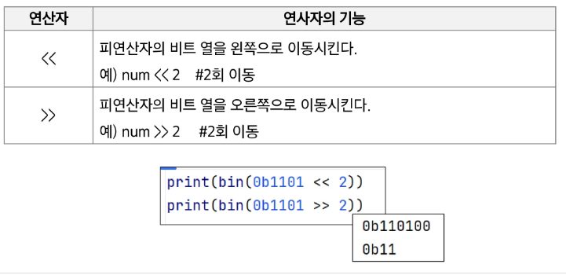
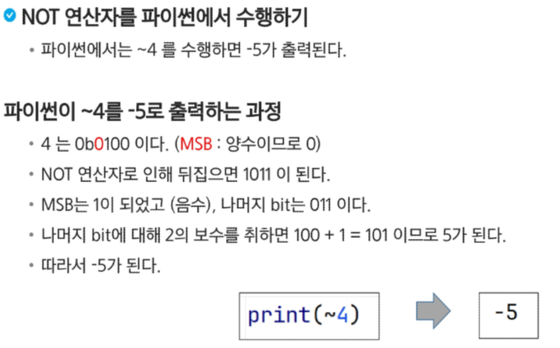
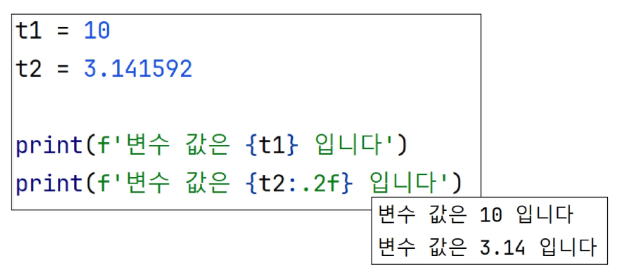
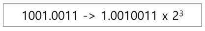

# 비트 연산

## 비트와 바이트
- 1bit : 0과 1을 표현하는 정보의 단위
- 1byte : 8 bit를 묶어 1byte라 한다.

## 비트연산
- 컴퓨터의 CPU는 0과 1로 다루어 동작되며, 내부적으로 비트 연산을 사용하여 덧셈, 뺄셈, 곱셈 등을 계산한다.

### 파이썬에서 2진수, 16진수, 10진수 변환하여 출력하기
- 2진수는 숫자 0과 소문자 b -> 0b를 접두사로 붙여 표현한다.
- 16진수는 숫자 0과 소문자 x -> 0x를 접두사로 붙여 표현한다.
  
### AND와 OR 비트연산자 이해하기
- a AND b : a,b 둘다 1일때만 결과가 1, 그 외에는 0
- a OR b : a,b 둘 중 하나만 1이면 결과가 1, 그 외에는 0

### XOR
- ^ : XOR 연산자, OR 처럼 동작되는데 둘 다 1인 경우는 0이다.
  - 어떤 값이던 특정 수로 2회 XOR 하면 원래 수로 돌아온다.

### Left Shift와 Right Shift
- Left Shift  << : 특정 수 만큼 비트를 왼쪽으로 밀어낸다.
- Right Shift >> : 특정 수 만큼 비트르 오른쪽으로 밀어낸다.(우측 비트들이 제거 된다.)

### i & (1<<n)
- i의 n번쨰 비트가 1인지 아닌지를 확인할 수 있다.
- ex) 1101 & (1<<2)
- 1101에서 2번 bit가 1인지 확인 가능하다. (결과값 = 0100)
- 결과값이 0보다 크면 n번째 비트는 1임이 확정된다.

### 음수 표형
- 컴퓨터는 음수를 '2의 보수'로 관리한다.
- 맨 앞자리 bit (MSB)는 음수 or 양수를 구분하는 비트이다.
- 2의 보수를 취한 수를 한번 더 2의 보수를 취하면 원래의 값으로 돌아온다.

### NOT 연산자
- NOT 연산자 ~ : 모든 비트를 반전시킨다.
- 만약 8 bit일 때 ~(0001 1111)이라면 값은 1110 0000이 된다.

# 실수
## 소수점 출력 방법
- {t2: .2f} : t2 값을 소수점 둘 째 자리에서 반올림하여 표현

## 실수의 표현
- 컴퓨터는 실수를 표현하기 위해 부동 소수점(floating-point) 표기법을 사용한다.
- 이 표기법은 IEEE 754 이라는 컴퓨터에서 부동소수점을 표기하는 국제 표준이다.
- 부동 소수점 표기 방법은 소수점의 위치를 고정시켜 표현하는 방식이다.
- 소수점의 위치를 왼쪽의 가장 유효한 숫자 다음으로 고정시키고 밑수의 지수승으로 표현

## 실수를 저장하기 위한 형식 (IEEE 754, 32 bit - Single Precision 표기법 기준)
- 32bit 구조
- 부호 1비트 : 0이면 양수, 1이면 음수
- 지수부(exponent) : 부동소수점의 크기 + bias 값
- 가수부(maxtissa) : 실질적 수

## 컴퓨터는 실수를 근가적으로 표현한다.
- 이진법으로 표현할 수 없는 형태의 실수는 정확한 값이 아니라 근사 값으로 저장되는데 이 때 생기는 작은 오차가 계산 과정에서 다른 결과를 가져온다.